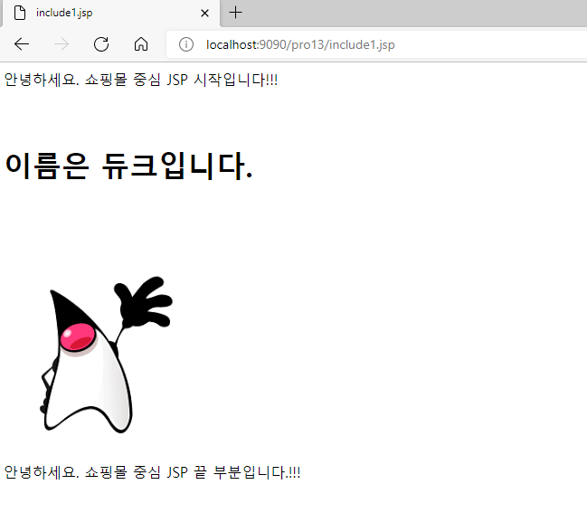
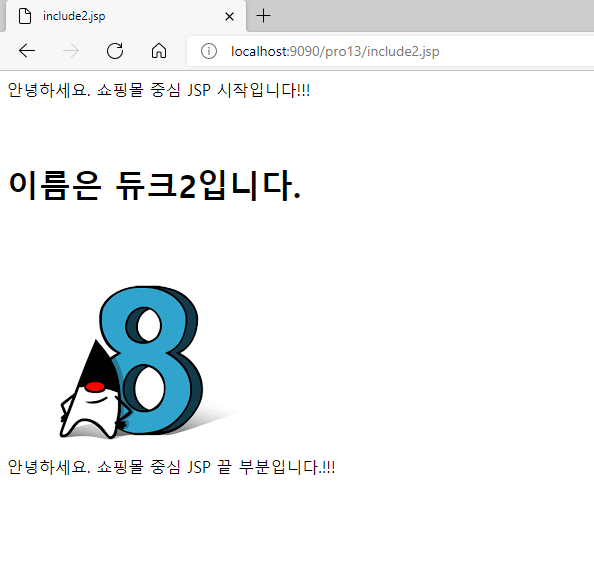
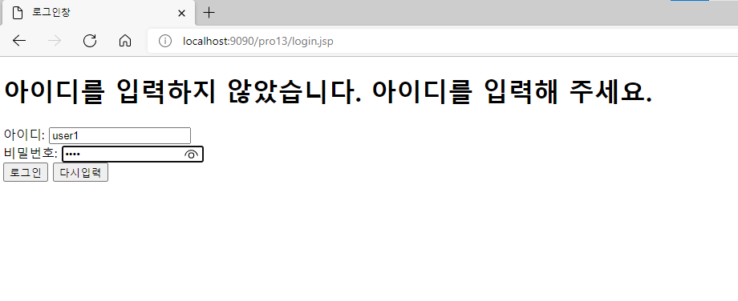
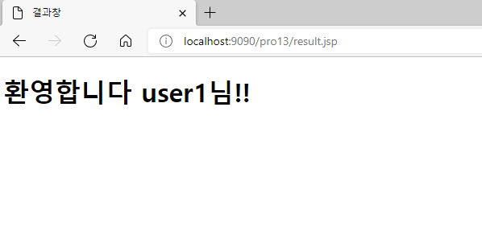
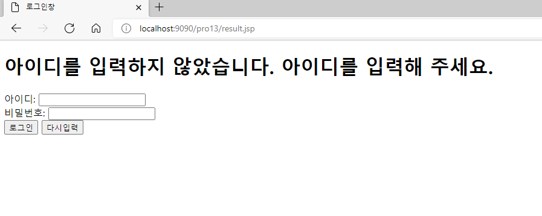
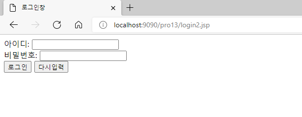
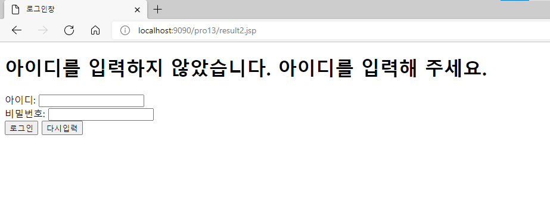
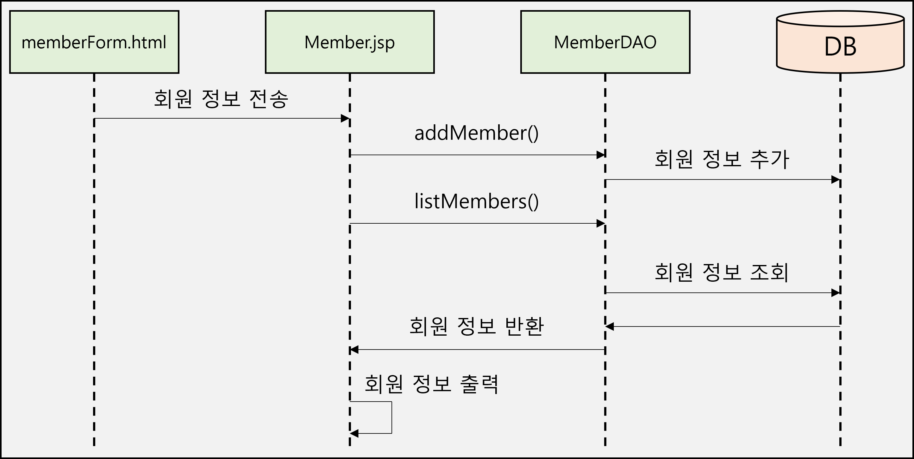
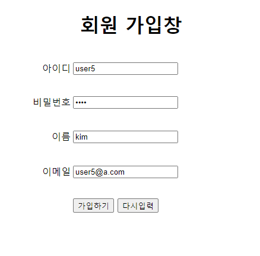
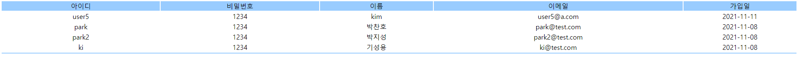

# 10. Action Tag

## 10.1 JSP의 액션 태그

### 10.1.1 JSP의 여러 가지 액션 태그

- JSP 액션 태그
    1. 인클루드 액션 태그 : `<jsp:include>`
        - 이미 있는 JSP를 현재 JSP에 포함하는 태그
    2. 포워드 액션 태그 : `<jsp:forward>`
        - 서블릿에서 RequestDispatcher 클래스의 포워딩 기능을 대신하는 태그
    3. 유즈빈 액션 태그 : `<jsp:useBean>`
        - 객체를 생성하기 위한 new 연산자를 대신하는 태그
    4. 셋프로퍼티 액션 태그 : `<jsp:setProperty>`
        - setter를 대신하는 태그
    5. 겟프로퍼티 액션 태그 : `<jsp:getProperty>`
        - getter를 대신하는 태그

## 10.2 인클루드 액션 태그 사용하기

### 10.2.1 인클루드 액션 태그

- 인클루드 액션 태그
    - 화면을 분할해서 관리할 때 사용
    - 공통적으로 사용하는 부분은 재사용 가능
    - 태그 형식
      
        ```jsp
        <jsp:include page="jsp 페이지" flush="true" 또는 "false">
        
        ...
        
        </jsp:include>
        ```
        
        - `page` : 포함할 JSP 페이지
        - `flush` : 지정한 JSP를 실행하기 전에 출력 버퍼 비움 여부 지정
- 인클루드 액션 태그와 인클루드 디렉티브 태그 비교
  
    [비교](https://www.notion.so/33e5ce26b78041d5bf3c2d1ee7443ffa)
    
- 인클루드 액션 태그 처리 과정
    1. 브라우저 요청 시 JSP 파일을 컴파일
    2. 컴파일 시 `<jsp:include>`가 지시하는 JSP 요청
    3. 요청된 JSP를 컴파일
    4. 컴파일된 JSP가 응답 보냄
    5. JSP는 브라우저에서 요청한 응답 결과를 출력

### 10.2.2 JSP 페이지에 이미지 포함 실습

- 실습
    1. 이미지 파일 추가
       
        (duke.png, duke2.png)
        
    2. JSP 파일 생성
       
        (duke_image.jsp, include1.jsp, include2.jsp)
        
    3. 자식 JSP 작성
       
        <duke_image.jsp>
        
        ```jsp
        <%@ page language="java" contentType="text/html; charset=UTF-8"
            pageEncoding="UTF-8"%>
        <%
           request.setCharacterEncoding("utf-8");
           String name = request.getParameter("name" ) ;
           String imgName = request.getParameter("imgName" ) ;
        %> 
        
        <!DOCTYPE html>
        <html>
        <head>
        <meta  charset="UTF-8">
        <title>듀크이미지</title>
        </head>
        <body>
        <br><br>
          <h1>이름은 <%= name%>입니다. </h1><br><br>
          "  />
        </body>
        </html>
        ```
        
        - param 액션 태그로 전달된 매개변수를 `getParameter()` 메서드를 이용해 가져오기
          
            ```java
            	request.setCharacterEncoding("utf-8");
             	String name = request.getParameter("name" ) ;
            	String imgName = request.getParameter("imgName" ) ;
            ```
        
    4. 부모 JSP 작성
       
        <include1.jsp>
        
        ```jsp
        <%@ page language="java" contentType="text/html; charset=UTF-8"
            pageEncoding="UTF-8"%>
         <%
        request.setCharacterEncoding("utf-8");
        %> 
        
        <!DOCTYPE html>
        <html>
        <head>
        <meta charset="UTF-8">
        <title>include1.jsp</title>
        </head>
        <body>
          안녕하세요. 쇼핑몰 중심 JSP 시작입니다!!!
        <br>
        <jsp:include  page="duke_image.jsp"  flush="true" >
           <jsp:param name= "name"  value="듀크" />
           <jsp:param name="imgName"  value="duke.png" />
        </jsp:include>
        <br>
          안녕하세요. 쇼핑몰 중심 JSP 끝 부분입니다.!!!
        </body>
        </html>
        ```
        
        - `page="duke_image.jsp"` : duke_image.jsp를 동적으로 포워딩
        - param 액션 태그를 이용해 duke_image.jsp로 이름과 파일 이름 전달
          
            ```jsp
            	<jsp:param name= "name"  value="듀크" />
              	<jsp:param name="imgName"  value="duke.png" />
            ```
        
    5. 또 다른 부모 JSP 작성
       
        <include2.jsp>
        
        ```jsp
        <%@ page language="java" contentType="text/html; charset=UTF-8"
            pageEncoding="UTF-8"%>
        <%
           request.setCharacterEncoding("utf-8");
        %> 
        
        <!DOCTYPE html>
        <html>
        <head>
        <meta  charset="UTF-8">
        <title>include2.jsp</title>
        </head>
        <body>
          안녕하세요. 쇼핑몰 중심 JSP 시작입니다!!! 
        <br>
        <jsp:include  page="duke_image.jsp"  flush="true" >
           <jsp:param name="name"  value="듀크2"/>
           <jsp:param name="imgName"  value="duke2.png"/>
        </jsp:include>
        <br>
          안녕하세요. 쇼핑몰 중심 JSP 끝 부분입니다.!!! 
        </body>
        </html>
        ```
    
- 실습 결과
    1. 첫 번째 부모 JSP 요청
       
        
        
    2. 두 번째 부모 JSP 요청
       
        
        

## 10.3 포워드 액션 태그 사용하기

### 10.3.1 포워드 액션 태그 실습

- 포워드 액션 태그 형식
  
    ```jsp
    <jsp:forward page="포워딩 할 JSP 페이지">
    
    ..
    
    </jsp:forward>
    ```
    
- 실습 1
    1. 로그인 JSP와 결과 JSP 생성
    2. 로그인 창에서 아이디와 비밀번호를 입력한 후 action의 JSP로 전달하도록 로그인 JSP 작성
       
        <login.jsp>
        
        ```jsp
        <%@ page language="java" contentType="text/html; charset=UTF-8"
            pageEncoding="UTF-8"%>
        <%
           request.setCharacterEncoding("utf-8");
        %> 
        <!DOCTYPE html>
        <html>
        <head>
          <meta charset="UTF-8">
          <title>로그인창</title>
        </head>
        <body>
           <h1>아이디를 입력하지 않았습니다. 아이디를 입력해 주세요. </h1>
           <form   action="result.jsp"  method="post">
               아이디:  <input type="text"  name="userID"><br>
               비밀번호:  <input type="password"  name="userPw"><br>
              <input type="submit"  value="로그인">
              <input type="reset"  value="다시입력">
           </form>
        </body>
        </html>
        ```
        
    3. ID를 입력하지 않은 경우 Java의 RequestDispatcher를 사용하지 않고 포워드 액션 태그를 사용해 로그인 창으로 이동하도록 결과 JSP 작성
       
        <result.jsp>
        
        ```jsp
        <%@ page language="java" contentType="text/html; charset=UTF-8"
            pageEncoding="UTF-8"%>
            
        <%
           request.setCharacterEncoding("utf-8");
        %> 
        <!DOCTYPE html>
        <html>
        <head>
          <meta charset="UTF-8">
          <title>결과창</title>
        </head>
        <body>
        <%
           String userID = request.getParameter("userID" );
           if(userID.length()==0){
           
        %>
           <jsp:forward  page="login.jsp" />
        <%	
          }
        %>
          <h1>환영합니다   <%= userID %>님!! </h1>
        </body>
        </html>
        ```
    
- 실습 1 결과
    1. login.jsp 요청
       
        
        
    2. 아이디를 입력한 경우(입력값 : ID - user1 / PW - 1234)
       
        
        
    3. 아이디를 입력하지 않은 경우
       
        
    
- 실습 2
    - 오류 메시지가 오류 시에만 표시하도록 수정하기
    1. 새로운 로그인 JSP와 결과 JSP 생성
    2. 로그인 창에 접속 시 `getParameter()` 메서드를 이용해 `msg` 값을 가져와서 표시하도록 로그인 JSP 작성
       
        <login2.jsp>
        
        ```jsp
        <%@ page language="java" contentType="text/html; charset=UTF-8"
            pageEncoding="UTF-8"%>
        <%
           request.setCharacterEncoding("utf-8");
        %> 
        <!DOCTYPE html>
        <html>
        <head>
          <meta charset="UTF-8">
          <title>로그인창</title>
        </head>
        <body>
        <%
          String msg = request.getParameter("msg");
          if(msg != null){
        %>
           <h1><%=msg %>  </h1>
        <%
          }
        %>
        
        <form action="result2.jsp"  method="post">
           아이디:  <input type="text"  name="userID"><br>
           비밀번호:  <input type="password"  name="userPw"><br>
           <input type="submit"  value="로그인">
           <input type="reset"  value="다시입력">
        </form>
        </body>
        ```
        
        - 브라우저에서 접속 시 msg 값을 가져와서 표시
          
            ```jsp
            <%
              String msg = request.getParameter("msg");
              if(msg != null){
            %>
               <h1><%=msg %>  </h1>
            <%
              }
            %>
            ```
            
            - 최초 접속 시에는 NULL 값이므로 아무것도 표현되지 않음
    3. ID를 입력하지 않은 경우 다시 로그인 창으로 포워딩하면서 `msg` 값을 전달하도록 결과 JSP 작성
       
        <result2.jsp>
        
        ```jsp
        <%@ page language="java" contentType="text/html; charset=UTF-8"
            pageEncoding="UTF-8"%>
            
        <%
           request.setCharacterEncoding("utf-8");
        %> 
        
        <%!
          String msg = "아이디를 입력하지 않았습니다. 아이디를 입력해 주세요.";
        %>
        <!DOCTYPE html>
        <html>
        <head>
          <meta charset="UTF-8">
          <title>결과창</title>
        </head>
        <body>
        <%
           String userID = request.getParameter("userID" );
           if(userID.length()==0){
        %>
           <jsp:forward  page="login2.jsp" >		
              <jsp:param name="msg" value="<%= msg %>" />
           </jsp:forward>
        
        <%	
          }
        %>
          <h1>환영합니다.   <%=userID %>님!!! </h1>
        </body>
        </html>
        ```
        
        - 전달할 오류 메시지 선언
          
            ```java
            <%!
              String msg = "아이디를 입력하지 않았습니다. 아이디를 입력해 주세요.";
            %>
            ```
            
        - 로그인 시 입력한 값 가져오기
          
            ```java
            String userID = request.getParameter("userID" );
            ```
            
        - ID를 입력하지 않은 경우 `<jsp:param>` 액션 태그를 이용해 오류 메시지를 login2.jsp로 포워딩
          
            ```jsp
            if(userID.length()==0){
            %>
               <jsp:forward  page="login2.jsp" >		
                  <jsp:param name="msg" value="<%= msg %>" />
               </jsp:forward>
            
            <%	
              }
            ```
    
- 실습 2 결과
    1. 로그인 JSP 요청
       
        
        
    2. ID를 입력하지 않은 경우
       
        
        

## 10.4 useBean, setProperty, getProperty 액션 태그 사용하기

### 10.4.1 자바 빈을 이용한 회원 정보 조회 실습

- 자바 빈
    - Java EE 프로그래밍 시 여러 객체를 거치면서 만들어지는 데이터를 저장하거나 전달하는 데 사용
    - 자바의 DTO(Data Transfer Object) 클래스, VO(Value Object) 클래스와 같은 개념
- 자바 빈 특징
    - 속성의 접근 제한자는 `private`
    - 각 속성(attribute, property)은 각각의 `setter`/`getter`를 가짐
    - `setter`/`getter` 이름의 첫 글자는 소문자
    - 인자 없는 생성자를 반드시 가짐
    - 다른 생성자도 추가할 수 있음
- 자바 빈을 이용해 회원 정보를 등록, 조회하고 출력하는 과정
  
    
    
- 자바 빈을 이용한 회원 정보 조회 실습
    1. 패키지를 생성하고, MemberBean 클래스와 MemberDAO 클래스 추가
    2. 회원 정보를 저장하는 테이블 생성
       
        <t_member.sql> - 이용 Tool : MySQL
        
        ```sql
        create table t_member(
        		id varchar(10) primary key,
            pwd varchar(10),
            name varchar(50),
            email varchar(50),
            joinDate timestamp default NOW()
        )default character set utf8 collate utf8_general_ci;
        ```
        
        Oracle의 경우
        
        ```sql
        create table t_member(
        		id varchar2(10) primary key,
            pwd varchar2(10),
            name varchar2(50),
            email varchar2(50),
            joinDate date default sysdate
        );
        ```
        
    3. MemberBean 클래스 작성
       
        ```java
        package sec01.ex01;
        
        import java.sql.Date;
        
        public class MemberBean {
        	private String id;
        	private String pwd;
        	private String name;
        	private String email;
        	private Date joinDate;
        	
        	
        	public MemberBean() {
        		
        	}
        
        	public MemberBean(String id, String pwd, String name, String email) {
        		this.id = id;
        		this.pwd = pwd;
        		this.name = name;
        		this.email = email;
        	}
        
        	public String getId() {
        		return id;
        	}
        
        	public void setId(String id) {
        		this.id = id;
        	}
        
        	public String getPwd() {
        		return pwd;
        	}
        
        	public void setPwd(String pwd) {
        		this.pwd = pwd;
        	}
        
        	public String getName() {
        		return name;
        	}
        
        	public void setName(String name) {
        		this.name = name;
        	}
        
        	public String getEmail() {
        		return email;
        	}
        
        	public void setEmail(String email) {
        		this.email = email;
        	}
        
        	public Date getJoinDate() {
        		return joinDate;
        	}
        
        	public void setJoinDate(Date joinDate) {
        		this.joinDate = joinDate;
        	}
        }
        ```
        
    4. 회원가입 창 작성
       
        <memberForm.html>
        
        ```html
        <!DOCTYPE html>
        <html>
        <head>
           <meta charset="UTF-8">
           <title>회원 가입창</title>
        <body>
        <form method="post"   action="member.jsp">
        <h1  style="text-align:center">회원 가입창</h1>
        <table  align="center">
              <tr>
                 <td width="200"><p align="right">아이디</td>
                 <td width="400"><input type="text" name="id"></td>
              </tr>
              <tr>
                  <td width="200"><p align="right">비밀번호</td>
                  <td width="400"><input type="password"  name="pwd"></td>
              </tr>
              <tr>
                  <td width="200"><p align="right">이름</td>
                  <td width="400"><p><input type="text"  name="name"></td>
              </tr>
              <tr>
                  <td width="200"><p align="right">이메일</td>
                  <td width="400"><p><input type="text"  name="email"></td>
              </tr>
              <tr>
                  <td width="200"><p>&nbsp;</p></td>
                  <td width="400">
        			<input type="submit" value="가입하기">
        			<input type="reset" value="다시입력">
        		  </td>
              </tr>
        </table>
        </form>
        </body>
        </html>
        ```
        
    5. 전송받은 회원정보를 출력할 JSP 작성
       
        <member.jsp>
        
        ```jsp
        <%@ page language="java"   contentType="text/html; charset=UTF-8"
             import="java.util.*,sec01.ex01.*" 
            pageEncoding="UTF-8"%>
        <%
          request.setCharacterEncoding("UTF-8");
        %>    
        
        <%
           String   id=request.getParameter("id");
           String  pwd = request.getParameter("pwd");
           String  name = request.getParameter("name");
           String  email = request.getParameter("email");
         
          
           MemberBean  m =  new MemberBean(id, pwd, name, email);
           MemberDAO  memberDAO=new MemberDAO();
           memberDAO.addMember(m);
           List membersList = memberDAO.listMembers();	
        %>
        <!DOCTYPE html>
        <html>
        <head>
          <meta charset="UTF-8">
          <title>회원 목록창</title>
        </head>
        <body>
          <table align="center"  width="100%">
        	 <tr align="center" bgcolor="#99ccff">
        	      <td width="7%" >아이디</td>
        	      <td width="7%">비밀번호</td>
        	      <td width="5%" >이름</td>
        	      <td width="11%" >이메일</td>
        	      <td width="5%" >가입일</td>
        	   </tr>
        	<%
        	   if(membersList.size()==0){
        	%>
        	  <tr>
        	      <td colspan="5">
        	        <p align="center"><b><span style="font-size:9pt;">
        	                      등록된 회원이  없습니다.</span></b></p>
        	      </td>
        	  </tr>
        	<%
        	}else{
        	   for( int i = 0; i < membersList.size(); i++ ) {
        	      MemberBean bean = (MemberBean) membersList.get(i);
        	%>
        	   <tr align="center">
        	       <td><%=bean.getId() %></td>
        	       <td><%=bean.getPwd() %></td>
        	       <td><%=bean.getName() %></td>
        	       <td><%=bean.getEmail() %></td>
        	       <td><%=bean.getJoinDate() %></td>
        	   </tr>
        	<%
        	      } // end for
        	
        	   } // end if
        	%>
        	   <tr height="1" bgcolor="#99ccff">
        	      <td colspan="5"></td>
        	   </tr>
        	</table>
        </body>
        </html>
        ```
        
        - 회원 정보 가져오기
          
            ```java
            	String   id=request.getParameter("id");
              	String  pwd = request.getParameter("pwd");
              	String  name = request.getParameter("name");
              	String  email = request.getParameter("email");
            ```
            
        - MemberBean 객체를 생성한 후 속성 설정
          
            ```java
            MemberBean  m =  new MemberBean(id, pwd, name, email);
            ```
            
        - 회원 정보를 테이블에 추가
          
            ```java
            memberDAO.addMember(m);
            ```
            
        - 전체 회원 정보 조회
          
            ```java
            List membersList = memberDAO.listMembers();
            ```
            
        - 반복문을 이용해 memberList에 저장된 MemberBean 객체를 한 개씩 가져온 후 각 속성의 회원 정보를 다시 출력
          
            ```jsp
            for( int i = 0; i < membersList.size(); i++ ) {
            	      MemberBean bean = (MemberBean) membersList.get(i);
            	%>
            	   <tr align="center">
            	       <td><%=bean.getId() %></td>
            	       <td><%=bean.getPwd() %></td>
            	       <td><%=bean.getName() %></td>
            	       <td><%=bean.getEmail() %></td>
            	       <td><%=bean.getJoinDate() %></td>
            	   </tr>
            	<%
            	      } // end for
            ```
        
    6. MemberDAO 작성
       
        ```java
        package sec01.ex01;
        
        import java.sql.Connection;
        import java.sql.Date;
        import java.sql.PreparedStatement;
        import java.sql.ResultSet;
        import java.sql.Statement;
        import java.util.ArrayList;
        import java.util.List;
        
        import javax.naming.Context;
        import javax.naming.InitialContext;
        import javax.sql.DataSource;
        
        public class MemberDAO {
        	private Connection con;
        	private PreparedStatement pstmt;
        	private DataSource dataFactory;
        
        	public MemberDAO() {
        		try {
        			Context ctx = new InitialContext();
        			Context envContext = (Context) ctx.lookup("java:/comp/env");
        			dataFactory = (DataSource) envContext.lookup("jdbc/mysql");
        		} catch (Exception e) {
        			e.printStackTrace();
        		}
        	}
        
        	public List listMembers() {
        		List list = new ArrayList();
        		try {
        			con = dataFactory.getConnection();
        			String query = "select * from t_member order by joinDate desc ";
        			System.out.println("prepareStatememt: " + query);
        			pstmt = con.prepareStatement(query);
        			ResultSet rs = pstmt.executeQuery();
        			while (rs.next()) {
        				String id = rs.getString("id");
        				String pwd = rs.getString("pwd");
        				String name = rs.getString("name");
        				String email = rs.getString("email");
        				Date joinDate = rs.getDate("joinDate");
        				MemberBean vo = new MemberBean();
        				vo.setId(id);
        				vo.setPwd(pwd);
        				vo.setName(name);
        				vo.setEmail(email);
        				vo.setJoinDate(joinDate);
        				list.add(vo);
        			}
        			rs.close();
        			pstmt.close();
        			con.close();
        		} catch (Exception e) {
        			e.printStackTrace();
        		}
        		return list;
        	}
        
        	public void addMember(MemberBean memberBean) {
        		try {
        			Connection con = dataFactory.getConnection();
        			String id = memberBean.getId();
        			String pwd = memberBean.getPwd();
        			String name = memberBean.getName();
        			String email = memberBean.getEmail();
        			String query = "insert into t_member";
        			query += " (id,pwd,name,email)";
        			query += " values(?,?,?,?)";
        			System.out.println("prepareStatememt: " + query);
        			pstmt = con.prepareStatement(query);
        			pstmt.setString(1, id);
        			pstmt.setString(2, pwd);
        			pstmt.setString(3, name);
        			pstmt.setString(4, email);
        			pstmt.executeUpdate();
        			pstmt.close();
        		} catch (Exception e) {
        			e.printStackTrace();
        		}
        	}
        }
        ```
        
        - SQL 쿼리문
          
            ```java
            String query = "select * from t_member order by joinDate desc ";
            ```
            
        - 조회한 회원 정보를 MemberBean 객체의 속성에 저장한 후 다시 ArrayList에 저장
          
            ```java
            MemberBean vo = new MemberBean();
            				vo.setId(id);
            				vo.setPwd(pwd);
            				vo.setName(name);
            				vo.setEmail(email);
            				vo.setJoinDate(joinDate);
            				list.add(vo);
            ```
            
        - MemberBean 객체에 저장된 회원 정보를 전달
          
            ```java
            public void addMember(MemberBean memberBean)
            ```
            
        - `getter`를 이용해 회원 정보 가져오기
          
            ```java
            			String id = memberBean.getId();
            			String pwd = memberBean.getPwd();
            			String name = memberBean.getName();
            			String email = memberBean.getEmail();
            ```
            
        - 회원 정보 추가
          
            ```java
            			System.out.println("prepareStatememt: " + query);
            			pstmt = con.prepareStatement(query);
            			pstmt.setString(1, id);
            			pstmt.setString(2, pwd);
            			pstmt.setString(3, name);
            			pstmt.setString(4, email);
            			pstmt.executeUpdate();
            			pstmt.close();
            ```
    
- 실습 결과
    1. 회원 정보 입력
       
        
        
    2. 회원 정보 조회
       
        
        

### 10.4.2 유즈빈 액션 태그를 이용한 회원 정보 조회 실습

- 유즈빈 액션 태그
    - 자바 빈을 자주 사용할 경우 화면이 복잡해짐
    - 유즈빈 액션 태그는 JSP 페이지에서 자바 빈을 대체하기 위한 태그
    - 사용 형식
      
        ```jsp
        <jsp:useBean id="빈 이름" class="패키지 이름을 포함한 자바 빈 클래스 [scope="접근범위"]/>
        ```
        
        - class는 패키지 이름을 포함한 자바 빈 이름 지정
        - scope는 자바 빈에 대한 접근 범위를 지정
          
            (page, request, session, application을 가지며 기본값은 page)
    
- 유즈빈 액션 태그를 이용한 회원 등록 및 조회 실습
    - 유즈빈 액션 태그를 적용한 JSP 작성
      
        <member2.jsp>
        
        ```jsp
        <%@ page language="java"   contentType="text/html; charset=UTF-8"
             import="java.util.*,sec01.ex01.*" 
            pageEncoding="UTF-8"%>
        <%
          request.setCharacterEncoding("UTF-8");
        %>    
        
        <jsp:useBean  id="m"  class="sec01.ex01.MemberBean"  scope="page"/>
        
        <%
           String   id=request.getParameter("id");
           String  pwd = request.getParameter("pwd");
           String  name = request.getParameter("name");
           String  email = request.getParameter("email");
          
           // MemberBean  m = new MemberBean(id, pwd, name, email);
           m.setId(id);
           m.setPwd(pwd);
           m.setName(name);
           m.setEmail(email);
        
           MemberDAO  memberDAO=new MemberDAO();
           memberDAO.addMember(m);
           List membersList = memberDAO.listMembers();	
        %>
        <!DOCTYPE html>
        <html>
        <head>
          <meta charset="UTF-8">
          <title>회원 목록창</title>
        </head>
        <body>
          <table align="center"  width="100%">
        	 <tr align="center" bgcolor="#99ccff">
        	      <td width="7%" >아이디</td>
        	      <td width="7%">비밀번호</td>
        	      <td width="5%" >이름</td>
        	      <td width="11%" >이메일</td>
        	      <td width="5%" >가입일</td>
        	   </tr>
        	<%
        	   if(membersList.size()==0){
        	%>
        	  <tr>
        	      <td colspan="5">
        	        <p align="center"><b><span style="font-size:9pt;">
        	                      등록된 회원이  없습니다.</span></b></p>
        	      </td>
        	  </tr>
        	<%
        	}else{
        	   for( int i = 0; i < membersList.size(); i++ ) {
        	      MemberBean bean = (MemberBean) membersList.get(i);
        	%>
        	   <tr align="center">
        	       <td><%=bean.getId() %></td>
        	       <td><%=bean.getPwd() %></td>
        	       <td><%=bean.getName() %></td>
        	       <td><%=bean.getEmail() %></td>
        	       <td><%=bean.getJoinDate() %></td>
        	   </tr>
        	<%
        	      } // end for
        	
        	   } // end if
        	%>
        	   <tr height="1" bgcolor="#99ccff">
        	      <td colspan="5"></td>
        	   </tr>
        	</table>
        </body>
        </html>
        ```
        
        - `<jsp:useBean id="m" class="sec01.ex01.MemberBean" scope="page"/>` : 유즈빈 액션 태그로 id가 m인 MemberBean 객체 생성

### 10.4.3 setProperty/getProperty 액션 태그를 이용한 회원 정보 조회 실습

- setProperty/getProperty 액션 태그
    1. setProperty
        - useBean의 속성에 값을 설정하는 태그
        - 형식
          
            ```jsp
            <jsp:setProperty name="자바 빈 이름" property="속성 이름" value="값"/>
            ```
            
            - name : 유즈빈 액션태그의 id 속성에 지정한 이름
            - property : 값을 설정할 속성 이름
            - value : 속성에 설정할 속성 값
    2. getProperty
        - useBean의 속성 값을 얻는 태그
        - 형식
          
            ```html
            <jsp:getProperty name="자바 빈 이름" property="속성 이름"/>
            ```
            
            - name : 유즈빈 액션태그의 id 속성에 지정한 이름
            - property : 값을 얻을 속성 이름
    
- 실습 1
  
    <member3.jsp>
    
    ```jsp
    <%@ page language="java"   contentType="text/html; charset=UTF-8"
         import="java.util.*,sec01.ex01.*" 
        pageEncoding="UTF-8"%>
    <%
      request.setCharacterEncoding("UTF-8");
    %>    
    
    <jsp:useBean  id="m"  class="sec01.ex01.MemberBean"  scope="page"/>
    
    <jsp:setProperty name="m"  property="id"    value='<%= request.getParameter("id") %>'  />
    <jsp:setProperty name="m"  property="pwd"   value='<%= request.getParameter("pwd") %>'  />
    <jsp:setProperty name="m"  property="name"  value='<%= request.getParameter("name") %>'  />
    <jsp:setProperty name="m"  property="email" value='<%= request.getParameter("email") %>'  />
    
    <%
      /*  String   id=request.getParameter("id");
       String  pwd = request.getParameter("pwd");
       String  name = request.getParameter("name");
       String  email = request.getParameter("email");
      
       m.setId(id);
       m.setPwd(pwd);
       m.setName(name);
       m.setEmail(email); */
    
       MemberDAO  memberDAO=new MemberDAO();
       memberDAO.addMember(m);
       List membersList = memberDAO.listMembers();	
    %>
    <!DOCTYPE html>
    <html>
    <head>
      <meta charset="UTF-8">
      <title>회원 목록창</title>
    </head>
    <body>
      <table align="center"  width="100%">
    	 <tr align="center" bgcolor="#99ccff">
    	      <td width="7%" >아이디</td>
    	      <td width="7%">비밀번호</td>
    	      <td width="5%" >이름</td>
    	      <td width="11%" >이메일</td>
    	      <td width="5%" >가입일</td>
    	   </tr>
    	<%
    	   if(membersList.size()==0){
    	%>
    	  <tr>
    	      <td colspan="5">
    	        <p align="center"><b><span style="font-size:9pt;">
    	                      등록된 회원이  없습니다.</span></b></p>
    	      </td>
    	  </tr>
    	<%
    	}else{
    	   for( int i = 0; i < membersList.size(); i++ ) {
    	      MemberBean bean = (MemberBean) membersList.get(i);
    	%>
    	   <tr align="center">
    	       <td><%=bean.getId() %></td>
    	       <td><%=bean.getPwd() %></td>
    	       <td><%=bean.getName() %></td>
    	       <td><%=bean.getEmail() %></td>
    	       <td><%=bean.getJoinDate() %></td>
    	   </tr>
    	<%
    	      } // end for
    	
    	   } // end if
    	%>
    	   <tr height="1" bgcolor="#99ccff">
    	      <td colspan="5"></td>
    	   </tr>
    	</table>
    </body>
    </html>
    ```
    
- 실습 2
  
    <member4.jsp>
    
    ```jsp
    <%@ page language="java"   contentType="text/html; charset=UTF-8"
         import="java.util.*,sec01.ex01.*" 
        pageEncoding="UTF-8"%>
    <%
      request.setCharacterEncoding("UTF-8");
    %>    
    
    <jsp:useBean  id="m"  class="sec01.ex01.MemberBean"  scope="page"/>
    <jsp:setProperty name="m"  property="id"       param="id"  />
    <jsp:setProperty name="m"  property="pwd"    param="pwd"  />
    <jsp:setProperty name="m"  property="name"      param="name"/>
    <jsp:setProperty name="m"  property="email"   param="email" />
    
    <%
      /*  String   id=request.getParameter("id");
       String  pwd = request.getParameter("pwd");
       String  name = request.getParameter("name");
       String  email = request.getParameter("email");
      
       m.setId(id);
       m.setPwd(pwd);
       m.setName(name);
       m.setEmail(email); */
    
       MemberDAO  memberDAO=new MemberDAO();
       memberDAO.addMember(m);
       List membersList = memberDAO.listMembers();	
    %>
    <!DOCTYPE html>
    <html>
    <head>
      <meta charset="UTF-8">
      <title>회원 목록창</title>
    </head>
    <body>
      <table align="center"  width="100%">
    	 <tr align="center" bgcolor="#99ccff">
    	      <td width="7%" >아이디</td>
    	      <td width="7%">비밀번호</td>
    	      <td width="5%" >이름</td>
    	      <td width="11%" >이메일</td>
    	      <td width="5%" >가입일</td>
    	   </tr>
    	<%
    	   if(membersList.size()==0){
    	%>
    	  <tr>
    	      <td colspan="5">
    	        <p align="center"><b><span style="font-size:9pt;">
    	                      등록된 회원이  없습니다.</span></b></p>
    	      </td>
    	  </tr>
    	<%
    	}else{
    	   for( int i = 0; i < membersList.size(); i++ ) {
    	      MemberBean bean = (MemberBean) membersList.get(i);
    	%>
    	   <tr align="center">
    	       <td><%=bean.getId() %></td>
    	       <td><%=bean.getPwd() %></td>
    	       <td><%=bean.getName() %></td>
    	       <td><%=bean.getEmail() %></td>
    	       <td><%=bean.getJoinDate() %></td>
    	   </tr>
    	<%
    	      } // end for
    	
    	   } // end if
    	%>
    	   <tr height="1" bgcolor="#99ccff">
    	      <td colspan="5"></td>
    	   </tr>
    	</table>
    </body>
    </html>
    ```
    
- 실습 3
  
    <member5.jsp>
    
    ```jsp
    <%@ page language="java"   contentType="text/html; charset=UTF-8"
         import="java.util.*,sec01.ex01.*" 
        pageEncoding="UTF-8"%>
    <%
      request.setCharacterEncoding("UTF-8");
    %>    
    
    <jsp:useBean  id="m"  class="sec01.ex01.MemberBean"  scope="page"/>
    <jsp:setProperty name="m" property="id"  />
    <jsp:setProperty name="m" property="pwd"  />
    <jsp:setProperty name="m" property="name"   />
    <jsp:setProperty name="m" property="email" />
    
    <%
    
       MemberDAO  memberDAO=new MemberDAO();
       memberDAO.addMember(m);
       List membersList = memberDAO.listMembers();	
    %>
    <!DOCTYPE html>
    <html>
    <head>
      <meta charset="UTF-8">
      <title>회원 목록창</title>
    </head>
    <body>
      <table align="center"  width="100%">
    	 <tr align="center" bgcolor="#99ccff">
    	      <td width="7%" >아이디</td>
    	      <td width="7%">비밀번호</td>
    	      <td width="5%" >이름</td>
    	      <td width="11%" >이메일</td>
    	      <td width="5%" >가입일</td>
    	   </tr>
    	<%
    	   if(membersList.size()==0){
    	%>
    	  <tr>
    	      <td colspan="5">
    	        <p align="center"><b><span style="font-size:9pt;">
    	                      등록된 회원이  없습니다.</span></b></p>
    	      </td>
    	  </tr>
    	<%
    	}else{
    	   for( int i = 0; i < membersList.size(); i++ ) {
    	      MemberBean bean = (MemberBean) membersList.get(i);
    	%>
    	   <tr align="center">
    	       <td><%=bean.getId() %></td>
    	       <td><%=bean.getPwd() %></td>
    	       <td><%=bean.getName() %></td>
    	       <td><%=bean.getEmail() %></td>
    	       <td><%=bean.getJoinDate() %></td>
    	   </tr>
    	<%
    	      } // end for
    	
    	   } // end if
    	%>
    	   <tr height="1" bgcolor="#99ccff">
    	      <td colspan="5"></td>
    	   </tr>
    	</table>
    </body>
    </html>
    ```
    
- 실습 4
  
    <member6.jsp>
    
    ```jsp
    <%@ page language="java"   contentType="text/html; charset=UTF-8"
         import="java.util.*,sec01.ex01.*" 
        pageEncoding="UTF-8"%>
    <%
      request.setCharacterEncoding("UTF-8");
    %>    
    
    <jsp:useBean  id="m"  class="sec01.ex01.MemberBean"  scope="page"/>
    <jsp:setProperty name="m" property="*" />
    
    <%
    
       MemberDAO  memberDAO=new MemberDAO();
       memberDAO.addMember(m);
       List membersList = memberDAO.listMembers();	
    %>
    <!DOCTYPE html>
    <html>
    <head>
      <meta charset="UTF-8">
      <title>회원 목록창</title>
    </head>
    <body>
      <table align="center"  width="100%">
    	 <tr align="center" bgcolor="#99ccff">
    	      <td width="7%" >아이디</td>
    	      <td width="7%">비밀번호</td>
    	      <td width="5%" >이름</td>
    	      <td width="11%" >이메일</td>
    	      <td width="5%" >가입일</td>
    	   </tr>
    	<%
    	   if(membersList.size()==0){
    	%>
    	  <tr>
    	      <td colspan="5">
    	        <p align="center"><b><span style="font-size:9pt;">
    	                      등록된 회원이  없습니다.</span></b></p>
    	      </td>
    	  </tr>
    	<%
    	}else{
    	   for( int i = 0; i < membersList.size(); i++ ) {
    	      MemberBean bean = (MemberBean) membersList.get(i);
    	%>
    	   <tr align="center">
    	       <td><%=bean.getId() %></td>
    	       <td><%=bean.getPwd() %></td>
    	       <td><%=bean.getName() %></td>
    	       <td><%=bean.getEmail() %></td>
    	       <td><%=bean.getJoinDate() %></td>
    	   </tr>
    	<%
    	      } // end for
    	
    	   } // end if
    	%>
    	   <tr height="1" bgcolor="#99ccff">
    	      <td colspan="5"></td>
    	   </tr>
    	</table>
    </body>
    </html>
    ```
    
- 실습 5
  
    <member7.jsp>
    
    ```jsp
    <%@ page language="java"  contentType="text/html; charset=UTF-8"
          import="java.util.*, sec01.ex01.*" pageEncoding="UTF-8"%>
    <%
       request.setCharacterEncoding("UTF-8");  
    %>
    <jsp:useBean  id="m"  class="sec01.ex01.MemberBean"  scope="page"/>
    <jsp:setProperty name="m" property="*" />
    <!DOCTYPE html>
    <html>
    <head>
      <meta charset="UTF-8">
      <title>회원 목록창</title>
    </head>
    <body>
     <table align="center"  width="100%">
    	 <tr align="center" bgcolor="#99ccff">
    	      <td width="7%" >아이디</td>
    	      <td width="7%">비밀번호</td>
    	      <td width="5%" >이름</td>
    	      <td width="11%" >이메일</td>
    	   </tr>
    	   <tr align="center">
    	  <td> <jsp:getProperty name="m"  property="id"  /> </td>
              <td> <jsp:getProperty name="m"  property="pwd"  />  </td>
              <td> <jsp:getProperty name="m"  property="name"     /> </td>
              <td> <jsp:getProperty name="m"  property="email"  /> </td>
    	   </tr>
    	   <tr height="1" bgcolor="#99ccff">
    	      <td colspan="5"></td>
    	   </tr>
    	</table>
    </body>
    </html>
    ```
    

---