# 11. EL & JSTL

# 11.1 표현 언어란?

### 11.1.1 표현 언어

- 표현 언어(EL; Expression Language)
    - 표현 언어는 자바 코드가 들어가는 표현식을 좀 더 편리하게 사용하기 위해 JSP 2.0부터 도입된 데이터 출력 기능
    - 표현식의 자바 코드가 복잡해짐에 따라 JSP 2.0부터 자바 코드로 출력하는 표현식을 대체하기 위해 표현 언어가 등장
- 표현 언어 특징
    - 기존 표현식보다 편리하게 값을 출력
    - 변수와 여러 가지 연산자를 포함할 수 있음
    - JSP의 내장 객체에 저장된 속성 및 자바의 빈 속성도 표현 언어에서 출력 가능
    - 표현 언어 자체 내장 객체도 제공
    - JSP 페이지 생성 시 기본 설정은 표현 언어를 사용할 수 없음
    - 페이지 디렉티브 태그에서는 반드시 `isELInored=false`로 설정해야 함

### 11.1.2 표현 언어에서 사용되는 자료형과 연산자

- 표현 언어에서 사용되는 자료형
    - 불 : true와 false 값을 가짐
    - 정수 : 0~9로 이루어진 값을 가지고 음수인 경우 마이너스가 붙음
    - 실수 : 소수점을 사용할 수 있고, 1.4e5와 같이 지수형으로 표현할 수 있음
    - 문자열 : 따옴표와 같이 사용
    - 널 : null
- 표현 언어의 여러 가지 연산자
    1. 산술 연산자 : `+`, `-`, `*`, `/` 또는 `div`, `%` 또는 `mod`
    2. 비교 연산자 : `==` 또는 `eq`, `!=` 또는 `ne`, `<` 또는 `lt`, `>` 또는 `gt`, `<=` 또는 `le`, `>=` 또는 `ge`
    3. 논리 연산자 : `&&` 또는 `and`, `||` 또는 `or`, `!` 또는 `not`
    4. empty 연산자 : `empty <값>`
    5. 조건 연산자 : `<수식>?<값1>:<값2>`

### 11.1.3 JSP에서 표현 언어 사용 실습

- 실습
  
    <elTest1.jsp>
    
    ```jsp
    <%@ page language="java" contentType="text/html; charset=UTF-8"
        pageEncoding="UTF-8"
        isELIgnored="false" %>
    
    <html>
    <head>
    <meta charset="UTF-8">
    	<title>표현언어에서 사용되는 데이터들</title>
    </head>
    <body>
    	<h1>표현언어로 여러 가지 데이터 출력하기</h1>
    	<h1>
    	 \${100}: ${100}<br>
    	 \${"안녕하세요"}: ${"안녕하세요"}<br>
    	 \${10+1}: ${10+1}<br>
    	 \${"10"+1} : ${"10"+1 }<br>
    <%--\${null+10 }: ${null+10 }<br> --%> 
    <%--\${"안녕"+11 }: ${"안녕"+11 }<br> --%> 
    <%--\${"hello"+"world"}:${"hello"+"world"}<br> --%> 
    	 </h1>
    </body>
    </html>
    ```
    
    - `${"10"+1 }` : 숫자형 문자열과 실제 숫자를 더하면 문자열을 자동으로 숫자로 변환하여 더함
    - `${null+10 }` : null과 10을 더하면 10이 됨
    - 문자열끼리 더하거나 문자열과 숫자를 더할 수는 없음
- 실습 결과
  
    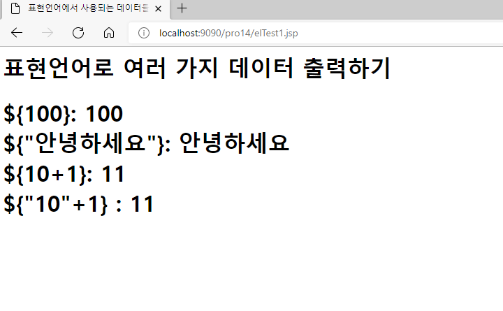
    

### 11.1.4 표현 언어의 산술 연산자

- 실습
  
    <elTest2.jsp>
    
    ```jsp
    <%@ page language="java" contentType="text/html; charset=UTF-8"
        pageEncoding="UTF-8"
        isELIgnored="false" %>
    
    <html>
    <head>
       <meta charset="UTF-8">
       <title>표현언어의 여러 가지 연산자들</title>
    </head>
    <body>
       <h2>여러 가지 산술 연산자</h2>
       <h1>
       \${10+10}  : ${10+10} <br>
       \${20-10}  : ${20-10}  <br>
       \${10*10}  : ${10*10} <br>
       \${100/9} : ${100/9} <br>
    <%--    \${100 div 9} : ${100 div 9} <br> --%>
       \${100%9} : ${100%9}<br>
       \${100 mod 9} : ${100 mod 9}<br>
       </h1>
       </body>
    </html>
    ```
    
- 실습 결과
  
    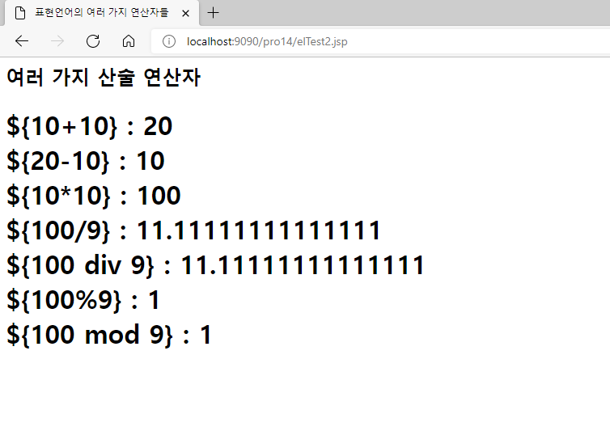
    

### 11.1.5 표현 언어의 비교 연산자

- 실습
  
    <elTest3.jsp>
    
    ```jsp
    <%@ page language="java" contentType="text/html; charset=UTF-8"
        pageEncoding="UTF-8"
    	isELIgnored="false"
        %>
    <!DOCTYPE html>
    <html>
    <head>
    <meta charset="UTF-8">
    <title>여러가지 비교 연산자</title>
    </head>
    <body>
        <h2>여러 가지 비교 연산자</h2>
        <h3>
        \${10==10} : ${10==10} <br>
        \${10 eq 10} : ${10 eq 10} <br><br>
        \${"hello"=="hello"} : ${"hello"=="hello"} <br>
        \${"hello" eq "hello"} : ${"hello" eq "hello"} <br><br>
    
        \${20!=10} : ${20!=10}<br>
        \${20 ne 10} : ${20 ne 10}<br><br>
        \${"hello"!="apple"} : ${"hello"!="apple"} <br>
        \${"hello" ne "apple"} : ${"hello" ne "apple"} <br><br>
        \${10 < 10} : ${10 < 10} <br>
        \${10 lt 10} : ${10 lt 10} <br><br>
        \${100>10} : ${100 > 10}<br>
        \${100 gt 10} : ${100 gt 10}<br><br>
        \${100 <=10} : ${100 <= 10}<br>
        \${100 le 10} : ${100 le 10}<br><br>
        \${100 >=10} : ${100 >= 10}<br>
        \${100 ge 10} : ${100 ge 10}<br><br>
        </h3>
    
    </body>
    </html>
    ```
    
- 실습 결과
  
    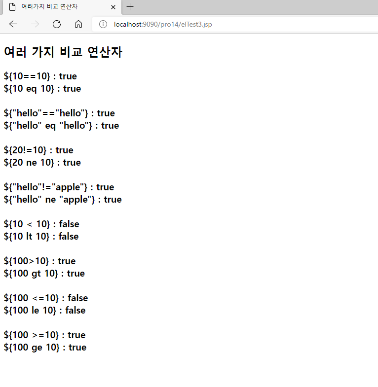
    

### 11.1.6 표현 언어의 논리 연산자

- 실습
  
    <elTest4.jsp>
    
    ```jsp
    <%@ page language="java" contentType="text/html; charset=UTF-8"
        pageEncoding="UTF-8"
        isELIgnored="false" %>
    
    <html>
       <head>
          <meta  charset=”UTF-8">
          <title>표현언어의 여러 가지 연산자들</title>
       </head>
       <body>
          <h2>여러가지 논리연산자</h2>
          <h2>
          \${(10==10) && (20==20)}  : ${(10==10)&&(20==20)} <br>
          \${(10==10) and (20!=20)}  : ${(10==10) and (20!=20)} <br><br>
     
          \${(10==10) || (20!=30)}  : ${(10==10)||(20==30)} <br>
          \${(10!=10) or (20!=20)}  : ${(10!=10) or (20!=20)} <br><br>
    
          \${!(20==10)}  : ${!(20==10)}<br>
          \${not (20==10)}  : ${not (20==10)}<br><br>
    
          \${!(20!=10)}  : ${!(20!=10)}<br>
          \${not(20!=10)}  : ${not(20!=10)}<br><br>       
       </h2>
       </body>
    </html>
    ```
    
- 실습 결과
  
    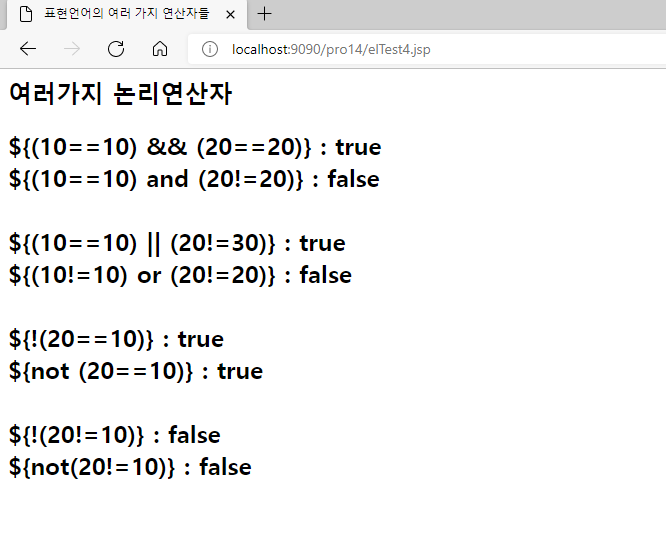
    

### 11.1.7 표현 언어의 empty 연산자

- 실습
  
    <elTest5.jsp>
    
    ```jsp
    <%@ page language="java" contentType="text/html; charset=UTF-8"
         import="java.util.*"
        pageEncoding="UTF-8"
        isELIgnored="false" %>
        
    <jsp:useBean  id="m1"  class="sec01.ex01.MemberBean" scope="page"  />
    <jsp:setProperty  name="m1"  property="name" value="이순신"/>
    <jsp:useBean  id="m2"  class="java.util.ArrayList" scope="page"  />
    
    <html>
    <head>
       <meta charset="UTF-8">
       <title>표현언어의 여러 가지 연산자들</title>
    </head>
    <body>
       empty 연산자
     <h2>
       \${empty m1 } : ${empty m1 } <br>
       \${not empty m1 } : ${not empty m1 } <br><br>
    
       \${empty m2 } : ${empty m2 } <br>
       \${not empty m2} : ${not empty m2 } <br><br>
    
       \${empty "hello"} : ${empty "hello" }<br>
       \${empty null} : ${empty null } <br>
       \${empty ""} : ${empty "" } <br>
    </h2>
    </body>
    </html>
    ```
    
- 실습 결과
  
    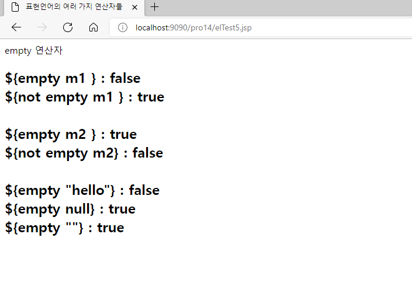
    
    - 유즈빈 액션태그로 빈 m1을 생성한 후 값을 설정했기 때문에 empty 연산자를 적용하면 false를 반환
    - 빈 m2는 생성 후 아무 것도 저장하지 않았기 때문에 empty 연산자를 적용하면 true 반환

## 11.2 표현 언어 내장 객체(내장 변수)

### 11.2.1 표현 언어에서 제공하는 내장 객체의 종류와 기능

- 표현 언어에서 제공하는 여러 가지 내장 객체
    1. 스코프
        - `pageScope` : page 영역에 바인딩된 객체 참조
        - `requestScope` : request에 바인딩된 객체 참조
        - `sessionScope` : session에 바인딩된 객체 참조
        - `applicationScope` : application에 바인딩된 객체 참조
    2. 요청 매개변수
        - `param` : request.getParameter() 메서드를 호출한 것과 같음
        - `paramValues` : request.getParameterValues() 메서드를 호출한 것과 같음
    3. 헤더 값
        - `header` : request.getHeader() 메서드를 호출한 것과 같음
        - `headerValues` : request.getHeader() 메서드를 호출한 것과 같음
    4. 쿠키 값
        - `Cookies` : 쿠키 이름의 값 반환
    5. JSP 내용
        - `pageContext` : pageContext 객체를 참조할 때 사용
    6. 초기 매개변수
        - `initParam` : 컨텍스트의 초기화 매개변수 이름의 값 반환

### 11.2.2 param 내장 객체 사용 실습

- 실습
    1. 회원 가입 창 작성
       
        <memberForm.jsp>
        
        ```jsp
        <%@ page language="java" contentType="text/html; charset=UTF-8"
            pageEncoding="UTF-8"%>
        <!DOCTYPE html>
        <html>
        <head>
           <meta charset="UTF-8">
           <title>회원 가입창</title>
        <body>
        <form method="post"   action="member1.jsp">
        <h1  style="text-align:center">회원 가입창</h1>
        <table  align="center">
            <tr>
               <td width="200"><p align="right">아이디</td>
               <td width="400"><input type="text" name="id"></td>
            </tr>
            <tr>
                <td width="200"><p align="right">비밀번호</td>
                <td width="400"><input type="password"  name="pwd"></td>
            </tr>
            <tr>
                <td width="200"><p align="right">이름</td>
                <td width="400"><p><input type="text"  name="name"></td>
            </tr>
            <tr>
                <td width="200"><p align="right">이메일</td>
                <td width="400"><p><input type="text"  name="email"></td>
            </tr>
            <tr>
                <td width="200"><p>&nbsp;</p></td>
                <td width="400">
        	<input type="submit" value="가입하기">
        	<input type="reset" value="다시입력">
          </td>
            </tr>
        </table>
        </form>
        </body>
        </html>
        ```
        
    2. 회원 정보 출력 창 작성
       
        <member1.jsp>
        
        ```jsp
        <%@ page language="java" contentType="text/html; charset=UTF-8"
            pageEncoding="UTF-8" 
            isELIgnored="false"  %>
        <%
           request.setCharacterEncoding("UTF-8");
           String id=request.getParameter("id");
           String pwd=request.getParameter("pwd");
           String name= request.getParameter("name");
           String email= request.getParameter("email");
          
        %>   
        <html>
        <head>
        <meta charset=”UTF-8">
        <title>회원 정보 출력창</title>
        </head>
        <body>
        <table border="1"  align="center" >
            <tr align="center" bgcolor="#99ccff">
              <td width="20%"><b>아이디</b></td>
              <td width="20%"><b>비밀번호</b></td>
              <td width="20%" ><b>이름</b></td>
              <td width="20%"><b>이메일</b></td>
           </tr>
           <tr align=center>
              <td><%=id %> </td>
              <td><%=pwd%> </td>
              <td><%=name %> </td>
              <td><%=email %> </td>
           </tr>   
           <tr align=center>
              <td>${param.id } </td>
              <td>${param.pwd } </td>
              <td>${param.name } </td>
              <td>${param.email }</td>
           </tr>
        </table>
        </body>
        </html>
        ```
        
        - getParameter() 메서드를 이용하지 않고 회원 정보 출력
          
            ```jsp
            <tr align=center>
                  <td>${param.id } </td>
                  <td>${param.pwd } </td>
                  <td>${param.name } </td>
                  <td>${param.email }</td>
            </tr>
            ```
    
- 실습 결과
    1. 회원 가입 정보 입력
       
        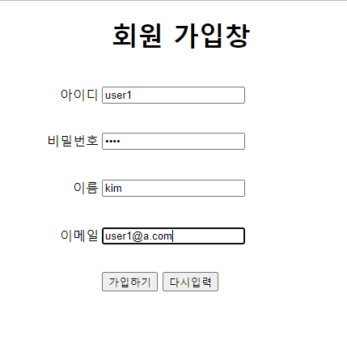
        
    2. 회원 정보 출력
       
        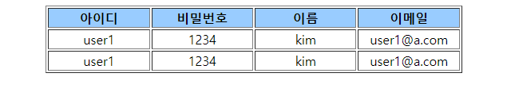
        
        - 첫 번째 회원 정보는 `getParameter()` 메서드로 가져온 것
        - 두 번째 회언 정보는 `param` 내장 객체로 출력한 결과

### 11.2.3 requestScope 사용 실습

- 실습
    1. 회원 가입창의 action 태그를 데이터를 바인딩하는 JSP로 수정
    2. 바인딩하는 JSP 작성
       
        <forward.jsp>
        
        ```jsp
        <%@ page language="java" contentType="text/html; charset=UTF-8"
            pageEncoding="UTF-8"%>
        <%
          request.setCharacterEncoding("utf-8");
          request.setAttribute("address","서울시 강남구");
        %>    
        
        <html>
        <head>
           <meta charset=”UTF-8">
           <title>forward</title>
        </head>
        <body>
           <jsp:forward page="member2.jsp"></jsp:forward>
        </body>
        </html>
        ```
        
        - `request.setAttribute("address","서울시 강남구");` : 회원 가입 창의 request에 대해 다시 주소 정보를 바인딩
        - `<jsp:forward page="member2.jsp"></jsp:forward>` : member2.jsp로 포워딩
    3. 회원 정보 출력 창 작성
       
        <member2.jsp>
        
        ```jsp
        <%@ page language="java" contentType="text/html; charset=UTF-8"
            pageEncoding="UTF-8" 
            isELIgnored="false"  %>
        <%
           request.setCharacterEncoding("UTF-8");
        %>   
        <html>
        <head>
        <meta charset=”UTF-8">
        <title>회원 정보 출력창</title>
        </head>
        <body>
        <table border="1"   align="center">
            <tr align="center" bgcolor="#99ccff">
               <td width="20%"><b>아이디</b></td>
               <td width="20%"><b>비밀번호</b></td>
               <td width="20%" ><b>이름</b></td>
               <td width="20%"><b>이메일</b></td>
               <td width="20%" ><b>주소</b></td>
            </tr>
        <tr align=center>
               <td>${param.id } </td>
               <td>${param.pwd} </td>
               <td>${param.name } </td>
               <td>${param.email }</td>
               <td>${requestScope.address}</td>
           </tr>
        </table>
        </body>
        </html>
        ```
        
        - `<td>${requestScope.address}</td>` : requestScope를 이용해 바인딩된 주소 정보 출력
- 실습 결과
  
    입력 값 : 11.2.2 실습과 동일
    
    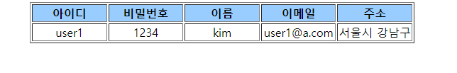
    

### 11.2.4 pageContext 객체 사용 실습

- `<a>` 태그를 이용해 다른 서블릿이나 JSP를 요청하는 방법
    1. 직접 컨텍스트 이름 입력
       
        ```html
        <a href="/pro14/test01/memberForm.jsp"> 회원 가입하기</a>
        ```
        
        - 컨텍스트 이름이 바뀌면 일일이 찾아서 수정해야 한다는 단점이 있음
    2. `getContextPath()` 메서드를 이용해 컨텍스트 이름을 가져오는 방법
       
        ```html
        <a href="<%=request.getContextPath() %>/test01/memberForm.jsp"> 회원가입하기</a>
        ```
        
        - 자바 코드가 사용되므로 화면 작업이 복잡해지는 단점이 있음
    3. pageContext 이용
       
        ```html
        <a href="${pageContext.request.contextPath}/test01/memberForm.jsp"> 회원가입하기 </a>
        ```
    
- 실습
    - 로그인 창 작성
      
        <login.jsp>
        
        ```jsp
        <%@ page language="java" contentType="text/html; charset=UTF-8"  pageEncoding="UTF-8"
        isELIgnored="false"  %>
        
        <!DOCTYPE html>
        <html>
        <head>
          <meta charset="UTF-8">
          <title>로그인창</title>
        </head>
        <body>
           <form action="result.jsp">
        	   아이디 : <input type="text" size=20 /><br>
        	   비밀번호: <input  type="password"  size=20 /><br>
        	   <input  type="submit" value="로그인" /> <input type="reset" value="다시입력"  />
           </form> 
           <br><br>
          <!--  <a href="http://localhost:8090/pro14/test01/memberForm.jsp">회원가입하기</a> -->
            <%--   <a href="<%=request.getContextPath() %>/test01/memberForm.jsp">회원가입하기</a>  --%>
           <a href="${pageContext.request.contextPath}/test01/memberForm.jsp">회원가입하기</a>
           
        </body>
        </html>
        ```
    
- 결과
    1. 로그인 창 요청
       
        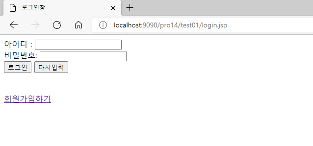
        
    2. 회원 가입창으로 이동
       
        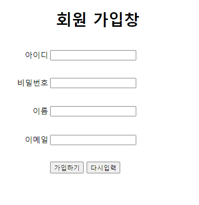
        

### 11.2.5 빈 사용 실습

- 빈 속성 접근
    - 형식
      
        ```javascript
        ${빈이름.속성이름}
        ```
    
- 실습
    1. 회원가입 창의 action 태그를 새로운 회원정보 조회 창으로 연결
    2. 회원정보 조회 창 작성
       
        <member3.jsp>
        
        ```jsp
        <%@ page language="java" contentType="text/html; charset=UTF-8"
            pageEncoding="UTF-8"
            isELIgnored="false" %>
        <%
          request.setCharacterEncoding("UTF-8");
        %>    
        <jsp:useBean  id="m" class="sec01.ex01.MemberBean" />
        <jsp:setProperty  name="m" property="*" />
        
        <meta  charset=”UTF-8">
        <html>
        <head>
        <title>회원 정보 출력창</title>
        </head>
        <body>
           <table align=center border="1" >
             <tr align="center" bgcolor="#99ccff">
                <td width=20%><b>아이디</b></td>
                <td width="20%" ><b>비밀번호</b></td>
                <td width="20%" ><b>이름</b></td>
                <td width="20%" ><b>이메일</b></td>		
             </tr>
             </tr>
             <tr align="center">
               <td><%=m.getId() %> </td>
               <td><%=m.getPwd() %></td>
               <td><%=m.getName() %></td>
               <td><%=m.getEmail() %></td>
        </tr>
             <tr align="center">
               <td>${m.id } </td>
               <td>${m.pwd} </td>
               <td>${m.name }</td>
               <td>${m.email }</td>
        </tr>
        </table>
        </body>
        </html>
        ```
        
        - 회원 정보를 저장할 빈 생성
          
            ```jsp
            <jsp:useBean  id="m" class="sec01.ex01.MemberBean" />
            ```
            
        - 전송된 회원 정보를 빈의 속성에 설정
          
            ```jsp
            <jsp:setProperty  name="m" property="*" />
            ```
            
        - 표현식을 이용한 회원 정보 출력
          
            ```jsp
            <td><%=m.getId() %> </td>
            <td><%=m.getPwd() %></td>
            <td><%=m.getName() %></td>
            <td><%=m.getEmail() %></td>
            ```
            
        - 빈 id와 속성 이름으로 회원 정보 출력
          
            ```jsp
            <td>${m.id } </td>
            <td>${m.pwd} </td>
            <td>${m.name }</td>
            <td>${m.email }</td>
            ```
    
- 실습 결과
    1. 회원 정보 입력
       
        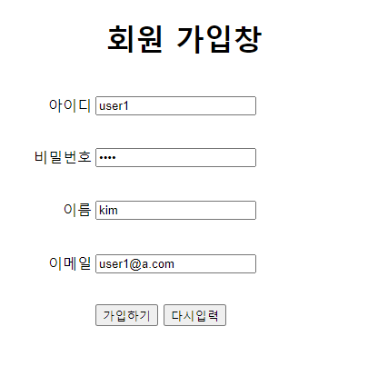
        
    2. 회원 정보 출력
       
        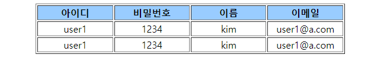
        

### 11.2.6 Collection 객체 사용 실습

- 형식
  
    ```javascript
    ${Collection객체이름[index].속성이름}
    ```
    
- 실습
    - 새로운 회원 정보 창 작성
      
        <member4.jsp>
        
        ```jsp
        <%@ page language="java" contentType="text/html; charset=UTF-8"
            import="java.util.*, sec01.ex01.*" pageEncoding="UTF-8" 
            isELIgnored="false"  %>
        <%
          request.setCharacterEncoding("UTF-8");
        %>    
        <jsp:useBean  id="m1" class="sec01.ex01.MemberBean"/>
        <jsp:setProperty name="m1" property="*"  />
        <jsp:useBean  id="membersList" class="java.util.ArrayList" />
        <%	
           MemberBean m2 = new MemberBean("son", "1234", "손흥민", "son@test.com");
           membersList.add(m1);
           membersList.add(m2);
        %>
        <html>
        <head>
        <meta  charset=UTF-8">
        <title>회원 정보 출력창</title>
        </head>
        <body>
        <table border=1  align="center"   >
           <tr align="center"  bgcolor="#99ccff">
              <td width="20%"><b>아이디</b></td>
              <td width="20%"><b>비밀번호</b></td>
              <td width="20%" ><b>이름</b></td>
              <td width="20%"><b>이메일</b></td>
        </tr>
          <tr align="center">
              <td>${membersList[0].id}</td>
              <td>${membersList[0].pwd}</td>
              <td>${membersList[0].name}</td>
              <td>${membersList[0].email}</td>
          </tr>
          <tr align="center">
              <td>${membersList[1].id}</td>
              <td>${membersList[1].pwd}</td>
              <td>${membersList[1].name}</td>
              <td>${membersList[1].email}</td>
        </tr>
        </table>
        </body>
        </html>
        ```
        
        - memberList로 ArrayList 객체 생성
          
            ```jsp
            <jsp:useBean  id="membersList" class="java.util.ArrayList" />
            ```
    
- 실습 결과
    1. 회원 정보 입력
       
        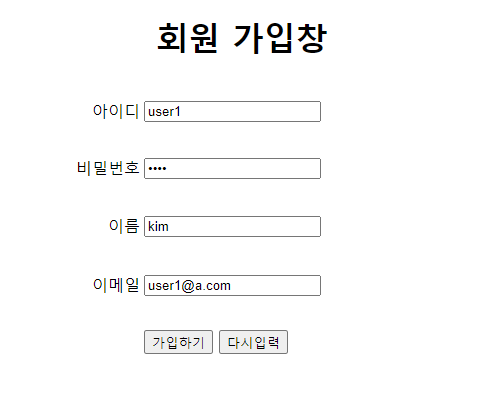
        
    2. 회원 정보 출력
       
        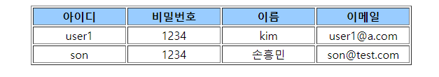
        

### 11.2.7 HashMap 사용 실습

- 형식
  
    ```javascript
    ${HashMap객체이름.키이름}
    ```
    
- 실습
    - 새로운 회원 정보 창 작성
      
        <member5.jsp>
        
        ```jsp
        <%@ page language="java" contentType="text/html; charset=UTF-8"
            import="java.util.*, sec01.ex01.*"
            pageEncoding="UTF-8" 
            isELIgnored="false"  %>
        <%
          request.setCharacterEncoding("UTF-8");
        %>    
        <jsp:useBean  id="m1" class="sec01.ex01.MemberBean"/>
        <jsp:setProperty name="m1" property="*"  />
        <jsp:useBean  id="membersList" class="java.util.ArrayList" />
        <jsp:useBean  id="membersMap" class="java.util.HashMap" />
        <%	
           membersMap.put("id", "park2");
           membersMap.put("pwd", "4321");
           membersMap.put("name","박지성");
           membersMap.put("email","park2@test.com");
           
           MemberBean m2 = new MemberBean("son", "1234", "손흥민", "son@test.com");
           membersList.add(m1);
           membersList.add(m2); 
           membersMap.put("membersList",  membersList);  
        %>
        <html>
        <head>
        <meta charset=”UTF-8">
        <title>회원 정보 출력창</title>
        </head>
        <body>
        <table border=1  align="center" >
            <tr align=center bgcolor="#99ccff">
              <td width="20%"><b>아이디</b></td>
              <td width="20%"><b>비밀번호</b></td>
              <td width="20%" ><b>이름</b></td>
              <td width="20%"><b>이메일</b></td>
        </tr>
        <tr align=center>
              <td>${membersMap.id}</td>
              <td>${membersMap.pwd}</td>
              <td>${membersMap.name}</td>
              <td>${membersMap.email }</td> 
        </tr>
            <tr align=center>
              <td>${membersMap.membersList[0].id}</td>
              <td>${membersMap.membersList[0].pwd}</td>
              <td>${membersMap.membersList[0].name}</td>
              <td>${membersMap.membersList[0].email}</td>
           </tr>
           <tr align=center>
              <td>${membersMap.membersList[1].id}</td>
              <td>${membersMap.membersList[1].pwd}</td>
              <td>${membersMap.membersList[1].name}</td>
              <td>${membersMap.membersList[1].email}</td>
        </tr>
        </table>
        </body>
        ```
        
        - MemberBean 객체를 저장할 ArrayList 객체 생성
          
            ```jsp
            <jsp:useBean  id="membersList" class="java.util.ArrayList" />
            ```
            
        - HashMap 객체 생성
          
            ```jsp
            <jsp:useBean  id="membersMap" class="java.util.HashMap" />
            ```
            
        - 회원 정보가 저장된 memberList를 memberList라는 key로 HashMap에 저장
          
            ```java
            membersMap.put("membersList",  membersList);
            ```
    
- 실습 결과
    1. 회원 정보 입력
       
        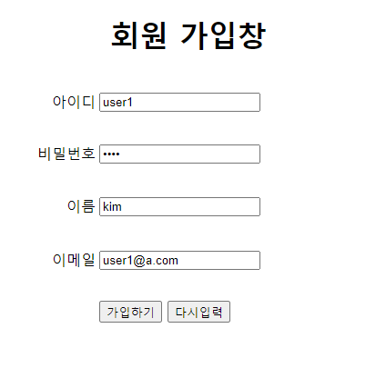
        
    2. 회원 정보 출력
       
        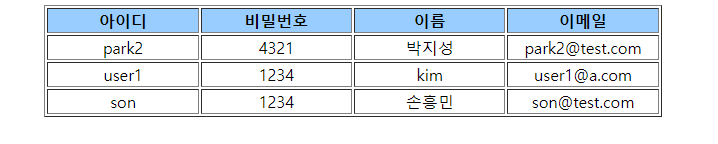
        

### 11.2.8 has-a 관계 빈 사용 실습

- has-a 관계
    - 객체가 다른 겍체를 속성으로 가지는 경우
    - 형식
      
        ```javascript
        ${부모빈이름.자식속성이름.속성이름}
        ```
    
- 실습
    1. 빈 클래스 작성
       
        <MemberBean.java>
        
        ```java
        package sec01.ex02;
        
        import java.sql.Date;
        
        public class MemberBean {
        	private String id;
        	private String pwd;
        	private String name;
        	private String email;
        	private Date joinDate;
        	private Address addr;
        	
        	
        	public MemberBean() {
        		
        	}
        
        	public MemberBean(String id, String pwd, String name, String email) {
        		this.id = id;
        		this.pwd = pwd;
        		this.name = name;
        		this.email = email;
        	}
        
        	public String getId() {
        		return id;
        	}
        
        	public void setId(String id) {
        		this.id = id;
        	}
        
        	public String getPwd() {
        		return pwd;
        	}
        
        	public void setPwd(String pwd) {
        		this.pwd = pwd;
        	}
        
        	public String getName() {
        		return name;
        	}
        
        	public void setName(String name) {
        		this.name = name;
        	}
        
        	public String getEmail() {
        		return email;
        	}
        
        	public void setEmail(String email) {
        		this.email = email;
        	}
        
        	public Date getJoinDate() {
        		return joinDate;
        	}
        
        	public void setJoinDate(Date joinDate) {
        		this.joinDate = joinDate;
        	}
        
        	public Address getAddr() {
        		return addr;
        	}
        
        	public void setAddr(Address addr) {
        		this.addr = addr;
        	}
        	
        	
        }
        ```
        
        - 주소 정보를 저장하는 Address 클래스 타입 속성 선언
    2. 회원의 거주 도시와 우편번호를 저장하는 자식 클래스 Address 작성
       
        <Address.java>
        
        ```java
        package sec01.ex02;
        
        public class Address {
        	private String city;
        	private String zipcode;
        	
        	public Address() {
        		
        	}
        
        	public String getCity() {
        		return city;
        	}
        
        	public void setCity(String city) {
        		this.city = city;
        	}
        
        	public String getZipcode() {
        		return zipcode;
        	}
        
        	public void setZipcode(String zipcode) {
        		this.zipcode = zipcode;
        	}
        	
        	
        	
        	
        
        }
        ```
        
    3. 회원 가입 창의 action 태그를 새로 생성할 회원 정보 조회 창으로 연결
    4. 새로운 회원 정보 조회 창 작성
       
        <member6.jsp>
        
        ```jsp
        <%@ page language="java" contentType="text/html; charset=UTF-8"
            pageEncoding="UTF-8" 
            isELIgnored="false"  %>
        <%
          request.setCharacterEncoding("UTF-8");
        %>    
        <jsp:useBean  id="m" class="sec01.ex02.MemberBean" />
        <jsp:setProperty  name="m" property="*" />
        <jsp:useBean   id="addr" class="sec01.ex02.Address"/>
        <jsp:setProperty   name="addr" property="city" value="서울"/>
        <jsp:setProperty   name="addr" property="zipcode" value="07654"/>
        <%
          m.setAddr(addr);
        %> 
        <html>
        <head>
        <meta charset=”UTF-8">
        <title>회원 정보 출력창</title>
        </head>
        <body>
        <table border=1 align="center"   >
           <tr align="center"  bgcolor="#99ccff" >
              <td width="7%"><b>아이디</b></td>
              <td width="7%"><b>비밀번호</b></td>
              <td width="5%" ><b>이름</b></td>
              <td width="5%"><b>이메일</b></td>
        <td width="5%" ><b>도시</b></td>
              <td width="5%" ><b>우편번호</b></td>
           </tr>
           <tr align="center">
              <td>${m.id } </td>
              <td>${m.pwd } </td>
              <td>${m.name } </td>
              <td>${m.email}</td>
              <td><%=m.getAddr().getCity() %></td>
              <td><%=m.getAddr().getZipcode() %></td>   
           </tr>
           <tr align="center">
              <td>${m.id } </td>
              <td>${m.pwd } </td>
              <td>${m.name} </td>
              <td>${m.email}</td>
        <td>${m.addr.city}</td>
              <td>${m.addr.zipcode}</td>
           </tr>
        </table>
        </body>
        </html>
        ```
        
        - has-a 관계로 주소 출력
          
            ```jsp
            <td>${m.addr.city}</td>
            <td>${m.addr.zipcode}</td>
            ```
    
- 실습 결과
    1. 회원 정보 입력
       
        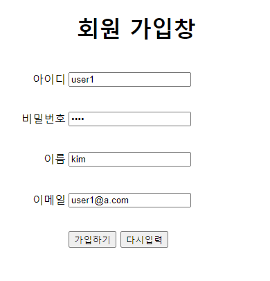
        
    2. 회원 정보 출력
       
        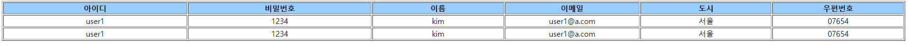
        
    

## 11.3 표현 언어로 바인딩 속성 출력하기

### 11.3.1 내장 객체 속성 값 출력 실습

- 실습 1 : 내장 객체에 회원 정보 바인딩 후 출력
    1. 바인딩하는 JSP 작성
       
        <forward1.jsp>
        
        ```jsp
        <%@ page language="java" contentType="text/html; charset=UTF-8"
            pageEncoding="UTF-8"%>
        <%
          request.setCharacterEncoding("utf-8");
          request.setAttribute("id","hong");
          request.setAttribute("pwd", "1234");
          session.setAttribute("name", "홍길동");
          application.setAttribute("email", "hong@test.com");
        %>    
        
        <html>
        <head>
        <meta  charset=”UTF-8">
        <title>forward1</title>
        </head>
        <body>
           <jsp:forward page="member1.jsp" />
        </html>
        ```
        
    2. 포워딩된 정보 출력 창 작성
       
        <member1.jsp>
        
        ```jsp
        <%@ page language="java" contentType="text/html; charset=UTF-8"
            pageEncoding="UTF-8" 
            isELIgnored="false"  %>
        <%
           request.setCharacterEncoding("UTF-8");
           String id= (String)request.getAttribute("id");
           String pwd= (String)request.getAttribute("pwd");
           String name= (String)session.getAttribute("name");
           String email= (String)application.getAttribute("email");
          
        %>   
        <html>
        <head>
        <meta charset=”UTF-8">
        <title>회원 정보 출력창</title>
        </head>
        <body>
        <table border="1"  align="center" >
            <tr align="center" bgcolor="#99ccff">
              <td width="20%"><b>아이디</b></td>
              <td width="20%"><b>비밀번호</b></td>
              <td width="20%" ><b>이름</b></td>
              <td width="20%"><b>이메일</b></td>
           </tr>
           <tr align="center">
              <td><%=id %> </td>
              <td><%=pwd%> </td>
              <td><%=name %> </td>
              <td><%=email %> </td>
           </tr>   
           <tr align="center">
              <td>${id} </td>
              <td>${pwd} </td>
              <td>${name} </td>
              <td>${email}</td>
           </tr>
        </table>
        </body>
        </html>
        ```
        
        - 표현식으로 회원 정보 출력
          
            ```jsp
            <td><%=id %> </td>
            <td><%=pwd%> </td>
            <td><%=name %> </td>
            <td><%=email %> </td>
            ```
            
        - 자바 코드 없이 바인딩된 속성 이름으로 회원 정보 출력
          
            ```jsp
            <td>${id} </td>
            <td>${pwd} </td>
            <td>${name} </td>
            <td>${email}</td>
            ```
    
- 실습 1 결과
    - 바인딩하는 창으로 요청하여 회원 정보 출력
      
        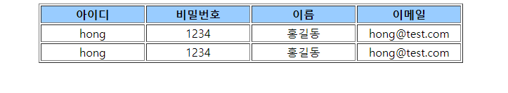
    
- 실습 2 : request에 회원 정보를 저장한 MemberBean 객체를 바인딩 후 출력
    1. 바인딩 하는 JSP 작성
       
        <forward2.jsp>
        
        ```jsp
        <%@ page language="java" contentType="text/html; charset=UTF-8"
             import="sec01.ex01.*"  pageEncoding="UTF-8"%>
        <%
          request.setCharacterEncoding("utf-8");
          MemberBean member = new MemberBean("lee", "1234", "이순신", "lee@test.com");
          request.setAttribute("member", member);
        %>    
        
        <html>
        <head>
        <meta  charset=”UTF-8">
        <title>forward2</title>
        </head>
        <body>
           <jsp:forward page="member2.jsp" />
        </html>
        ```
        
        - MemberBean 객체를 생성하고 속성에 회원 정보 설정
        - member2.jsp로 포워딩
    2. 포워딩 된 정보 출력 창 작성
       
        <member2.jsp>
        
        ```jsp
        <%@ page language="java" contentType="text/html; charset=UTF-8"
            pageEncoding="UTF-8"    isELIgnored="false"  %>
          
        <html>
        <head>
        <meta charset=”UTF-8">
        <title>회원 정보 출력창</title>
        </head>
        <body>
        <table border="1"  align="center" >
            <tr align="center" bgcolor="#99ccff">
              <td width="20%"><b>아이디</b></td>
              <td width="20%"><b>비밀번호</b></td>
              <td width="20%" ><b>이름</b></td>
              <td width="20%"><b>이메일</b></td>
           </tr>
           <tr align="center">
              <td>${member.id} </td>
              <td>${member.pwd} </td>
              <td>${member.name} </td>
              <td>${member.email}</td>
           </tr>
        </table>
        </body>
        </html>
        ```
        
        - 바인딩 시 사용한 속성 이름으로 MemberBean 속성에 접근하여 회원 정보 출력
- 실습 2 결과
    - 포워딩하는 JSP로 요청
      
        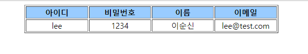
    
- 실습 3 : request에 회원 정보를 저장한 ArrayList를 바인딩 후 출력
    1. 바인딩하는 JSP 작성
       
        <forward3.jsp>
        
        ```jsp
        <%@ page language="java" contentType="text/html; charset=UTF-8"
            import="java.util.*, sec01.ex01.*" pageEncoding="UTF-8" 
            isELIgnored="false"  %>
        <%
           request.setCharacterEncoding("UTF-8");
           List membersList = new ArrayList();
           MemberBean m1 = new MemberBean("lee", "1234", "이순신", "lee@test.com");
           MemberBean m2 = new MemberBean("son", "1234", "손흥민", "son@test.com");
           membersList.add(m1);
           membersList.add(m2);
           request.setAttribute("membersList", membersList);
        %>
        <!DOCTYPE html>
        <html>
        <head>
        <meta charset="UTF-8">
        <title>forward3</title>
        </head>
        <body>
          <jsp:forward page="member3.jsp" />
        </body>
        </html>
        ```
        
    2. 포워딩 된 정보를 출력하는 JSP 작성
       
        <member3.jsp>
        
        ```jsp
        <%@ page language="java" contentType="text/html; charset=UTF-8"
             pageEncoding="UTF-8"   isELIgnored="false"  %>
        <%
          request.setCharacterEncoding("UTF-8");
        %>    
        
        <html>
        <head>
        <meta  charset=UTF-8">
        <title>회원 정보 출력창</title>
        </head>
        <body>
        <table border=1  align="center"   >
           <tr align="center"  bgcolor="#99ccff">
              <td width="20%"><b>아이디</b></td>
              <td width="20%"><b>비밀번호</b></td>
              <td width="20%" ><b>이름</b></td>
              <td width="20%"><b>이메일</b></td>
        </tr>
          <tr align="center">
              <td>${membersList[0].id}</td>
              <td>${membersList[0].pwd}</td>
              <td>${membersList[0].name}</td>
              <td>${membersList[0].email}</td>
          </tr>
          <tr align="center">
              <td>${membersList[1].id}</td>
              <td>${membersList[1].pwd}</td>
              <td>${membersList[1].name}</td>
              <td>${membersList[1].email}</td>
        </tr>
        </table>
        </body>
        </html>
        ```
    
- 실습 3 결과
  
    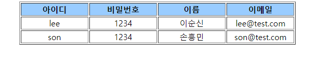
    

### 11.3.2 스코프 우선순위

- 스코프 우선순위
    - 각 내장 객체에 바인딩하는 속성 이름이 같은 경우 우선순위에 따라 순서대로 속성에 접근
    - 우선순위
      
        page > request > session > application
    
- 실습
    1. 바인딩 JSP 작성
       
        <forward4.jsp>
        
        ```jsp
        <%@ page language="java" contentType="text/html; charset=UTF-8"
            pageEncoding="UTF-8"%>
        <%
          request.setCharacterEncoding("utf-8");
          request.setAttribute("id","hong");
          request.setAttribute("pwd", "1234");
          session.setAttribute("name", "홍길동");
          application.setAttribute("email", "hong@test.com");
          //request.setAttribute("address","서울시 강남구");
        %>    
        
        <html>
        <head>
        <meta  charset=”UTF-8">
        <title>forward2</title>
        </head>
        <body>
           <jsp:forward page="member4.jsp" />
        </html>
        ```
        
    2. 포워딩 된 정보를 출력하는 JSP 작성
       
        <member4.jsp>
        
        ```jsp
        <%@ page language="java" contentType="text/html; charset=UTF-8"
            pageEncoding="UTF-8"
            isELIgnored="false"%>
        <%
          session.setAttribute("address","수원시 팔달구");
        %> 
        
        <html>
        <head>
        <meta charset=”UTF-8">
        <title>회원 정보 출력창</title>
        </head>
        <body>
        <table border="1" align="center"   >
           <tr align="center"  bgcolor="#99ccff">
              <td width="7%"><b>아이디</b></td>
              <td width="7%"><b>비밀번호</b></td>
              <td width="5%" ><b>이름</b></td>
              <td width="5%"><b>이메일</b></td>
              <td width="5%" ><b>주소</b></td>
           <tr>
           <tr align="center">
               <td>${id } </td>
               <td>${pwd } </td>
               <td>${name } </td>
               <td>${email }</td>
               <td>${address }</td>
            </tr>
        </table>
        </html>
        ```
    
- 실습 결과
  
    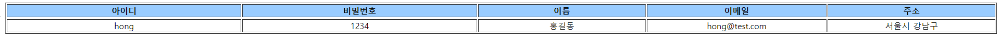
    

## 11.4 커스텀 태그

### 11.4.1 커스텀 태그

- 커스텀 태그
    - JSP 페이지에서 자주 사용하는 자바 코드를 대체하기 위해 만든 태그
    - 종류
        1. JSTL(JSP Standard Tag Library)
            - JSP 페이지에서 가장 많이 사용하는 기능을 태그로 제공
            - JSTL 라이브러리를 따로 설치해서 사용
        2. 개발자가 만든 커스텀 태그
            - 개발자가 필요에 의해 만든 태그
            - 스트러츠나 스프링 프레임워크에서 미리 만들어서 제공

## 11.5 JSP 표준 태그 라이브러리(JSTL)

### 11.5.1 JSTL 태그 종류

- JSTL 태그 종류
    1. 코어
        - 기능 : 변수 지원, 흐름 제어, 반복문 처리, URL 처리
        - 접두어 : `c`
    2. 국제화
        - 기능 : 지역, 메시지 형식, 숫자 및 날짜 형식
        - 접두어 : `fmt`
    3. XML
        - 기능 : XML 코어, 흐름 제어, XML 변환
        - 접두어 : `x`
    4. 데이터베이스
        - 기능 : SQL
        - 접두어 : `sql`
    5. 함수
        - 기능 : 컬렉션 처리, 문자열 처리
        - 접두어 : `fn`

## 11.6 Core 태그 라이브러리 사용하기

### 11.6.1 Core 태그 라이브러리 기능

- Core 태그
    - 선언, 조건식, 반복문 기능에 대한 자바 코드를 대체할 수 있음
    - 톰캣에서는 JSTL 라이브러리를 기본으로 제공하지 않고 외부 라이브러리에서 가져와 기능 수행
    - 코어 태그 라이브러리를 사용하려면 JSP 페이지 상단에 태그를 추가해야 함
      
        ```html
        <%@ taglib prefix="c" uri="http://java.sun.com/jsp/jstl/core"%>
        ```
    
- Core 태그 라이브러리 기능
    1. 변수 지원
        - `<c:set>` : JSP 페이지에서 변수 지정
        - `<c:remove>` : 지정된 변수 제거
    2. 흐름 제어
        - `<c:if>` : 조건문 사용
        - `<c:choose>` : switch 문 사용(`<c:when>`, `<c:otherwise>` 서브 태그를 가짐)
        - `<c:forEach>` : 반복문 사용
        - `<c:forTokens>` : 구분자로 분리된 각각의 토큰을 처리할 때 사용
    3. URL 처리
        - `<c:import>` : URL을 이용해 다른 자원을 JSP 페이지에 추가
        - `<c:redirect>` : `response.senRedirect()` 기능 수행
        - `<c:url>` : 요청 매개변수로부터 URL 생성
    4. 기타
        - `<c:catch>` : 예외 처리에 사용
        - `<c:out>` : JspWriter에 내용을 처리한 후 출력

### 11.6.2 <c:set> 태그를 이용한 실습

- 형식
  
    ```html
    <c:set var="변수 이름" value="변수값" [scope="scope 속성 중 하나"] />
    ```
    
- 실습 1
    - 상단에 taglib 디렉티브 태그를 선언하고 태그를 이용하는 JSP 작성
      
        <member1.jsp>
        
        ```jsp
        <%@ page language="java" contentType="text/html; charset=UTF-8"
            pageEncoding="UTF-8"
            isELIgnored="false" %>
        <%@ taglib prefix="c" uri="http://java.sun.com/jsp/jstl/core" %>
        <%
          request.setCharacterEncoding("UTF-8");
        %>  
        
        <c:set  var="id"  value="hong"  scope="page" />
        <c:set  var="pwd"  value="1234"  scope="page" />
        <c:set  var="name"  value="${'홍길동'}"  scope="page" />
        <c:set  var="age"  value="${22}"  scope="page" />
        <c:set  var="height"  value="${177}"  scope="page" />
        
        <html>
        <head>
          <meta charset=”UTF-8">
          <title>회원 정보 출력창</title>
        </head>
        <body>
        <table  align="center"  border=1  >
           <tr align="center"  bgcolor="lightgreen" >
              <td width="7%" ><b>아이디</b></td>
              <td width="7%" ><b>비밀번호</b></td>
              <td width="7%" ><b>이름</b></td>
              <td width="7%" ><b>나이</b></td>
              <td width="7%" ><b>키</b></td>
           </tr>
           <tr align="center">
              <td>${id}</td>
              <td>${pwd}</td>
              <td>${name}</td>
              <td>${age}</td>
              <td>${height}</td>
           </tr>
        </table>
        ```
        
        - 표현 언어로 변수에 바로 접근하여 값을 출력
- 실습 1 결과
  
    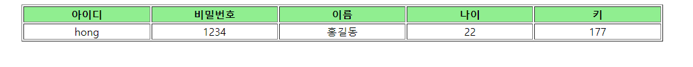
    
- 실습 2 : `<c:set>` 태그를 이용해서 길이가 긴 변수나 속성 이름을 간결하게 만들기
  
    <login.jsp>
    
    ```jsp
    <%@ page language="java" contentType="text/html; charset=UTF-8"
        pageEncoding="UTF-8"
         isELIgnored="false"  %>
    <%@ taglib prefix="c" uri="http://java.sun.com/jsp/jstl/core"  %>
    <c:set var="contextPath" value="${pageContext.request.contextPath}"  />
    <!DOCTYPE html>
    <html>
    <head>
      <meta charset="UTF-8">
      <title>로그인 창</title>
    </head>
    <body>
       <form action="result.jsp">
    아이디 : <input type="text" size=20 /><br>
    비밀번호: <input  type="password"  size=20 /><br>
    <input  type="submit" value="로그인" /> <input type="reset" value="다시입력"  />
       </form> 
       <br><br>
       <%-- 
    <a href="${pageContext.request.contextPath}/memberForm.jsp">회원등록하기</a>
     --%>
          <a href="${contextPath}/test03/memberForm.jsp">회원등록하기</a>
       
    </body>
    </html>
    ```
    
- 실습 3 : `<c:set>` 태그를 이용해서 바인딩된 속성 이름이 긴 경우 짧은 변수로 대체
  
    <member2.jsp>
    
    ```jsp
    <%@ page language="java" contentType="text/html; charset=UTF-8"
        import="java.util.*,sec01.ex01.*"
        pageEncoding="UTF-8"  isELIgnored="false"  %>
    <%@ taglib prefix="c" uri="http://java.sun.com/jsp/jstl/core" %>
    <%
      request.setCharacterEncoding("UTF-8");
    %>    
    <jsp:useBean  id="membersList" class="java.util.ArrayList" />
    <jsp:useBean  id="membersMap" class="java.util.HashMap" />
    <%	
        membersMap.put("id", "park2");
        membersMap.put("pwd", "4321");
        membersMap.put("name", "박지성");
        membersMap.put("email", "park2@test.com");
        MemberBean m1 = new MemberBean("son", "1234", "손흥민", "son@test.com");
    MemberBean m2 = new MemberBean("ki", "4321", "기성용", "ki@test.com");
        membersList.add(m1);
        membersList.add(m2); 
        membersMap.put("membersList",  membersList);  
    %>
    <c:set var="membersList" value="${membersMap.membersList}"  />
    
    <html>
    <head>
    <meta  charset=”UTF-8">
    <title>회원 정보 출력 창</title>
    </head>
    <body>
    <table border=”1”  align="center" >
        <tr align=center bgcolor="#99ccff">
          <td width="20%"><b>아이디</b></td>
          <td width="20%"><b>비밀번호</b></td>
          <td width="20%" ><b>이름</b></td>
          <td width="20%"><b>이메일</b></td>
    </tr>
    <tr align=”center”>
          <td>${membersMap.id}</td>
          <td>${membersMap.pwd}</td>
          <td>${membersMap.name}</td>
          <td>${membersMap.email }</td> 
    </tr>
        <tr align=”center”>
          <td>${membersList[0].id}</td>
          <td>${membersList[0].pwd}</td>
          <td>${membersList[0].name}</td>
          <td>${membersList[0].email}</td>
       </tr>
       <tr align=”center”>
          <td>${membersList[1].id}</td>
          <td>${membersList[1].pwd}</td>
          <td>${membersList[1].name}</td>
          <td>${membersList[1].email}</td>
    </tr>
    </table>
    </body>
    </html>
    ```
    

### 11.6.3 <c:remove> 태그를 이용한 실습

- 형식
  
    ```html
    <c:remove var="변수이름" [scope="scope 속성 중 하나"] />
    ```
    
- 실습
  
    <member3.jsp>
    
    ```jsp
    <%@ page language="java" contentType="text/html; charset=UTF-8"
        pageEncoding="UTF-8"
        isELIgnored="false" %>
    <%@ taglib prefix="c" uri="http://java.sun.com/jsp/jstl/core" %>
    <%
      request.setCharacterEncoding("UTF-8");
    %>  
    
    <c:set  var="id"  value="hong"  scope="page" />
    <c:set  var="pwd"  value="1234"  scope="page" />
    <c:set  var="name"  value="${'홍길동'}"  scope="page" />
    <c:set  var="age"  value="${22}"  scope="page" />
    <c:set  var="height"  value="${177}"  scope="page" />
    
    <c:remove var="age"  />
    <c:remove var="height"  />
    <html>
    <head>
    <meta charset=”UTF-8">
    <title>회원 정보 출력 창</title>
    </head>
    <body>
    <table  align="center"  border="1" >
       <tr align="center"  bgcolor="lightgreen" >
          <td width="7%" ><b>아이디</b></td>
          <td width="7%" ><b>비밀번호</b></td>
          <td width="7%" ><b>이름</b></td>
          <td width="7%"><b>나이</b></td>
          <td width="7%" ><b>키</b></td>
       </tr>
       <tr align="center">
          <td>${id}</td>
          <td>${pwd}</td>
          <td>${name}</td>
          <td>${age}</td>
          <td>${height}</td>
       </tr>
    </table>
    </body>
    </html>
    ```
    
- 실습 결과
  
    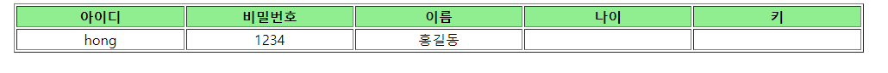
    

### 11.6.4 <c:if> 태그를 이용한 실습

- 형식
  
    ```jsp
    <c:if test="${조건식}" var="변수이름 [scope="scope 속성 중 하나"]>
    	...
    </c:if>
    ```
    
- 실습
  
    <member4.jsp>
    
    ```jsp
    <%@ page language="java" contentType="text/html; charset=UTF-8"
        pageEncoding="UTF-8"
        isELIgnored="false" %> 
    <%@ taglib prefix="c" uri="http://java.sun.com/jsp/jstl/core" %>
    <%
      request.setCharacterEncoding("UTF-8");
    %>  
    <c:set  var="id"  value="hong"  scope="page" />
    <c:set  var="pwd"  value="1234"  scope="page" />
    <c:set  var="name"  value="${'홍길동'}"  scope="page" />
    <c:set  var="age"  value="${22}"  scope="page" />
    <c:set  var="height"  value="${177}"  scope="page" />
    
    <html>
    <head>
      <meta charset="UTF-8">
      <title>조건문 실습</title>
    </head>
    <body>
    <c:if test="${true}">
      <h1>항상 참입니다.</h1>
    </c:if>
    
    <c:if test="${11==11}">
      <h1>두 값은 같습니다.</h1>
    </c:if>
    
    <c:if test="${11!=31}">
      <h1>두 값은 같지 않습니다.</h1>
    </c:if>
    
    <c:if test="${(id=='hong') && (name=='홍길동')}">
      <h1>아이디는 ${id}이고, 이름은 ${name }입니다.</h1>
    </c:if>
    
    <c:if test="${age==22}">
      <h1>${name }의 나이는 ${age}살입니다.</h1>
    </c:if>
    
    <c:if test="${height>160}">
      <h1>${name }의 키는 160보다 큽니다.</h1>
    </c:if>
    </body>
    </html>
    ```
    
- 실습 결과
  
    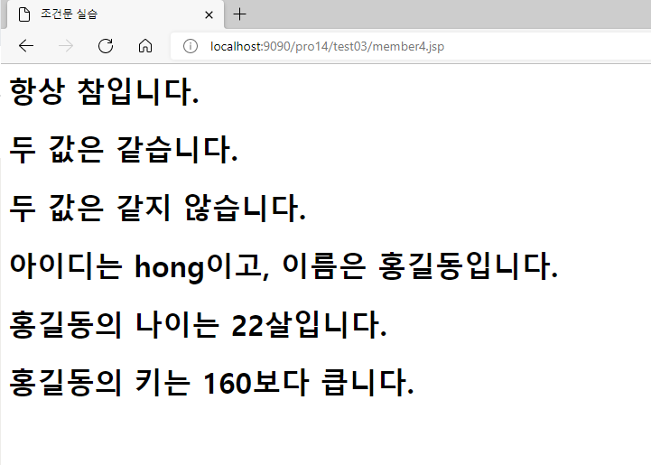
    

### 11.6.5 <c:choose> 태그를 이용한 실습

- 형식
  
    ```jsp
    <c:choose>
    	<c:when test="조건식1" >본문내용1</c:when>
    	<c:when test="조건식2" >본문내용2</c:when>
    	...
    	<c:otherwise>본문내용n</c:otherwise>
    </c:choose>
    ```
    
- 실습
  
    <member5.jsp>
    
    ```jsp
    <%@ page language="java" contentType="text/html; charset=UTF-8"
        pageEncoding="UTF-8"
        isELIgnored="false" %> 
    <%@ taglib prefix="c" uri="http://java.sun.com/jsp/jstl/core" %>
    <%
      request.setCharacterEncoding("UTF-8");
    %>  
    <c:set  var="id"  value="hong"  scope="page" />
    <c:set  var="pwd"  value="1234"  scope="page" />
    <c:set  var="name"  value="${'홍길동'}"  scope="page" />
    <c:set  var="age"  value="${22}"  scope="page" />
    <c:set  var="height"  value="${177}"  scope="page" />
    <html>
    <head>
    <meta charset=”UTF-8">
    <title>회원 정보 출력 창</title>
    </head>
    <body>
    <table align="center" border="1"  >
       <tr align="center"  bgcolor="lightgreen">
          <td width="7%" ><b>아이디</b></td>
          <td width="7%" ><b>비밀번호</b></td>
          <td width="7%" ><b>이름</b></td>
          <td width="7%"><b>나이</b></td>
          <td width="7%" ><b>키</b></td>
       </tr>
    <c:choose> 
       <%-- <c:when test="${name==null}"> --%>
       <c:when test="${empty name}">
          <tr align="center">
             <td colspan=5 >이름을 입력하세요!!</td> 
          </tr>
       </c:when>
       <c:otherwise >
          <tr align="center">
             <td>${id}</td>
             <td>${pwd}</td>
             <td>${name}</td>
             <td>${age}</td>
             <td>${height}</td>
          </tr>
       </c:otherwise>
    </c:choose>   
    </table>
    </body>
    </html>
    ```
    
- 실습 결과
    1. 제대로 정보를 입력한 경우
       
        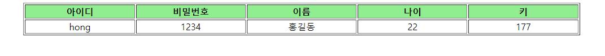
        
    2. 이름을 입력하지 않은 경우
       
        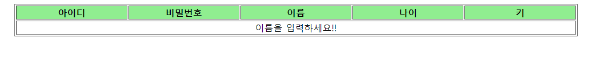
        

---