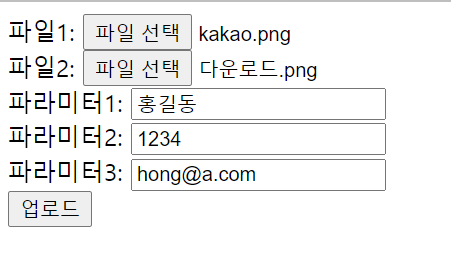
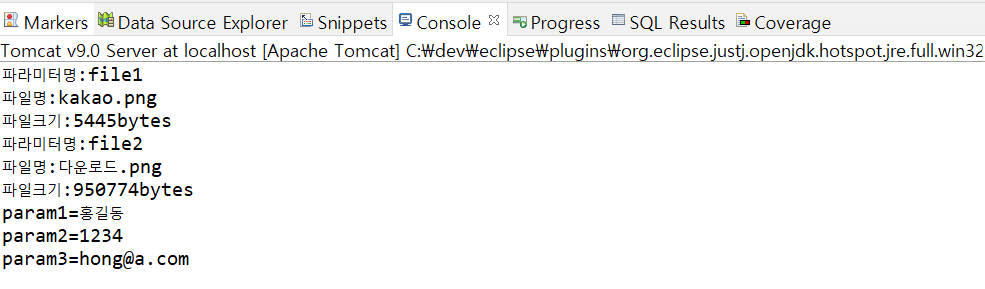
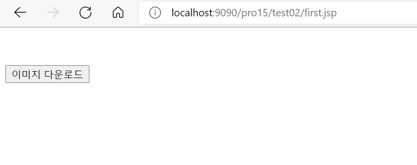

# 12. JSP Open Source

## 12.1 JSP에서 파일 업로드

### 12.1.1 파일 업로드 라이브러리 설치

- 파일 업로드 라이브러리
    - jakarta.apache.org에서 commons-fileupload-1.3.3-bin.zip을 다운받아 WEB-INF 하위 lib 폴더에 commons-fileupload-1.3.3.jar 복사

### 12.1.2 commons-io-2.6.jar 파일 설치

- commons-io-2.6.jar 파일 설치
    - [https://commons.apaches.org/proper/commons-io/download_io.cgi에](https://commons.apaches.org/proper/commons-io/download_io.cgi에) 접속해서 commons-io-2.6-bin.zip 다운로드
    - commons-io-2.6.jar을 WEB-INF의 lib에 복사

### 12.1.3 파일 업로드 관련 API

- DiskFileItemFactory 클래스가 제공하는 메서드
    - `setRepository()` : 파일을 저장할 디렉터리를 설정
    - `setSizeThreadhold()` : 최대 업로드 가능한 파일 크기 설정
- ServletFileUpload 클래스가 제공하는 메서드
    - `parseRequest()` : 전송된 매개변수를 List 객체로 얻음
    - `getItemIterator()` : 전송된 매개변수를 Iterator 타입으로 얻음

### 12.1.4 JSP 페이지에서 파일 업로드

- 실습
    1. 파일 업로드 화면 생성 및 작성
       
        <uploadForm.jsp>
        
        ```jsp
        <%@ page language="java" contentType="text/html; charset=UTF-8"
            pageEncoding="UTF-8"
            isELIgnored="false" %>
        <%@ taglib prefix="fmt" uri="http://java.sun.com/jsp/jstl/fmt" %>    
        <%@ taglib prefix="c" uri="http://java.sun.com/jsp/jstl/core" %>
        
        <c:set var="contextPath"  value="${pageContext.request.contextPath}"  />
        
        <%
          request.setCharacterEncoding("UTF-8");
        %>    
        <html>
        <head>
        <meta charset="UTF-8">
         <head>
           <title>파일 업로드창</title>
         </head> <body>
           <form action="${contextPath}/upload.do"  method="post" enctype="multipart/form-data" >
              파일1: <input type="file" name="file1" ><br>
              파일2: <input type="file" name="file2" > <br>
              파라미터1: <input type="text" name="param1" > <br>
              파라미터2: <input type="text" name="param2" > <br>
              파라미터3: <input type="text" name="param3" > <br>
         <input type="submit" value="업로드" >
        </form>
         </body>
        </html>
        ```
        
        - 서블릿에 요청해 파일을 업로드
          
            ```jsp
            action="${contextPath}/upload.do"
            ```
            
        - 파일 업로드 시 encType을 multipart/form-data로 설정해야 함
    2. 파일 업로드 클래스 생성 및 작성
       
        <FileUpload.java>
        
        ```java
        package sec01.ex01;
        
        import java.io.File;
        import java.io.IOException;
        import java.util.List;
        
        import javax.servlet.ServletException;
        import javax.servlet.annotation.WebServlet;
        import javax.servlet.http.HttpServlet;
        import javax.servlet.http.HttpServletRequest;
        import javax.servlet.http.HttpServletResponse;
        
        import org.apache.commons.fileupload.FileItem;
        import org.apache.commons.fileupload.FileUploadException;
        import org.apache.commons.fileupload.disk.DiskFileItemFactory;
        import org.apache.commons.fileupload.servlet.ServletFileUpload;
        
        /**
         * Servlet implementation class FileUpload
         */
        @WebServlet("/upload.do")
        public class FileUpload extends HttpServlet {
        	private static final long serialVersionUID = 1L;
        
        	/**
        	 * @see HttpServlet#doGet(HttpServletRequest request, HttpServletResponse
        	 *      response)
        	 */
        	protected void doGet(HttpServletRequest request, HttpServletResponse response)
        			throws ServletException, IOException {
        		doHandle(request, response);
        	}
        
        	/**
        	 * @see HttpServlet#doPost(HttpServletRequest request, HttpServletResponse
        	 *      response)
        	 */
        	protected void doPost(HttpServletRequest request, HttpServletResponse response)
        			throws ServletException, IOException {
        		doHandle(request, response);
        	}
        
        	private void doHandle(HttpServletRequest request, HttpServletResponse response)	throws ServletException, IOException {
        		request.setCharacterEncoding("utf-8");
        			String encoding = "utf-8";
        			File currentDirPath = new File("C:\\file_repo");
        			DiskFileItemFactory factory = new DiskFileItemFactory();
        			factory.setRepository(currentDirPath);
        			factory.setSizeThreshold(1024 * 1024);
        
        			ServletFileUpload upload = new ServletFileUpload(factory);
        			try {
        				List items = upload.parseRequest(request);
        				for (int i = 0; i < items.size(); i++) {
        					FileItem fileItem = (FileItem) items.get(i);
        	
        					if (fileItem.isFormField()) {
        						System.out.println(fileItem.getFieldName() + "=" + fileItem.getString(encoding));
        					} else {
        						System.out.println("파라미터명:" + fileItem.getFieldName());
        						System.out.println("파일명:" + fileItem.getName());
        						System.out.println("파일크기:" + fileItem.getSize() + "bytes");
        	
        						if (fileItem.getSize() > 0) {
        							int idx = fileItem.getName().lastIndexOf("\\");
        							if (idx == -1) {
        								idx = fileItem.getName().lastIndexOf("/");
        							}
        							String fileName = fileItem.getName().substring(idx + 1);
        							File uploadFile = new File(currentDirPath + "\\" + fileName);
        							fileItem.write(uploadFile);
        						} // end if
        					} // end if
        				} // end for
        			} catch (Exception e) {
        				e.printStackTrace();
        			}
        	}
        
        }
        ```
        
        - 업로드 할 파일 경로 지정
          
            ```java
            File currentDirPath = new File("C:\\file_repo");
            ```
            
        - 파일 경로 설정
          
            ```java
            DiskFileItemFactory factory = new DiskFileItemFactory();
            factory.setRepository(currentDirPath);
            ```
            
        - 최대 업로드 가능 파일 크기 설정
          
            ```java
            factory.setSizeThreshold(1024 * 1024);
            ```
            
        - request 객체에서 매개변수를 List로 가져옴
          
            ```java
            List items = upload.parseRequest(request);
            ```
            
        - 파일 업로드 창에서 업로드된 항목들을 하나씩 가져옴
          
            ```java
            FileItem fileItem = (FileItem) items.get(i);
            ```
            
        - 폼 필드면 전송된 매개변수 값을 출력
          
            ```java
            if (fileItem.isFormField()) {
            						System.out.println(fileItem.getFieldName() + "=" + fileItem.getString(encoding));
            					}
            ```
            
        - 폼 필드가 아니면 파일 업로드 기능 수행
          
            ```java
            else {
            						System.out.println("파라미터명:" + fileItem.getFieldName());
            						System.out.println("파일명:" + fileItem.getName());
            						System.out.println("파일크기:" + fileItem.getSize() + "bytes");
            	
            						if (fileItem.getSize() > 0) {
            							int idx = fileItem.getName().lastIndexOf("\\");
            							if (idx == -1) {
            								idx = fileItem.getName().lastIndexOf("/");
            							}
            							String fileName = fileItem.getName().substring(idx + 1);
            							File uploadFile = new File(currentDirPath + "\\" + fileName);
            							fileItem.write(uploadFile);
            						} // end if
            					} // end if
            				}
            ```
            
        - 업로드한 파일 이름 가져옴
          
            ```java
            if (fileItem.getSize() > 0) {
            							int idx = fileItem.getName().lastIndexOf("\\");
            							if (idx == -1) {
            								idx = fileItem.getName().lastIndexOf("/");
            							}
            							String fileName = fileItem.getName().substring(idx + 1);
            ```
            
        - 업로드한 파일 이름으로 저장소에 파일을 업로드
          
            ```java
            File uploadFile = new File(currentDirPath + "\\" + fileName);
            fileItem.write(uploadFile);
            ```
    
- 결과
    1. 업로드 요청
       
        
        
    2. 저장소 업로드 결과
       
        
        
    3. Console 탭 출력 결과
       
        
        

## 12.2 JSP에서 파일 다운로드

### 12.2.1 JSP에서 파일 다운로드 실습

- 실습
    1. 다운로드할 이미지 파일 이름을 전달할 첫 번째 페이지 작성
       
        <first.jsp>
        
        ```jsp
        <%@ page language="java" contentType="text/html; charset=UTF-8"
            pageEncoding="UTF-8"
            isELIgnored="false"%>
        <%@ taglib prefix="c" uri="http://java.sun.com/jsp/jstl/core"  %>       
        
        <%
          request.setCharacterEncoding("utf-8");
        %>
        <html>
        <head>
        <meta charset="UTF-8">
        <title>파일 다운로드 요청하기</title>
        </head>
        <body>
         
         <form method="post"  action="result.jsp" >
        	 <input type=hidden  name="param1" value="kakao.png" /> <br>
        	 <input type=hidden  name="param2" value="다운로드.png" /> <br>
           <input type ="submit" value="이미지 다운로드">	 
         </form> 
        </body>
        </html>
        ```
        
        - 다운로드할 파일 이름을 매개변수로 전달
          
            ```jsp
            <input type=hidden  name="param1" value="kakao.png" /> <br>
            <input type=hidden  name="param2" value="다운로드.png" /> <br>
            ```
        
    2. 다운로드를 요청할 두 번째 페이지 작성
       
        <result.jsp>
        
        ```jsp
        <%@ page language="java" contentType="text/html; charset=UTF-8"
            pageEncoding="UTF-8"
            isELIgnored="false"%>
        <%@ taglib prefix="c" uri="http://java.sun.com/jsp/jstl/core"  %>       
        <c:set var="contextPath"  value="${pageContext.request.contextPath}"  />
        
        <%
          request.setCharacterEncoding("utf-8");
        %>
        <html>
        <head>
        <meta charset=”UTF-8">
        <c:set var="file1" value="${param.param1}"  />    
        <c:set var="file2" value="${param.param2}"  />
         
        <title>이미지 파일 출력하기</title>
        </head>
        <body>
        
        파라미터 1 :<c:out value="${file1}"  /><br>
        파라미터 2 :<c:out value="${file2}"  /><br>
        
        <c:if test="${not empty file1 }">
        <br>
        </c:if>
        <br>
        <c:if test="${not empty file2 }">
        <br>
        </c:if>
        파일 내려받기 :<br>
        <a href="${contextPath}/download.do?fileName=${file2}" >파일 내려받기</a><br>
        </body>
        </html>
        ```
        
        - 다운로드할 파일 이름을 가져옴
          
            ```jsp
            <c:set var="file1" value="${param.param1}"  />    
            <c:set var="file2" value="${param.param2}"  />
            ```
            
        - 파일 이름으로 서블릿에서 이미지를 다운로드해 표시
          
            ```jsp
            
            
            ```
            
        - 이미지를 파일로 다운로드
          
            ```jsp
            <a href="${contextPath}/download.do?fileName=${file2}" >파일 내려받기</a>
            ```
        
    3. 다운로드 클래스 작성
       
        ```java
        package sec01.ex02;
        
        import java.io.File;
        import java.io.FileInputStream;
        import java.io.IOException;
        import java.io.OutputStream;
        
        import javax.servlet.ServletException;
        import javax.servlet.annotation.WebServlet;
        import javax.servlet.http.HttpServlet;
        import javax.servlet.http.HttpServletRequest;
        import javax.servlet.http.HttpServletResponse;
        
        /**
         * Servlet implementation class FileDownload
         */
        @WebServlet("/download.do")
        public class FileDownload extends HttpServlet {
        	private static final long serialVersionUID = 1L;
        
        	/**
        	 * @see HttpServlet#doGet(HttpServletRequest request, HttpServletResponse
        	 *      response)
        	 */
        	protected void doGet(HttpServletRequest request, HttpServletResponse response) throws ServletException, IOException {
        		doHandle(request, response);
        	}
        
        	/**
        	 * @see HttpServlet#doPost(HttpServletRequest request, HttpServletResponse
        	 *      response)
        	 */
        	protected void doPost(HttpServletRequest request, HttpServletResponse response)	throws ServletException, IOException {
        		doHandle(request, response);
        	}
        
        	private void doHandle(HttpServletRequest request, HttpServletResponse response) throws ServletException, IOException {
        		request.setCharacterEncoding("utf-8");
        		response.setContentType("text/html; charset=utf-8");
        		String file_repo = "C:\\ai";
        		String fileName = (String) request.getParameter("fileName");
        		System.out.println("fileName=" + fileName);
        		OutputStream out = response.getOutputStream();
        		String downFile = file_repo + "\\" + fileName;
        		File f = new File(downFile);
        		response.setHeader("Cache-Control", "no-cache");
        		response.addHeader("Content-disposition", "attachment; fileName=" + fileName);
        		FileInputStream in = new FileInputStream(f);
        		byte[] buffer = new byte[1024 * 8];
        		while (true) {
        			int count = in.read(buffer);
        			if (count == -1)
        				break;
        			out.write(buffer, 0, count);
        		}
        		in.close();
        		out.close();
        	}
        
        }
        ```
        
        - 매개변수로 전송된 파일 이름 읽기
          
            ```java
            String fileName = (String) request.getParameter("fileName");
            ```
            
        - response에서 OutputStream 객체를 가져옴
          
            ```java
            OutputStream out = response.getOutputStream();
            ```
            
        - 파일 다운로드
          
            ```java
            response.setHeader("Cache-Control", "no-cache");
            response.addHeader("Content-disposition", "attachment; fileName=" + fileName);
            ```
            
        - 버퍼 기능을 이용해 파일에서 버퍼로 데이터를 읽어와 한꺼번에 출력
          
            ```java
            byte[] buffer = new byte[1024 * 8];
            		while (true) {
            			int count = in.read(buffer);
            			if (count == -1)
            				break;
            			out.write(buffer, 0, count);
            		}
            ```
    
- 결과
    1. 이미지 다운로드 요청
       
        
        
    2. 로컬 PC에 파일 저장
       
        
        

---