# 13. HTML5 & JQuery

## 13.1 HTML 5 주요 개념

### 13.1.1 HTML 5 주요 개념

- HTML 5 기능
    - Web Form : 입력 형태를 보다 다양하게 제공
    - Video : 동영상 재생을 위한 API 제공
    - Audio : 음성 재생을 위한 API 제공
    - Offline Web : 인터넷이 연결되지 않은 상태에서도 정상적인 기능을 지원하는 API 제공
    - Web Database : 표준 SQL을 사용해 데이터를 저장할 수 있는 기능 제공
    - Web Storage : 웹 애플리케이션에서 데이터를 저장할 수 있는 기능 제공
    - Canvas : 2차원 그래픽 그리기 및 객체에 대한 각종 효과를 주는 기능 제공
    - SVG : XML 기반 2차원 벡터 그래픽을 표현하기 위한 SVG 언어를 지원
    - Geolocation : 디바이스의 지리적 위치 정보를 가져오는 기능 제공
    - Web Worker : 웹 애플리케이션을 위한 스레드 기능 제공
    - Web Socket : 웹 애플리케이션과 서버 간의 양방향 통신 기능을 제공
    - CSS3 : 웹 애플리케이션의 다양한 스타일 및 효과를 나타내기 위한 CSS3 제공
- HTML 5의 문서 구조
  
    ```html
    <!DOCTYPE html>
    <html>
    <head>
    	<meta charset="UTF-8" />
    	<title>HTML5 구조 </title>
    </head>
    <body>
    	hello world!!!
    </body>
    </html>
    ```
    

## 13.2 HTML5 시맨틱 웹을 위한 구성 요소

### 13.2.1 HTML5에 추가된 웹 페이지 구조 관련 태그

- 구조 관련 태그
    - `<header>` : 머리말을 나타내는 태그
    - `<hgroup>` : 제목과 부제목을 묶는 태그
    - `<nav>` : 메뉴 부분을 나타내는 태그
    - `<section>` : 제목별로 나눌 수 있는 태그
    - `<article>` : 개별 콘텐츠를 나타내는 태그
    - `<aside>` : 왼쪽 또는 오른쪽에 위치하는 사이드 바를 나타내는 태그
    - `<footer>` : 하단의 정보를 표시하는 태그

### 13.2.2 HTML5 웹 페이지 구조 관련 태그 사용

- 실습 1
  
    <section1.html>
    
    ```html
    <!DOCTYPE html>
    <html>
    <head>
       <meta charset="UTF-8">
       <title> HTML5 기본 구조 </title>
    </head>
    <body>
       <section> 
          <h1>기사 제목1</h1> 
       <p>첫번째 기사 내용입니다.</p> 
       </section> 
       <section> 
       <h1>기사 제목2</h1> 
       <p>두번째 기사 내용입니다.</p> 
       </section>
    </body>
    </html>
    ```
    
- 실습 1 결과
  
    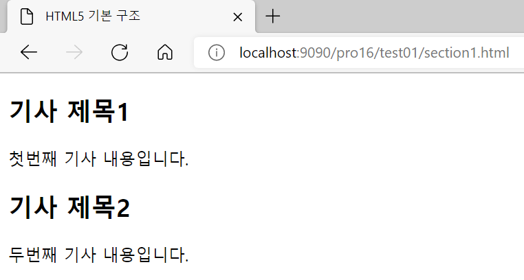
    
- 실습 2
  
    <section2.html>
    
    ```html
    <!DOCTYPE html>
    <html>
    <head>
       <meta charset="UTF-8">
       <title>HTML5 기본 구조</title>
    </head>
    <body>
      <section> 
         <article>
           <h1>기사 제목1</h1>
    	   <p>첫 번째 기사의 내용 </p>
         </article>
         <article>
    	   <h1>기사 제목2</h1>
    	   <p>두 번째 기사의 내용</p>
         </article>
       </section>
    </body>
    </html>
    ```
    
- 실습 2 결과
  
    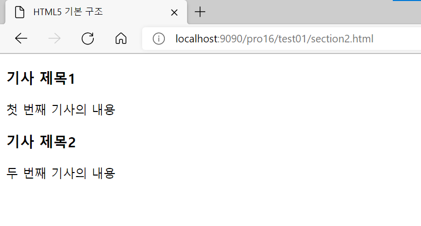
    
- 실습 3
  
    <section3.html>
    
    ```html
    <!DOCTYPE html>
    <html>
    <head>
       <meta charset="UTF-8">
       <title>프로그래밍 강좌</title>
    </head>
    <body>
       <header>
          <h1>HTML5 강좌를 시작합니다.</h1>
       </header> 
       <nav>
          <ul>
             <li>1.개념익히기</li>
             <li>2.문법익히기</li>
             <li>3.실전응용하기</li>
          </ul>
        </nav>  
       <aside>
          사이드 메뉴
       </aside> 
       <section> 
          <article>
             <h1> 첫 번째 강좌 제목 </h1>
             <p> 첫 번째 강좌 내용 </p>
          </article>
          <article>
             <h1> 두 번째 강좌 제목 </h1>
             <p> 두 번째 강좌 내용 </p>
          </article>
          <article>
             <h1> 세번째 강좌 제목 </h1>
             <p> 세번째 강좌 내용 </p>
          </article>
       </section> 
    <aside>
        퀵메뉴
    </aside> 
    <footer>
    프로그래밍 강의 Copyright  All right reserved.
    </footer> 
    </body>
    </html>
    ```
    
- 실습 3 결과
  
    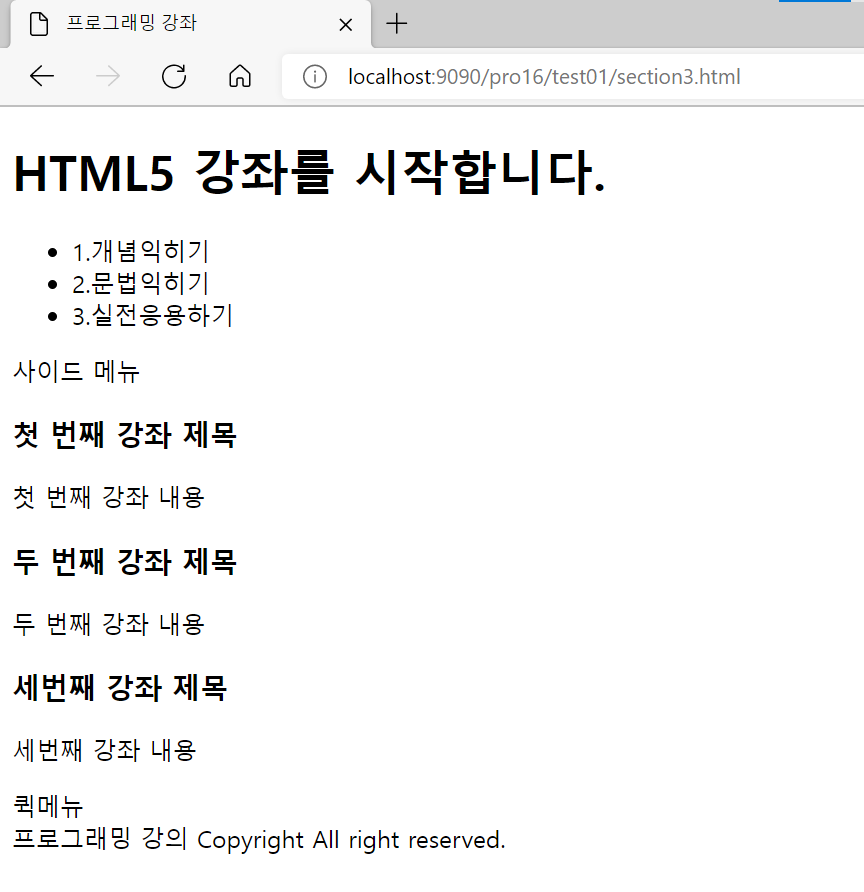
    
- 실습 4
  
    <section4.html>
    
    ```html
    <!DOCTYPE html>
    <html>
    <head>
    <meta charset="UTF-8">
       <title>도서쇼핑몰</title>
       <style type="text/css"> 
          html,body{width:100%;height:70%}
          html{overflow-y:scroll}
          body,div,dl,dt,dd,ul,ol,li,h1,h2,h3,h4,h5,form,fieldset,p,button{margin:0;padding:0}
          body,h1,h2,h3,h4,input,button{font-family:NanumGothicWeb,verdana,dotum, 
                                                 sans-serif;font-size:13px;color:#383d41}
          body{background-color:#fff}
          li{list-style:none}
          #container{width:760px;margin:0 auto}
          header{margin-top:20px;padding:20px;border:1px solid #000;background:#6600cc }
          hgroup{overflow:hidden;padding-bottom:20px}
          hgroup h1{float:left;font-size:18px;color:#fff}
          hgroup h2{float:right;font-weight:normal;color:#fff;opacity:0.8}
          nav{clear:both;overflow:hidden}
          nav li{float:left;padding-right:5px;font-family:verdana}
          nav li span{display:inline-block;padding:3px 10px;
                                          border-radius:5px;background-color:#fff}
          section{float:left;width:518px;margin-top:15px;
                 margin-bottom:20px;padding:20px;border:1px 
                  solid #330000;line-height:20px;background:#99ccff  }
          article{margin-bottom:10px}
          article h3{font-size:16px}
          aside{float:right;width:163px;padding:10px;margin-top:15px;border:
                             1px solid #330000;line-height:20px ;background:#99ccff }
          aside .ad{height:100px;margin-bottom:20px;background-color:#ebebeb}
          footer{clear:both;padding:20px;border:1px solid #330000 ;background:#99ccff;
                  text-align:center }
      </style> 
    </head>
    <body>
       <div id="container">
       <header>
          <hgroup>
             <h1>책읽는 사람이 세상을 바꾼다!!</h1>
             <h2>by 홍길동</h2>
          </hgroup>
       </header>
       <nav>
          <ul>
             <li><span>국내도서</span></li>
             <li><span>서양도서</span></li>
             <li><span>베스트셀러</span></li>
             <li><span>e-book</span></li>
             <li><span>아동전집</span></li>
             <li><span>이벤트</span></li>
             <li><span>문화행사</span></li>
          </ul>
       </nav>
       <section> 
          <article>
             <h1> 첫 번째 도서 제목 </h1>
             <p> 첫 번째 도서의 내용 </p>
          </article>
          <article>
             <h1> 두 번째 도서 제목 </h1>
             <p> 두 번째 도서의 내용 </p>
          </article>
          <article>
             <h1> 세번째 도서 제목 </h1>
             <p> 세번째 도서의 내용 </p>
          </article>
       </section>
       <aside>
          <p class="ad">문화 강좌 광고</p>
          <ul>
             <li><b>html5강좌</b></li>
             <li><b>컴퓨터강좌</b></li>
             <li><b>독서강좌</b></li>
          </ul>
       </aside>
       <footer>
          이메일:admin@test.com<br>
          회사주소:서울시 강동구<br>
          찾아오는 길:<a href="#">약도</a>
       </footer>
       </div>
    </body>
    </html>
    ```
    
- 실습 4 결과
  
    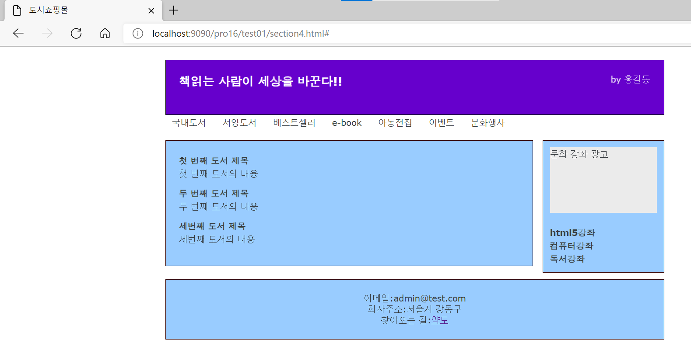
    

## 13.3 제이쿼리 주요 개념

### 13.3.1 제이쿼리 주요 개념

- 제이쿼리 개념
    - 화면의 동적 기능을 JavaScript보다 좀 더 쉽고 편리하게 개발할 수 있게 해주는 JavaScript 기반 라이브러리
    - 여러 가지 효과나 이벤트를 간단한 함수 호출만으로 빠르게 개발할 수 있어 유용
- 제이쿼리 주요 특징
    - CSS 선택자를 사용해 각 HTML 태그에 접근해서 작업하므로 명료하면서도 읽기 쉬운 형태로 표현할 수 있음
    - 메서드 체인 방식으로 수행하므로 여러 개의 동작이 한 줄로 나열되어 코드가 불필요하게 반복되는 것을 피할 수 있음
    - 풍부한 플러그인을 제공하므로 이미 개발된 많은 플러그인을 쉽고 빠르게 이용할 수 있음
    - 크로스 브라우징을 제공하므로 브라우저 종류에 상관없이 동일하게 기능을 수행
- 제이쿼리를 사용하는 방법
    1. www.jquery.com에서 라이브러리를 다운로드해서 사용
    2. 네트워크로 CDN 호스트를 설정해서 사용
- HTML&JSP에서 제이쿼리 CDN 호스트를 설정하는 방법
    - 지정한 버전의 제이쿼리 사용
      
        ```html
        <script src="http://code.jquery.com/jquery-2.2.1.min.js"></script>
        ```
        
    - 가장 최신 버전의 제이쿼리 사용
      
        ```html
        <script src="http://code.jquery.com/jquery-latest.min.js"></script>
        ```
        

## 13.4 제이쿼리의 여러 가지 기능

### 13.4.1 제이쿼리 선택자 사용

- 제이쿼리의 여러 가지 선택자
    1. All selector
        - 표현 방법 : `$("*")`
        - 모든 DOM을 선택
    2. ID selector
        - 표현 방법 : `$("#id")`
        - 해당되는 id를 가지는 DOM을 선택
    3. Element selector
        - 표현 방법 : `$("elementName")`
        - 해당되는 이름을 가지는 DOM을 선택
    4. class selector
        - 표현 방법 : `$(".className")`
        - CSS 중 해당되는 클래스 이름을 가지는 DOM을 선택
    5. Multiple selector
        - 표현 방법 : `$("selector1, selector2, ..., selectN")`
        - 해당되는 선택자를 가지는 모든 DOM을 선택
- 실습 1
  
    <jQuery1.html>
    
    ```html
    <!DOCTYPE html>
    <html>
    <head>
      <meta charset="UTF-8">
      <title>ID 셀렉터 연습1</title>
    <script  src="http://code.jquery.com/jquery-2.2.1.min.js"></script>
    <script type="text/javascript"> 
    $(document).ready(function(){				
      alert($("#unique2").html());	
    });
    </script>
    </head>
    <body>
      <div class="class1">안녕하세요.</div>
      <div id="unique2">제이쿼리입니다!!</div>
      <div id="unique3">
         <p>제이쿼리는 아주 쉽습니다!!!</p> 
      </div>
    </body>
    </html>
    ```
    
    - document에 DOM(Document Object Model)이 로드되는 이벤트 처리 함수
      
        ```jsx
        $(document).ready(function(){				
          	
        });
        ```
        
    - id가 unique2인 태그를 검색한 후 `html()` 메서드를 이용해 태그의 값을 가져옴
      
        ```jsx
        alert($("#unique2").html());	
        ```
    
- 실습 1 결과
  
    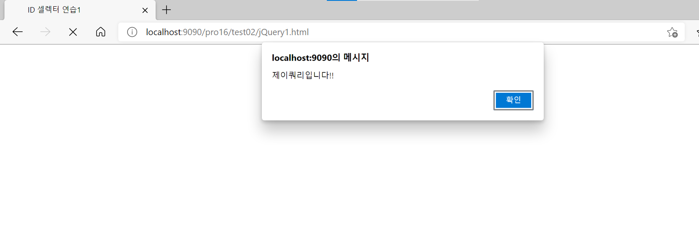
    
    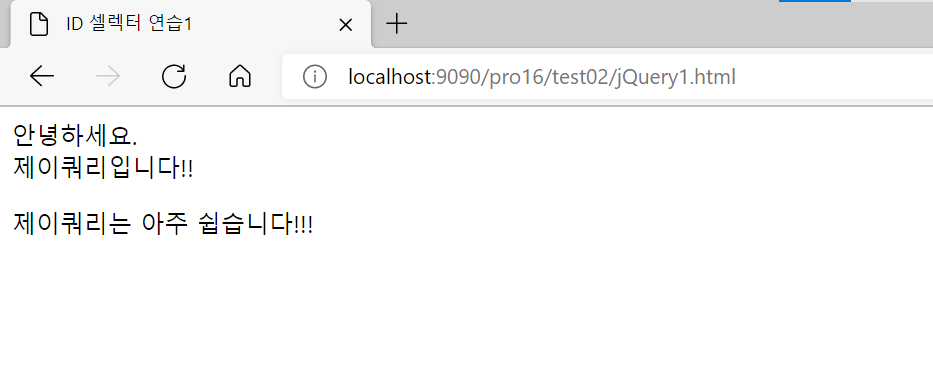
    
- 실습 2
  
    <jQuery2.html>
    
    ```html
    <!DOCTYPE html>
    <html>
    <head>
      <meta charset="UTF-8">
      <title>ID 셀렉터 연습2</title>
    <script  src="http://code.jquery.com/jquery-latest.min.js"></script>
    <script type="text/javascript"> 
     function addHtml(){
    	 $("#article").html('안녕하세요'+'<br>');
    	 
     }
    </script>
    </head>
    <body>
      <div>
         <p id="article"></p>
      </div>
      <input type="button" value="추가하기"  onClick="addHtml()"  />
    </body>
    </html>
    ```
    
    - 제이쿼리로 id가 article인 태그를 찾아서 `html()` 메서드의 인자 값을 태그에 설정
      
        ```jsx
        $("#article").html('안녕하세요'+'<br>');
        ```
        
    - 버튼 클릭 시 `addHtml()` 함수를 호출
      
        ```html
        onClick="addHtml()
        ```
    
- 실습 2 결과
  
    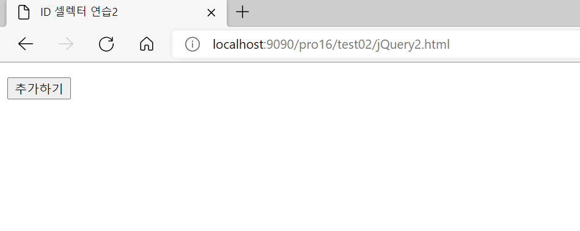
    
    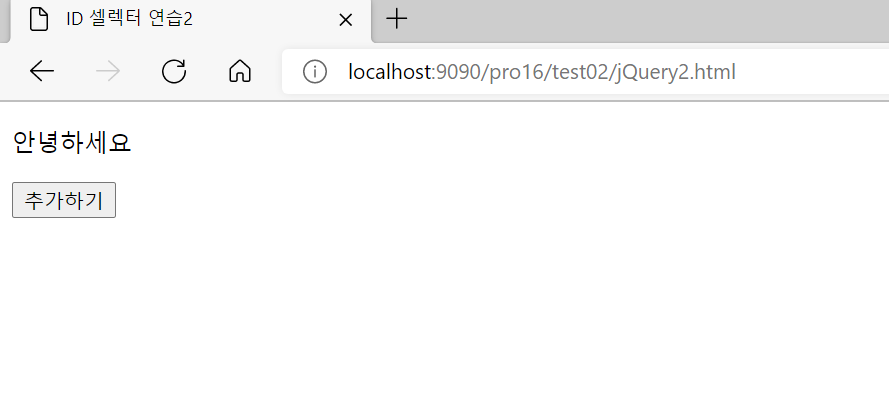
    
- 실습 3
  
    <jQuery3.html>
    
    ```html
    <!DOCTYPE html>
    <html>
    <head>
      <meta charset="UTF-8">
      <title>Class 셀렉터 연습</title>
    <script  src="http://code.jquery.com/jquery-latest.min.js"></script>
    <script type="text/javascript"> 
     function addImage(){
    	 $(".class1").html("");
    	 
     }
    </script>
    </head>
    <body>
      <div class="class1">
      </div>
      <div class="class1">
      </div>
      <input type="button" value="이미지 추가하기"  onClick="addImage()"  />
    </body>
    </html>
    ```
    
    - 클래스 이름이 class1인 태그를 찾아서 `` 태그를 추가
      
        ```jsx
        $(".class1").html("");
        ```
    
- 실습 3 결과
  
    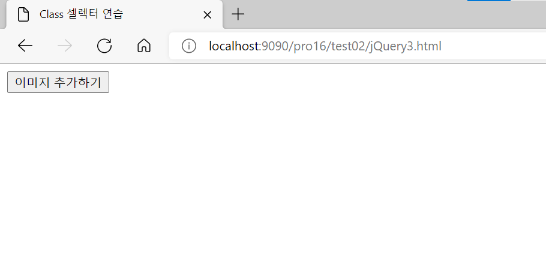
    
    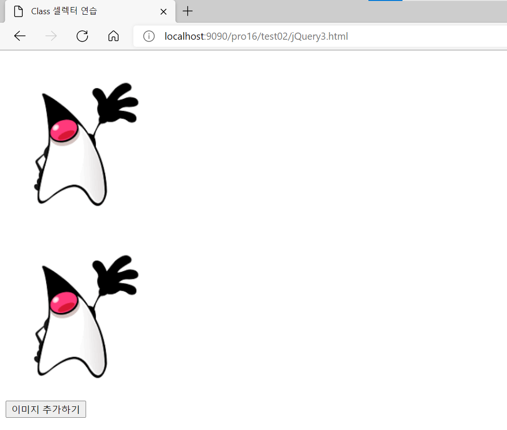
    
- 실습 4
  
    <jQuery4.html>
    
    ```html
    <!DOCTYPE html>
    <html>
    <head>
      <meta charset="UTF-8">
      <title>엘러먼트 셀렉터 연습</title>
    <script  src="http://code.jquery.com/jquery-latest.min.js"></script>
    <script type="text/javascript"> 
     function addImage(){
    	 $("div").html("");
    	 
     }
    </script>
    </head>
    <body>
      <div></div>
      <div></div>
      <input type="button" value="이미지 추가하기"  onClick="addImage()"  />
    </body>
    </html>
    ```
    
    - `<div>` 엘리먼트에 직접 접근하여 `` 태그를 추가
      
        ```jsx
        $("div").html("");
        ```
    
- 실습 4 결과
  
    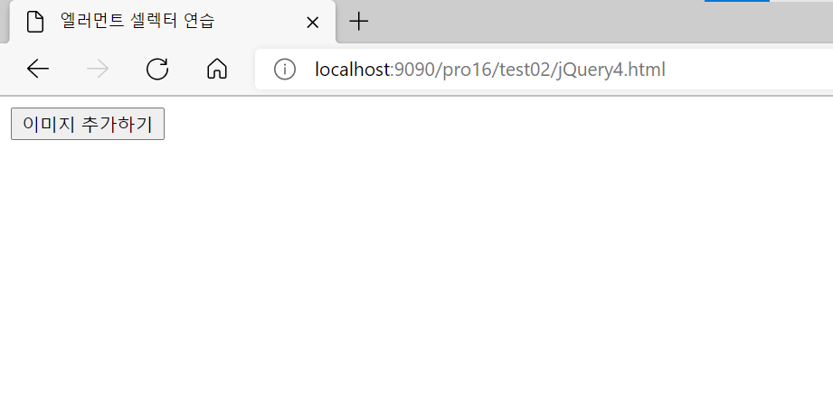
    
    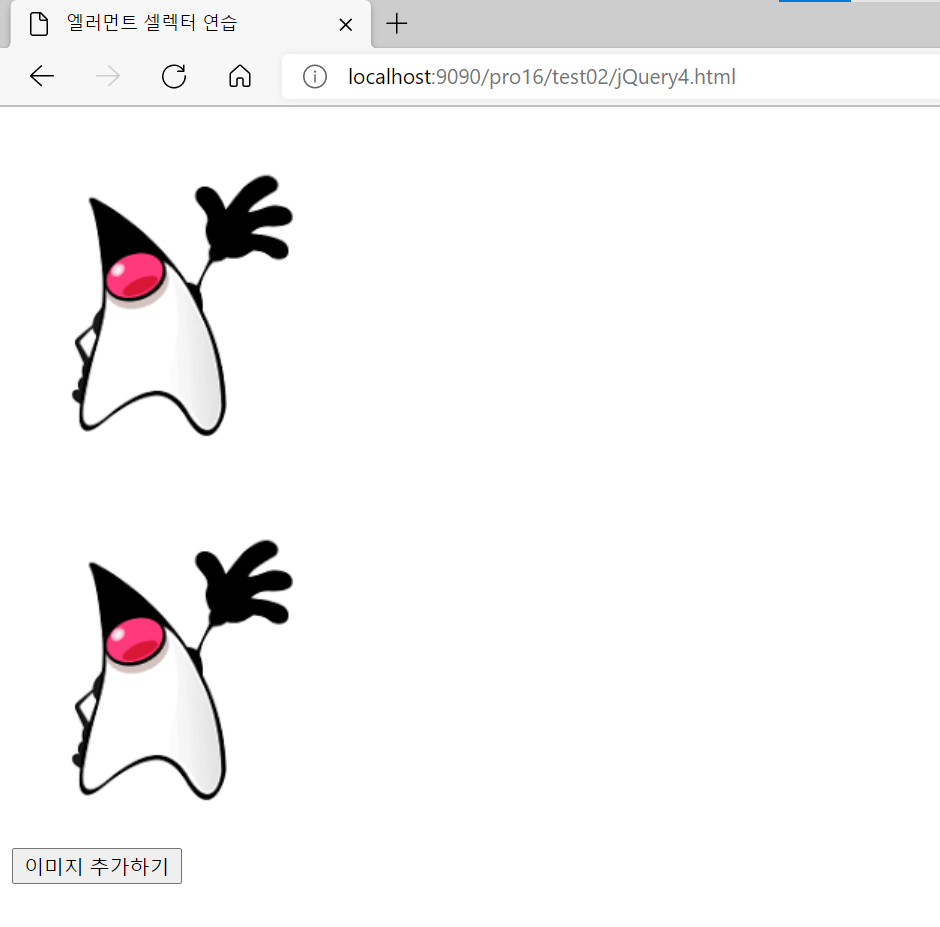
    
- 실습 5
  
    <jQuery5.html>
    
    ```html
    <!DOCTYPE html>
    <html>
    <head>
      <meta charset="UTF-8">
      <title>제이쿼리 연습</title>
    <script  src="http://code.jquery.com/jquery-latest.min.js"></script>
    <script type="text/javascript">
    function fn_process(){
       var value=$("#t_input").val();
       $("#t_output").val(value);
     }
      
    </script>
    </head>
    <body>
        <input type="text" id="t_input" /> 
        <input type="button" value="입력하기" onClick="fn_process()" /><br><br>
      <div>
        결과:<br>
         <input type="text" id="t_output"  disabled/>
      </div> 
    </body>
    </html>
    ```
    
    - id가 t_input인 텍스트 박스에 접근하여 `val()` 메서드를 이용해서 입력 값을 가져옴
      
        ```jsx
        var value=$("#t_input").val();
        ```
        
    - id가 t_output인 텍스트 박스에 접근하여 `val()` 메서드를 이용해서 값을 출력
      
        ```jsx
        $("#t_output").val(value);
        ```
    
- 실습 5 결과
  
    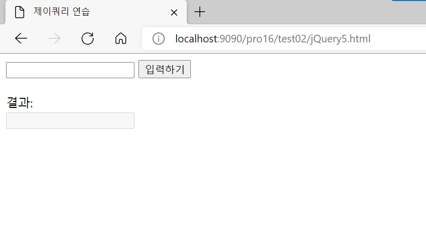
    
    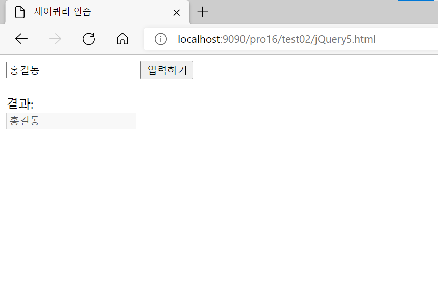
    

## 13.5 제이쿼리 Ajax 기능

### 13.5.1 제이쿼리 Ajax 개념

- Ajax
    - 클라이언트 측에서의 작업과는 상관 없이 비동기적으로 서버와 작업을 수행할 때 Ajax 기능 사용
    - Asynchronous Javascript + XML
    - 자바스크립트를 사용한 비동기 통신
    - 클라이언트와 서버 간의 XML이나 JSON 데이터를 주고받는 기술
    - 페이지 이동 없이 데이터 처리가 가능
    - 서버의 처리를 기다리지 않고 비동기 요청이 가능
- 기존 웹 페이지의 처리 방식과의 비교
    1. 기존 웹 페이지
       
        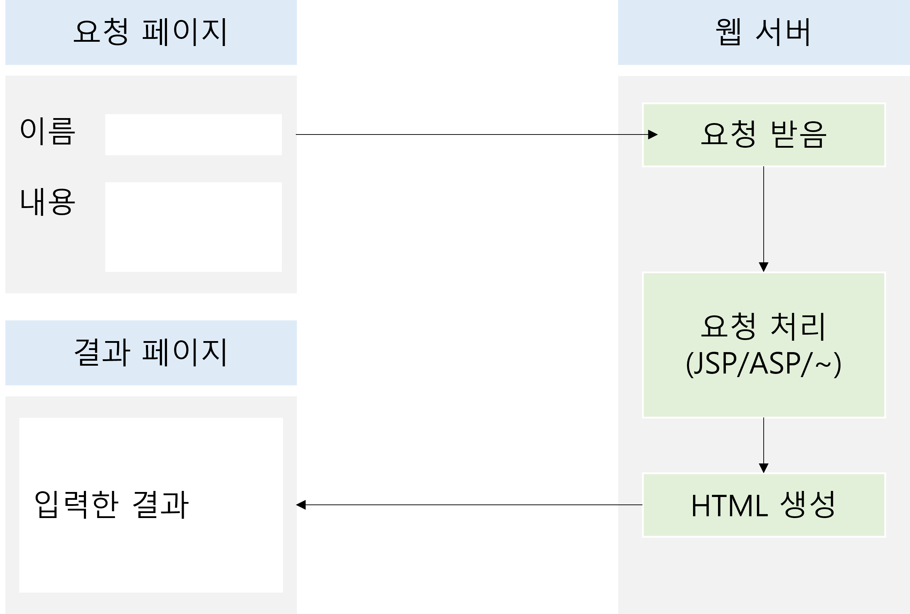
        
    2. Ajax를 이용한 웹 페이지
       
        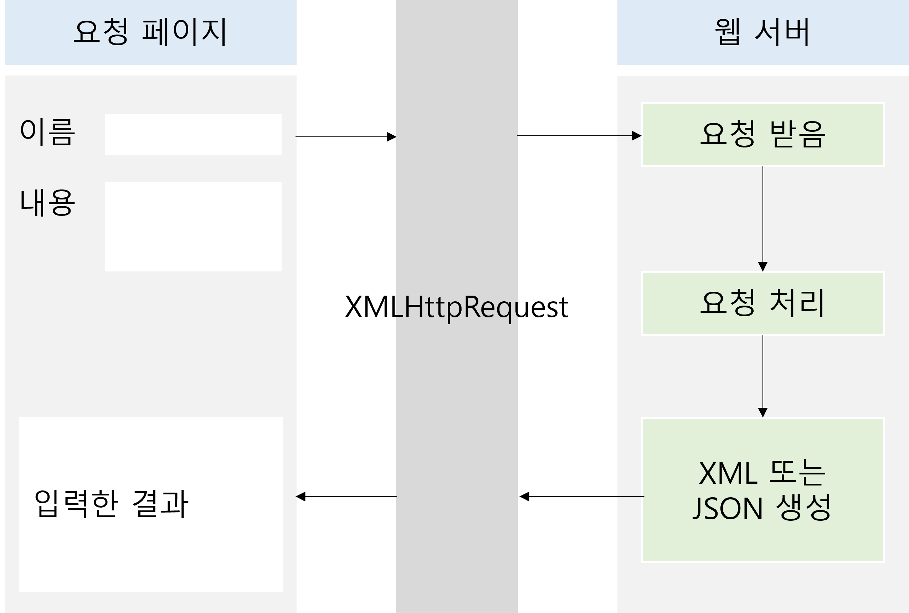
        

### 13.5.2 제이쿼리 Ajax 사용법

- 제이쿼리 Ajax 사용법
  
    ```javascript
    $.ajax({
    	type : "post" 또는 "get",
    	async : "true" 또는 "false",
    	url : "요청할 URL",
    	data : {서버로 전송할 데이터},
    	dataType : "서버에서 전송받을 데이터 형식",
    	success:{
    		//정상 요청, 응답 시 처리
    	},
    	error: function(xhr,status,error){
    		//오류 발생 시 처리
    	},
    	complete: function(data,textStatus){
    		//작업 완료 후 처리
    	}
    });
    ```
    
    - `type` : 통신 타입 설정
    - `url` : 요청할 url 설정
    - `async` : 비동기식으로 처리할지의 여부 설정
      
        (false인 경우 동기식으로 처리)
        
    - `data` : 서버에 요청할 때 보낼 매개변수 설정
    - `dataType` : 응답 받을 데이터 타입을 설정
    - `success` : 요청 및 응답에 성공했을 때 처리 구문을 설정
    - `error` : 요청 및 응답에 실패했을 때 처리 구문 설정
    - `complete` : 모든 작업을 마친 후 처리 구문 설정

### 13.5.3 제이쿼리 Ajax 사용하기

- 실습
    1. 클라이언트에서 Ajax로 메시지를 보내면 이를 처리하는 서블릿 작성
       
        <AjaxTest1.java>
        
        ```java
        package sec01.ex01;
        
        import java.io.IOException;
        import java.io.PrintWriter;
        
        import javax.servlet.ServletException;
        import javax.servlet.annotation.WebServlet;
        import javax.servlet.http.HttpServlet;
        import javax.servlet.http.HttpServletRequest;
        import javax.servlet.http.HttpServletResponse;
        
        /**
         * Servlet implementation class AjaxTest1
         */
        @WebServlet("/ajaxTest1")
        public class AjaxTest1 extends HttpServlet {
        	private static final long serialVersionUID = 1L;
        
        	/**
        	 * @see HttpServlet#doGet(HttpServletRequest request, HttpServletResponse
        	 *      response)
        	 */
        	protected void doGet(HttpServletRequest request, HttpServletResponse response) throws ServletException, IOException {
        		doHandler(request, response);
        	}
        
        	/**
        	 * @see HttpServlet#doPost(HttpServletRequest request, HttpServletResponse
        	 *      response)
        	 */
        	protected void doPost(HttpServletRequest request, HttpServletResponse response) throws ServletException, IOException {
        		doHandler(request, response);
        	}
        
        	private void doHandler(HttpServletRequest request, HttpServletResponse response)	throws ServletException, IOException {
        		request.setCharacterEncoding("utf-8");
        		response.setContentType("text/html; charset=utf-8");
        		String param = (String) request.getParameter("param");
        		System.out.println("param = " + param);
        		PrintWriter writer = response.getWriter();
        		writer.print("안녕하세요.서버입니다.");
        	}
        
        }
        ```
        
        - ajax로 전송된 매개변수를 가져옴
          
            ```java
            String param = (String) request.getParameter("param");
            ```
            
        - `print()` 메서드를 이용해 브라우저에 응답 메시지를 보냄
          
            ```java
            PrintWriter writer = response.getWriter();
            writer.print("안녕하세요.서버입니다.");
            ```
        
    2. Ajax 기능을 이용해 서블릿에 매개변수를 전송할 화면 작성
       
        <ajax1.html>
        
        ```html
        <!DOCTYPE html>
        <html>
        <head>
          <meta charset="UTF-8">
          <title>ajax 연습1</title>
          <script  src="http://code.jquery.com/jquery-latest.min.js"></script>
          <script type="text/javascript">
              function fn_process(){
               $.ajax({
                 type:"get",
                 dataType:"text",
                 async:false,  
                 url:"http://localhost:9090/pro16/ajaxTest1",
                 data: {param:"Hello,jquery"},
                 success:function (data,textStatus){
                    $('#message').append(data);
                 },
                 error:function(data,textStatus){
                    alert("에러가 발생했습니다.");ㅣ
                 },
                 complete:function(data,textStatus){
                    alert("작업을 완료 했습니다");
                 }
              });	
           }		
        </script>
        </head>
        <body>
        <input type="button" value="전송하기" onClick="fn_process()" /><br><br>
        <div id="message"></div>
        </body>
        </html>
        ```
        
        - `type:"get"` : GET 방식으로 전송
        - `dataType:"text"` : 응답 데이터를 텍스트로 지정
        - `async:false` : 동기식으로 처리
        - `url:"http://localhost:9090/pro16/ajaxTest1"` : 전송할 서블릿 지정
        - `data: {param:"Hello,jquery"}` : 서버로 매개변수와 값 설정
        - 전송과 응답이 성공했을 경우 작업
          
            ```html
            success:function (data,textStatus){
                        $('#message').append(data);
                     },
            ```
            
        - `$('#message').append(data);` : id가 message인 태그에 응답 메시지 표시
        - 작업 중 오류가 발생했을 경우 작업
          
            ```html
            error:function(data,textStatus){
                        alert("에러가 발생했습니다.");ㅣ
                     },
            ```
            
        - 완료 시 수행할 작업
          
            ```html
            complete:function(data,textStatus){
                        alert("작업을 완료 했습니다");
                     }
            ```
    
- 실습 결과
    1. 요청
       
        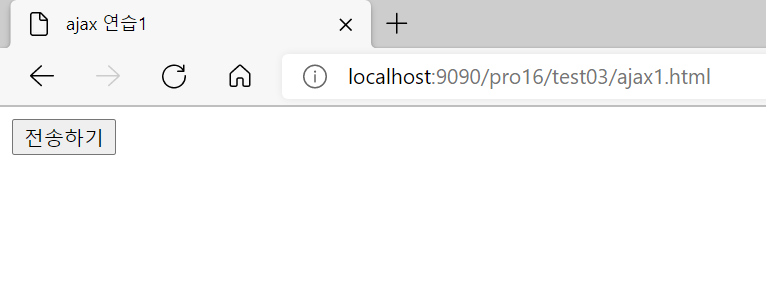
        
    2. 응답
       
        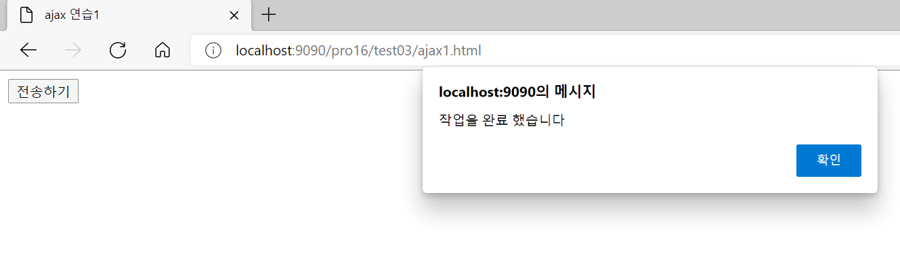
        
        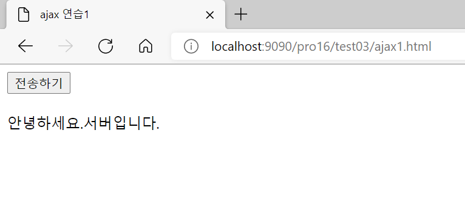
        
    3. 콘솔 창 출력
       
        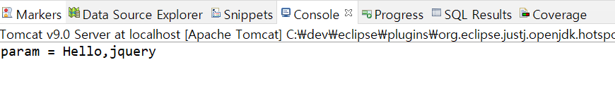
        

### 13.5.4 XML 데이터 연동하기

- 실습
    1. 도서 정보를 XML 형식으로 작성한 후 브라우저로 전송하는 서블릿 클래스 작성
       
        <AjaxTest2.java>
        
        ```java
        package sec01.ex01;
        
        import java.io.IOException;
        import java.io.PrintWriter;
        
        import javax.servlet.ServletException;
        import javax.servlet.annotation.WebServlet;
        import javax.servlet.http.HttpServlet;
        import javax.servlet.http.HttpServletRequest;
        import javax.servlet.http.HttpServletResponse;
        
        /**
         * Servlet implementation class AjaxTest2
         */
        @WebServlet("/ajaxTest2")
        public class AjaxTest2 extends HttpServlet {
        	private static final long serialVersionUID = 1L;
        
        	/**
        	 * @see HttpServlet#doGet(HttpServletRequest request, HttpServletResponse
        	 *      response)
        	 */
        	protected void doGet(HttpServletRequest request, HttpServletResponse response) throws ServletException, IOException {
        		doHandle(request, response);
        	}
        
        	/**
        	 * @see HttpServlet#doPost(HttpServletRequest request, HttpServletResponse
        	 *      response)
        	 */
        	protected void doPost(HttpServletRequest request, HttpServletResponse response)	throws ServletException, IOException {
        		doHandle(request, response);
        	}
        
        	private void doHandle(HttpServletRequest request, HttpServletResponse response) throws ServletException, IOException {
        		request.setCharacterEncoding("utf-8");
        		response.setContentType("text/html; charset=utf-8");
        		String result = "";
        		PrintWriter writer = response.getWriter();
        		result="<main><book>"+
        		         "<title><![CDATA[초보자를 위한 자바 프로그래밍]]></title>" +
        		         "<writer><![CDATA[인포북스 저 | 이병승]]></writer>" +                             
        		         "<image><![CDATA[http://localhost:9090/pro16/image/image1.jpg]]></image>"+
        		      "</book>"+
        		      "<book>"+
        		         "<title><![CDATA[모두의 파이썬]]></title>" +
        		         "<writer><![CDATA[길벗 저 | 이승찬]]></writer>" +                 
        		        "<image><![CDATA[http://localhost:9090/pro16/image/image2.jpg]]></image>"+
        		      "</book></main>";
        		System.out.println(result);
        		writer.print(result);
        	}
        
        }
        ```
        
        - 도서 정보를 XML로 작성한 후 클라이언트로 전송
          
            ```java
            result="<main><book>"+
            		         "<title><![CDATA[초보자를 위한 자바 프로그래밍]]></title>" +
            		         "<writer><![CDATA[인포북스 저 | 이병승]]></writer>" +                             
            		         "<image><![CDATA[http://localhost:9090/pro16/image/image1.jpg]]></image>"+
            		      "</book>"+
            		      "<book>"+
            		         "<title><![CDATA[모두의 파이썬]]></title>" +
            		         "<writer><![CDATA[길벗 저 | 이승찬]]></writer>" +                 
            		        "<image><![CDATA[http://localhost:9090/pro16/image/image2.jpg]]></image>"+
            		      "</book></main>";
            ```
        
    2. XML 데이터를 받은 후 각각의 도서 정보를 출력할 화면 작성
       
        <ajax2.html>
        
        ```html
        <!DOCTYPE html>
        <html>
        <head>
           <meta charset="UTF-8">
           <title>도서 정보 출력창</title>
           <script  src="http://code.jquery.com/jquery-latest.min.js"></script>
           <script type="text/javascript">
              function fn_process(){
                $.ajax({
                    type:"post",
                    async:false, 
                    url:"http://localhost:9090/pro16/ajaxTest2",
                    dataType:"xml",
                    success:function (info,textStatus){
                      $(info).find("book").each(function(){  
        	              var title=$(this).find("title").text();
        	              var writer=$(this).find("writer").text();
        	              var image=$(this).find("image").text();
        	              $("#bookInfo").append(
        	                  	"<p>" +title+ "</p>" +
        		                "<p>" +writer + "</p>"+
        	 	                ""				
        	              );
                      });
                    },
                    error:function(data,textStatus){
                       alert("에러가 발생했습니다.");ㅣ
                    },
                    complete:function(data,textStatus){
                       //alert("작업을완료 했습니다");
                    }
               }); 
             }
          </script>
        </head>
        <body>
        <div id="bookInfo"></div>
        <input type=button value="도서정보 요청"  onclick="fn_process()">
        </body>
        </html>
        ```
        
        - 데이터를 XML 형태로 받음 : `dataType:"xml"`
        - 전송된 XML 데이터에서 엘리먼트 이름으로 데이터를 가져옴
          
            ```jsx
            var title=$(this).find("title").text();
            var writer=$(this).find("writer").text();
            var image=$(this).find("image").text();
            ```
            
        - id가 bookinfo인 엘리먼트에 도서 정보 표시
          
            ```jsx
            $("#bookInfo").append(
            	                  	"<p>" +title+ "</p>" +
            		                "<p>" +writer + "</p>"+
            	 	                ""				
            	              );
            ```
    
- 실습 결과
  
    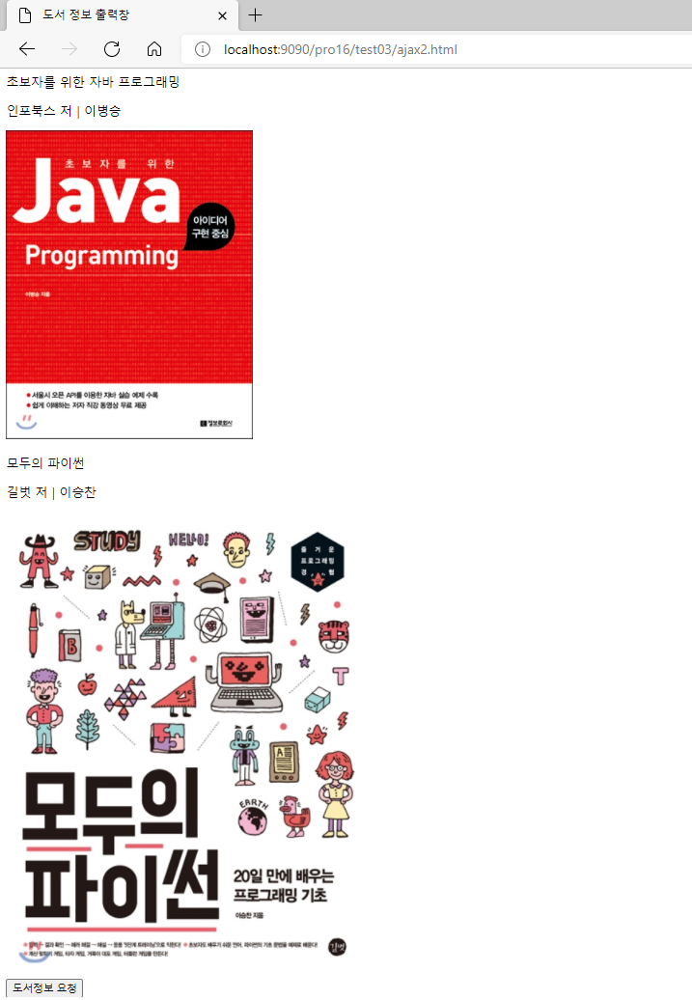
    

### 13.5.5 ID 중복 여부 확인하기

- 실습
    1. 서블릿 클래스 작성
       
        <MemberServlet.java>
        
        ```java
        package sec02.ex01;
        
        import java.io.IOException;
        import java.io.PrintWriter;
        
        import javax.servlet.ServletException;
        import javax.servlet.annotation.WebServlet;
        import javax.servlet.http.HttpServlet;
        import javax.servlet.http.HttpServletRequest;
        import javax.servlet.http.HttpServletResponse;
        
        /**
         * Servlet implementation class MemberServlet
         */
        @WebServlet("/mem")
        public class MemberServlet extends HttpServlet {
        	private static final long serialVersionUID = 1L;
        
        	/**
        	 * @see HttpServlet#doGet(HttpServletRequest request, HttpServletResponse
        	 *      response)
        	 */
        	protected void doGet(HttpServletRequest request, HttpServletResponse response)	throws ServletException, IOException {
        		doHandler(request, response);
        	}
        
        	/**
        	 * @see HttpServlet#doPost(HttpServletRequest request, HttpServletResponse
        	 *      response)
        	 */
        	protected void doPost(HttpServletRequest request, HttpServletResponse response) throws ServletException, IOException {
        		doHandler(request, response);
        	}
        
        	private void doHandler(HttpServletRequest request, HttpServletResponse response) throws ServletException, IOException {
        		request.setCharacterEncoding("utf-8");
        		response.setContentType("text/html; charset=utf-8");
        		PrintWriter writer = response.getWriter();
        
        		String id = (String) request.getParameter("id");
        		System.out.println("id = " + id);
        		MemberDAO memberDAO = new MemberDAO();
        		boolean overlappedID = memberDAO.overlappedID(id);
        
        		if (overlappedID == true) {
        			writer.print("not_usable");
        		} else {
        			writer.print("usable");
        		}
        	}
        
        }
        ```
        
        - MemberDAO 객체 생성 후 ID 중복 여부 체크하는 메서드 호출
          
            ```java
            MemberDAO memberDAO = new MemberDAO();
            boolean overlappedID = memberDAO.overlappedID(id);
            ```
            
        - 사용 가능 여부 결과를 메시지로 전송
          
            ```java
            if (overlappedID == true) {
            			writer.print("not_usable");
            		} else {
            			writer.print("usable");
            		}
            ```
        
    2. MemberDAO 작성
       
        <MemberDAO.java>
        
        ```java
        package sec02.ex01;
        
        import java.sql.Connection;
        import java.sql.Date;
        import java.sql.PreparedStatement;
        import java.sql.ResultSet;
        import java.sql.Statement;
        import java.util.ArrayList;
        import java.util.List;
        
        import javax.naming.Context;
        import javax.naming.InitialContext;
        import javax.sql.DataSource;
        
        public class MemberDAO {
        	private Connection con;
        	private PreparedStatement pstmt;
        	private DataSource dataFactory;
        
        	public MemberDAO() {
        		try {
        			Context ctx = new InitialContext();
        			Context envContext = (Context) ctx.lookup("java:/comp/env");
        			dataFactory = (DataSource) envContext.lookup("jdbc/mysql");
        		} catch (Exception e) {
        			e.printStackTrace();
        		}
        	}
        
        	public boolean overlappedID(String id){
        		boolean result = false;
        		try {
        			con = dataFactory.getConnection();
        			String query = "select IF(count(*)=1,'true','false') result from t_member";
        			query += " where id=?";
        			System.out.println("prepareStatememt: " + query);
        			pstmt = con.prepareStatement(query);
        			pstmt.setString(1, id);
        			ResultSet rs = pstmt.executeQuery();
        			rs.next();
        			result =Boolean.parseBoolean(rs.getString("result"));
        			pstmt.close();
        		} catch (Exception e) {
        			e.printStackTrace();
        		}
        		
        		return result;
        	}
        }
        ```
        
        - ID가 존재하면 true, 존재하지 않으면 false를 문자열로 조회
            1. oracle인 경우
               
                ```java
                String query = "select decode(count(*),1,'true','false') as result from t_member";
                ```
                
            2. mysql인 경우
               
                ```java
                String query = "select IF(count(*)=1,'true','false') result from t_member";
                ```
            
        - 결과로 출력되는 문자열을 불 자료형으로 변환
          
            ```java
            result =Boolean.parseBoolean(rs.getString("result"));
            ```
        
    3. ID를 중복 체크하는 화면 작성
       
        <ajax3.html>
        
        ```html
        <!DOCTYPE html>
        <html>
        <head>
          <meta charset="UTF-8">
          <title>아이디 중복 체크</title>
        <script  src="http://code.jquery.com/jquery-latest.min.js"></script>
        <script type="text/javascript">
         function fn_process(){
            var _id=$("#t_id").val();
            if(_id==''){
           	 alert("ID를 입력하세요");
           	 return;
            }
            $.ajax({
               type:"post",
               async:true,  
               url:"http://localhost:9090/pro16/mem",
               dataType:"text",
               data: {id:_id},
               success:function (data,textStatus){
            	   //alert(data);
            	   
                  if(data=='usable'){
               	   $('#message').text("사용할 수 있는 ID입니다.");
               	   $('#btnDuplicate').prop("disabled", true);
                  }else{
               	   $('#message').text("사용할 수 없는 ID입니다.");
                  }
               },
               error:function(data,textStatus){
                  alert("에러가 발생했습니다.");ㅣ
               },
               complete:function(data,textStatus){
                  //alert("작업을완료 했습니다");
               }
            });  //end ajax	 
         }		
        </script>
        </head>
        <body>
           <input  type="text" id="t_id"/>
           <input type="button" id="btnDuplicate" value="ID 중복체크하기" onClick="fn_process()" /><br><br>
           <div id="message"></div>
        </body>
        </html>
        ```
        
        - `var _id=$("#t_id").val();` : 아이디가 `t_id`인  `input` 태그에서 입력한 값을 가져옴
        - ID를 입력하지 않으면 오류 메시지 출력
          
            ```jsx
            if(_id==''){
               	 alert("ID를 입력하세요");
               	 return;
                }
            ```
            
        - ID를 서블릿으로 전송
          
            ```jsx
            data: {id:_id},
            ```
            
        - 서버에서 전송된 결과에 따라 메시지 표시
          
            ```jsx
            if(data=='usable'){
                   	   $('#message').text("사용할 수 있는 ID입니다.");
                   	   $('#btnDuplicate').prop("disabled", true);
                      }else{
                   	   $('#message').text("사용할 수 없는 ID입니다.");
                      }
            ```
            
            - `$('#btnDuplicate').prop("disabled", true);` : 사용할 수 있는 ID면 중복체크 버튼 비활성화
        - 아이디가 `message`인 태그에 결과 출력
          
            ```jsx
            $('#message').text("사용할 수 있는 ID입니다.");
            $('#message').text("사용할 수 없는 ID입니다.");
            ```
    
- 실습 결과
    1. 기존 아이디가 없는 경우
       
        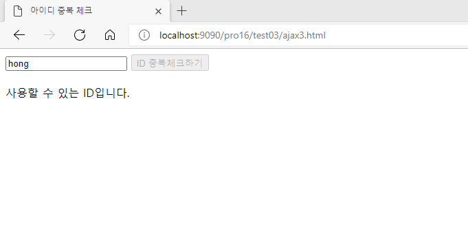
        
    2. 기존 아이디가 있는 경우
       
        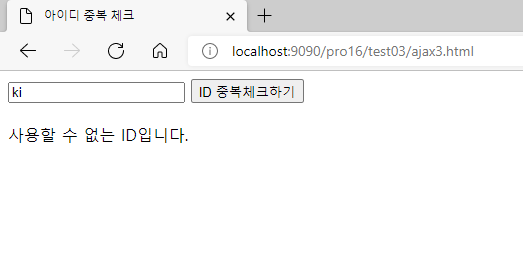
        

---