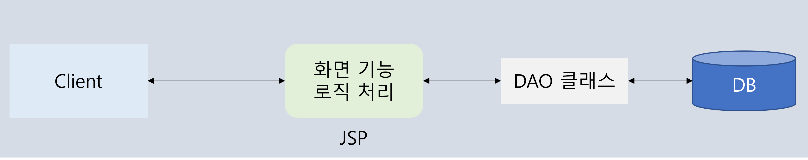
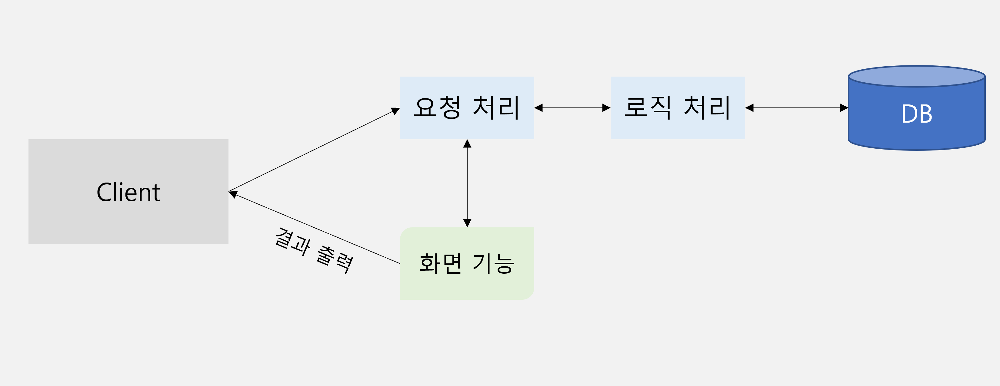
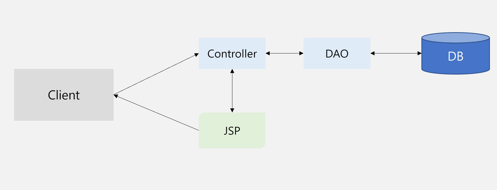
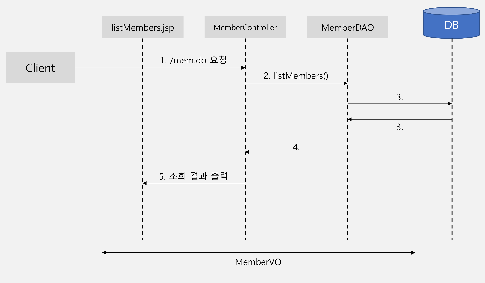
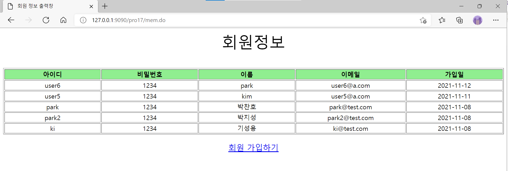

# 14. Model 2

## 14.1 웹 애플리케이션 모델

### 14.1.1 모델 1 방식

- 웹 애플리케이션 모델
    - 웹 애플리케이션 개발에서 일반적으로 많이 사용하는 표준화된 소스 구조
- 모델 1 방식
    - DB 연동 같은 비즈니스 로직 작업과 그 작업 결과를 나타내주는 작업을 동일한 JSP에서 수행
    - 모든 클라이언트의 요청과 비즈니스 로직 처리를 JSP가 담당하는 구조
    - 동작 방식
      
        
        
    - 기능이 조금만 복잡해져도 유지보수가 어려움

### 14.1.2 모델 2 방식

- 모델 2 방식
    - 웹 애플리케이션의 각 기능을 분리해서 구현하는 것
    - 개발자는 자신이 맡은 부분만 개발하면 되므로 훨씬 효율적인 개발 방식
    - 개발 후 서비스를 제공할 때도 유지보수가 편할 뿐만 아니라 개발한 모듈들은 비슷한 프로그램을 만들 때 사용할 수 있어 코드 재사용성도 높음
- 모델 2 방식 특징
    - 각 기능이 서로 분리되어 있어 개발 및 유지보수가 쉬움
    - 각 기능의 재사용성이 높음
    - 디자이너와 개발자의 작업을 분업화해서 쉽게 개발할 수 있음
    - 모델 2 방식과 관련된 기능이나 개념의 학습 필요
- 모델 2 동작 방식
  
    
    

## 14.2 MVC 디자인 패턴

### 14.2.1 MVC란

- MVC(Model-View-Controller) 개념
    - 일반 PC 프로그램 개발에 사용되는 디자인 패턴을 웹 애플리케이션에 도입한 것
    - 웹 애플리케이션을 화면 부분, 요청 처리 부분, 로직 처리 부분으로 나누어 개발
- MVC 특징
    - 각 기능이 분리되어 있어 개발 및 유지보수가 편리
    - 각 기능의 재사용성이 높아짐
    - 디자이너와 개발자의 작업을 분업화해서 쉽게 개발할 수 있음
- MVC 동작 과정
  
    
    
    - 컨트롤러는 사용자로부터 요청을 받아 어떤 비즈니스 로직을 처리해야 할지 제어
    - 모델은 DB 연동과 같은 비즈니스 로직을 처리
    - 뷰는 모델에서 처리한 결과를 화면에 구현하여 클라이언트로 전송

### 14.2.2 MVC 구성 요소와 기능

- 구성 요소 및 기능
  
    
    
    1. Controller
        - 서블릿이 컨트롤러 역할 수행
        - 클라이언트의 요청 분석
        - 요청에 대해서 필요한 모델을 호출
        - Model에서 처리한 결과를 보여주기 위해 JSP 선택
    2. Model
        - DB 연동과 같은 비즈니스 로직 수행
        - 일반적으로 DAO와 VO 클래스로 구성
    3. View
        - JSP가 화면 기능 담당
        - Model에서 처리한 결과를 화면에 표시

## 14.3 MVC를 이용한 회원 관리

### 14.3.1 회원 정보 조회 기능 구현

- MVC로 구현한 회원 정보 조회 기능 실행 과정
  
    
    
    1. 브라우저에서 /mem.do로 요청
    2. 서블릿 MemberController가 요청을 받아 MemberDAO의 `listMembers()` 메서드를 호출
    3. MemberDAO의 `listMembers()` 메서드에서 SQL문으로 회원 정보를 조회한 후 회원 정보를 MemberVO에 설정하여 반환
    4. MemberController에서는 조회한 회원 정보를 회원 목록창으로 포워딩
    5. 회원 목록창(listMembers.jsp)에서 포워딩한 회원 정보를 목록으로 출력
    
- 회원 정보 조회 실습
    1. 컨트롤러 작성
       
        <MemberController.java>
        
        ```java
        package sec01.ex01;
        
        import java.io.IOException;
        import java.io.PrintWriter;
        import java.util.List;
        
        import javax.servlet.RequestDispatcher;
        import javax.servlet.ServletException;
        import javax.servlet.annotation.WebServlet;
        import javax.servlet.http.HttpServlet;
        import javax.servlet.http.HttpServletRequest;
        import javax.servlet.http.HttpServletResponse;
        
        /**
         * Servlet implementation class MemberController
         */
        @WebServlet("/mem.do")
        public class MemberController extends HttpServlet {
        	private static final long serialVersionUID = 1L;
        	MemberDAO memberDAO;
        
        	public void init() throws ServletException {
        		memberDAO = new MemberDAO();
        	}
        
        	/**
        	 * @see HttpServlet#doGet(HttpServletRequest request, HttpServletResponse
        	 *      response)
        	 */
        	protected void doGet(HttpServletRequest request, HttpServletResponse response)
        			throws ServletException, IOException {
        		doHandle(request, response);
        	}
        
        	/**
        	 * @see HttpServlet#doPost(HttpServletRequest request, HttpServletResponse
        	 *      response)
        	 */
        	protected void doPost(HttpServletRequest request, HttpServletResponse response)
        			throws ServletException, IOException {
        		doHandle(request, response);
        	}
        
        	private void doHandle(HttpServletRequest request, HttpServletResponse response) throws ServletException, IOException {
        		request.setCharacterEncoding("utf-8");
        		response.setContentType("text/html;charset=utf-8");
        		List<MemberVO> membersList = memberDAO.listMembers();
        		request.setAttribute("membersList", membersList);
        		RequestDispatcher dispatch = request.getRequestDispatcher("/test01/listMembers.jsp");
        		dispatch.forward(request, response);
        	}
        
        } 
        ```
        
        - 요청에 대해 회원 정보 조회
          
            ```java
            List<MemberVO> membersList = memberDAO.listMembers();
            ```
            
        - 조회한 회원정보를 request에 바인딩
          
            ```java
            request.setAttribute("membersList", membersList);
            ```
            
        - 컨트롤러에서 표시하고자 하는 JSP로 포워딩
          
            ```java
            RequestDispatcher dispatch = request.getRequestDispatcher("/test01/listMembers.jsp");
            dispatch.forward(request, response);
            ```
        
    2. MemberDAO 작성
       
        <MemberDAO.java>
        
        ```java
        package sec01.ex01;
        
        import java.sql.Connection;
        import java.sql.Date;
        import java.sql.PreparedStatement;
        import java.sql.ResultSet;
        import java.sql.SQLException;
        import java.util.ArrayList;
        import java.util.List;
        
        import javax.naming.Context;
        import javax.naming.InitialContext;
        import javax.sql.DataSource;
        
        public class MemberDAO {
        	private DataSource dataFactory;
        	private Connection conn;
        	private PreparedStatement pstmt;
        
        	public MemberDAO() {
        		try {
        			Context ctx = new InitialContext();
        			Context envContext = (Context) ctx.lookup("java:comp/env");
        			dataFactory = (DataSource) envContext.lookup("jdbc/mysql");
        		} catch (Exception e) {
        			e.printStackTrace();
        		}
        	}
        
        	public List<MemberVO> listMembers() {
        		List<MemberVO> membersList = new ArrayList();
        		try {
        			conn = dataFactory.getConnection();
        			String query = "select * from  t_member order by joinDate desc";
        			System.out.println(query);
        			pstmt = conn.prepareStatement(query);
        			ResultSet rs = pstmt.executeQuery();
        			while (rs.next()) {
        				String id = rs.getString("id");
        				String pwd = rs.getString("pwd");
        				String name = rs.getString("name");
        				String email = rs.getString("email");
        				Date joinDate = rs.getDate("joinDate");
        				MemberVO memberVO = new MemberVO(id, pwd, name, email, joinDate);
        				membersList.add(memberVO);
        			}
        			rs.close();
        			pstmt.close();
        			conn.close();
        		} catch (SQLException e) {
        			e.printStackTrace();
        		}
        		return membersList;
        	}
        
        	public void addMember(MemberVO m) {
        		try {
        			conn = dataFactory.getConnection();
        			String id = m.getId();
        			String pwd = m.getPwd();
        			String name = m.getName();
        			String email = m.getEmail();
        			String query = "INSERT INTO t_member(id, pwd, name, email)" + " VALUES(?, ? ,? ,?)";
        			System.out.println(query);
        			pstmt = conn.prepareStatement(query);
        			pstmt.setString(1, id);
        			pstmt.setString(2, pwd);
        			pstmt.setString(3, name);
        			pstmt.setString(4, email);
        			pstmt.executeUpdate();
        			pstmt.close();
        			conn.close();
        		} catch (SQLException e) {
        			e.printStackTrace();
        		}
        	}
        }
        ```
        
        - 조회한 회원 정보를 레코드별로 MemberVO 객체의 속성에 저장
          
            ```java
            MemberVO memberVO = new MemberVO(id, pwd, name, email, joinDate);
            ```
            
        - memberList에 MemberVO 객체들을 차례대로 저장
          
            ```java
            membersList.add(memberVO);
            ```
        
    3. MemberVO 작성
       
        <MemberVO.java>
        
        ```java
        package sec01.ex01;
        
        import java.sql.Date;
        
        public class MemberVO {
        	private String id;
        	private String pwd;
        	private String name;
        	private String email;
        	private Date joinDate;
        	
        	public MemberVO() {
        		System.out.println("MemberVO 생성자 호출");
        	}
        	
        	
        
        	public MemberVO(String id, String pwd, String name, String email) {
        		super();
        		this.id = id;
        		this.pwd = pwd;
        		this.name = name;
        		this.email = email;
        	}
        
        	public MemberVO(String id, String pwd, String name, String email, Date joinDate) {
        		super();
        		this.id = id;
        		this.pwd = pwd;
        		this.name = name;
        		this.email = email;
        		this.joinDate = joinDate;
        	}
        
        	public String getId() {
        		return id;
        	}
        
        	public void setId(String id) {
        		this.id = id;
        	}
        
        	public String getPwd() {
        		return pwd;
        	}
        
        	public void setPwd(String pwd) {
        		this.pwd = pwd;
        	}
        
        	public String getName() {
        		return name;
        	}
        
        	public void setName(String name) {
        		this.name = name;
        	}
        
        	public String getEmail() {
        		return email;
        	}
        
        	public void setEmail(String email) {
        		this.email = email;
        	}
        
        	public Date getJoinDate() {
        		return joinDate;
        	}
        
        	public void setJoinDate(Date joinDate) {
        		this.joinDate = joinDate;
        	}
        
        	
        }
        ```
        
    4. 회원정보 조회 창(listMember.jsp) 작성
       
        ```html
        <%@ page language="java" contentType="text/html; charset=UTF-8"
        	import=" java.util.*,sec01.ex01.*"
        	pageEncoding="UTF-8"
        	isELIgnored="false" 
        %>
        <%@ taglib prefix="fmt" uri="http://java.sun.com/jsp/jstl/fmt" %>    
        <%@ taglib prefix="c" uri="http://java.sun.com/jsp/jstl/core" %>
        <%
        request.setCharacterEncoding("UTF-8");
        %>    
        <html>
        <head>
           <meta  charset="UTF-8">
           <title>회원 정보 출력창</title>
        <style>
             .cls1 {
               font-size:40px;
               text-align:center;
             }
            
             .cls2 {
               font-size:20px;
               text-align:center;
             }
          </style>
          
        </head>
        <body>
         <p class="cls1">회원정보</p>
           <table align="center" border="1" >
              <tr align="center" bgcolor="lightgreen">
                 <td width="7%" ><b>아이디</b></td>
                 <td width="7%" ><b>비밀번호</b></td>
                 <td width="7%" ><b>이름</b></td>
                 <td width="7%"><b>이메일</b></td>
                 <td width="7%" ><b>가입일</b></td>
           </tr>
        
        <c:choose>
            <c:when test="${ empty membersList}" >
              <tr>
                <td colspan=5 align="center">
                  <b>등록된 회원이 없습니다.</b>
               </td>  
              </tr>
           </c:when>  
           <c:when test="${!empty membersList }" >
              <c:forEach  var="mem" items="${membersList }" >
                <tr align="center">
                  <td>${mem.id }</td>
                  <td>${mem.pwd }</td>
                  <td>${mem.name}</td>     
                  <td>${mem.email }</td>     
                  <td>${mem.joinDate}</td>     
               </tr>
             </c:forEach>
        </c:when>
        </c:choose>
           </table>  
         <a href="#"><p class="cls2">회원 가입하기</p></a>
        </body>
        </html>
        ```
    
- 실습 결과
  
    
    

### 14.3.2 회원 정보 추가 기능 구현