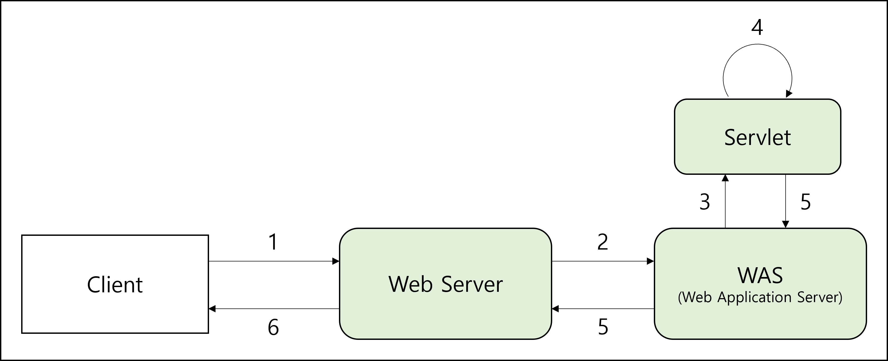
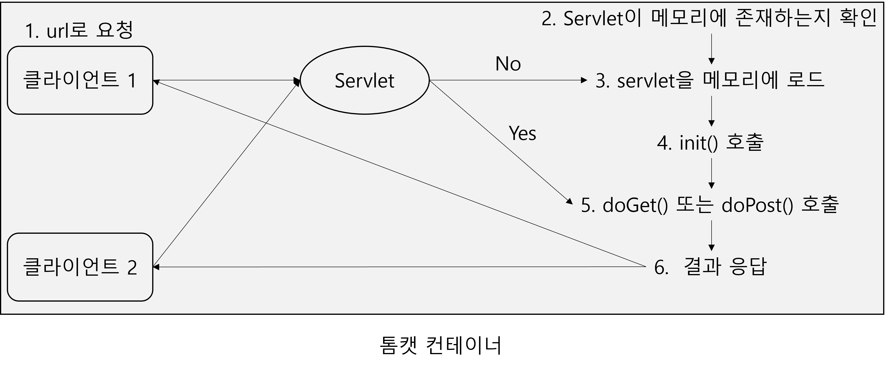
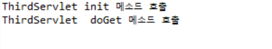

# Chapter 4. 서블릿 이해하기

## 4.1 서블릿이란?

### 4.1.1 서블릿 개념

- 개념
    - 서버 쪽에서 실행되면서 클라이언트의 요청에 따라 동적으로 서비스를 제공하는 자바 클래스
    - 일반 자바 프로그램과 다르게 독자적으로 실행되지 못하고 톰캣과 같은 JSP/Servlet 컨테이너에서 실행됨
    - 서버에서 실행되다가 웹 브라우저에서 요청을 하면 해당 기능을 수행한 후 웹 브라우저에 결과 전송

### 4.1.2 서블릿 동작 과정

- 동작 과정
  
    
    
    1. 클라이언트가 웹 서버에 요청
    2. 요청을 웹 애플리케이션 서버(WAS)에 위임
    3. WAS는 각 요청에 해당하는 서블릿 실행
    4. 서블릿이 요청에 대한 기능 수행
    5. 기능 수행 후 클라이언트에 결과 반환

### 4.1.3 서블릿 기능

- 기능 및 특징
    - 동적으로 변하는 정보를 효과적으로 다룰 수 있음
    - 서버 쪽에서 실행되면서 기능 수행
    - 스레드 방식으로 실행
    - 자바로 만들어져 자바의 특징(객체 지향)을 가짐
    - 컨테이너에서 실행
    - 컨테이너 종류에 상관없이 실행(플랫폼 독립적)
    - 보안 기능 적용 용이
    - 웹 브라우저에서 요청 시 기능 수행

## 4.2 서블리 API 계층 구조와 기능

### 4.2.1 서블릿 API 기능

- 서블릿 API
    - Servlet과 ServletConfig 인터페이스를 구현해 제공
    - GenericServlet 추상 클래스가 두 인터페이스의 추상 메서드 구현
    - HttpServlet이 GenericServlet을 상속받음
- 구성 요소 특징
    1. Servlet 인터페이스
        - javax.servlet 패키지에 선언
        - Servlet 관련 추상 메서드 선언
        - `init()`, `service()`, `destroy()`, `getServletInfo()`, `getServletConfig()` 선언
    2. ServletConfig 인터페이스
        - javax.servlet 패키지에 선언
        - Servlet 기능 관련 추상 메서드 선언
        - `getInitParameter()`, `getInitParameterNames()`, `getServletContext()`, `getServletName()` 선언
    3. GenericServlet 클래스
        - javax.servlet 패키지에 선언
        - Servlet 인터페이스와 ServletConfig 인터페이스를 구현하여 일반적인 서블릿 기능 구현
        - GenericServelt을 상속받아 구현한 서블릿은 프로토콜에 따라 각각 `service()`를 오버라이딩해서 구현
    4. HttpServlet 클래스
        - javax.servlet.http 패키지에 선언
        - GenericServlet을 상속받아 HTTP 포로토콜을 사용하는 웹 브라우저에서 서블릿 기능 수행
        - 웹 브라우저 기반 서비스를 제공하는 서블릿을 만들 때 상속받아 사용
        - 요청 시 `service()`가 호출되면서 요청 방식에 따라 `doGet()`이나 `doPost()`가 차례대로 호출
- HttpServlet의 여러 가지 메서드 기능
    1. `protected doDelete(HttpServletRequest req, HttpServletResponse resp)`
        - 서블릿이 DELETE request를 수행하기 위해 `service()`를 통해 호출됨
    2. `protected doGet(HttpServletRequest req, HttpServletResponse resp)`
        - 서블릿이 GET request를 수행하기 위해 `service()`를 통해 호출됨
    3. `protected doHead(HttpServletRequest req, HttpServletResponse resp)`
        - 서블릿이 HEAD request를 수행하기 위해 `service()`를 통해 호출됨
    4. `protected doPost(HttpServletRequest req, HttpServletResponse resp)`
        - 서블릿이 POST request를 수행하기 위해 `service()`를 통해 호출됨
    5. `protected service (ServletRequest req, ServletResponse resp)`
        - request를 `public service()`에서 전달받아 `doXXX()` 메서드 호출
    6. `public service (ServletRequest req, ServletResponse resp)`
        - 클라이언트의 request를 `protected service()`에게 전달

## 4.3 서블릿의 생명주기 메서드

### 4.3.1 서블릿 생명주기 메서드

- 서블릿 생명주기 메서드 기능
    1. 초기화
        - 호출 메서드 : `init()`
        - 서블릿 요청 시 맨 처음 한 번만 호출
        - 서블릿 생성 시 초기화 작업을 주로 수행
        - 생략 가능
    2. 작업 수행
        - 호출 메서드 : `doGet()`, `doPost()`
        - 서블릿 요청 시 매번 호출
        - 실제로 클라이언트가 요청하는 작업 수행
    3. 종료
        - 호출 메서드 : `destroy()`
        - 서블릿이 기능을 수행하고 메모리에서 소멸될 때 호출
        - 서블릿의 마무리 작업을 주로 수행
        - 생략 가능

## 4.4 FirstServlet을 이용한 실습

### 4.4.1 사용자 정의 서블릿 만들기

- 사용자 정의 서블릿
    - HttpServlet 클래스를 상속받아 만듦
    - 생명주기 메서드를 오버라이딩해서 기능 구현
      
        ```java
        public class FirstServlet extends HttpServlet{
        	@override
        	public void init(){
        		...
        	}
        
        	@override
        	public void doGet(HttpServletRequest req, HttpServletResponse resp){
        		...
        	}
        
        	@override
        	public void distroy(){
        		...
        	}
        }
        ```
        

### 4.4.2 톰캣의 servlet-api.jar 클래스 패스 설정

- 클래스 패스 설정
    - 이클립스의 프로젝트에서 서블릿을 사용하려면 클래스 패스를 설정해야 함
    - 프로젝트 생성
        1. New → Dynamic Web Project 선택
        2. Default 값으로 설정하고, 마지막에 Generate web.xml deplyment descriptor 체크
    - servlet-api.jar 추가
        1. 프로젝트 이름 선택 후 Build Path → Configure Build Path 선택
        2. Libraries 탭에서 Classpath 선택한 후 Add External JARs 클릭
        3. 톰캣 루트 디렉터리에서 servlet-api.jar 선택한 후 열기 클릭
        4. Apply and Close 클릭해 종료
    - 오류 해결
        - 프로젝트 생성 후 오류 표시가 뜨면 Configure Build Path의 Libraries 탭에서 JRE를 edit에서 default로 설정

### 4.4.3 첫 번째 서블릿 만들기

- 첫 번째 서블릿 만들기
    1. src 폴더에 Package 생성
    2. 생성한 Package에 Class 생성
    3. 생성한 Class에 아래의 코드 작성
       
        ```java
        package sec01.ex01;
        
        import java.io.IOException;
        
        import javax.servlet.ServletException;
        import javax.servlet.http.HttpServlet;
        import javax.servlet.http.HttpServletRequest;
        import javax.servlet.http.HttpServletResponse;
        
        public class FirstServlet  extends HttpServlet{ 
           public void init() throws ServletException {
              System.out.println("init 메서드 호출");
           }
        
           protected void doGet(HttpServletRequest req, HttpServletResponse resp) throws  ServletException, IOException {
              System.out.println("doGet 메서드 호출");
           } 
        
           public void destroy() {
              System.out.println("destroy 메서드 호출");
           }
        }
        ```
        

### 4.4.4 서블릿 매핑하기

- 서블릿 매핑 필요성
    - 브라우저에서 서블릿을 요청하려면 패키지 이름까지 포함된 서블릿 클래스 이름을 포함하여 요청해야 함
    - 클래스 이름이 길어지면 입력하기 어려움
    - 브라우저에서 클래스 이름으로 입력하면 보안상에도 좋지 않음
- 서블릿 매핑 과정
    1. web.xml에서 설정
    2. `<servlet>` 태그와 `<servlet-mapping>` 태그 이용
    3. 여러 개의 서블릿 매핑 시 `<servlet>` 태그를 먼저 정의하고 `<servlet-mapping>` 태그 정의
    - web.xml에 서블릿 매핑할 경우 문법, 태그, 철자가 틀리지 않도록 주의해야 함
- 적용하기
  
    ```xml
    <?xml version="1.0" encoding="UTF-8"?>
    <web-app xmlns:xsi="http://www.w3.org/2001/XMLSchema-instance" xmlns="http://java.sun.com/xml/ns/javaee" xsi:schemaLocation="http://java.sun.com/xml/ns/javaee http://java.sun.com/xml/ns/javaee/web-app_3_0.xsd" id="WebApp_ID" version="3.0">
      <servlet>
        <servlet-name>aaa</servlet-name>
        <servlet-class>sec01.ex01.FirstServlet</servlet-class>
      </servlet>
      <servlet-mapping>
        <servlet-name>aaa</servlet-name>
        <url-pattern>/first</url-pattern>
      </servlet-mapping>
    </web-app>
    ```
    
    - aaa가 `<servlet>`과 `<servlet-mapping>` 태그 연결
    - first는 웹 브라우저에서 요청하는 매핑 이름

### 4.4.5 톰캣에 프로젝트 실행

- 프로젝트 실행
    1. 톰캣 서버 선택 후 우클릭하여 Add and Remove 선택
    2. 서블릿을 만든 프로젝트를 Add를 클릭하여 추가 후 Finish 클릭

### 4.4.6 브라우저에서 서블릿 요청하기

- 서블릿 요청하기
    - 요청 형식 : http://IP주소:포트번호/프로젝트이름(컨텍스트이름)/서블릿매핑이름
    - 예시 : `http://localhost:8090/pro05/first`
    1. 톰캣 실행
    
    2. 브라우저에서 서블릿 매핑 이름으로 요청
    
    3. 웹 브라우저에서 요청하면 이클립스 콘솔에 각각의 메서드가 호출되면서 메시지 출력
    
        

### 4.4.7 다수의 서블릿 매핑하기

- 다수의 서블릿 매핑
    - 일반적인 웹 애플리케이션은 각 기능에 대한 서블릿을 따로 만들어서 서비스 제공
      
        ⇒ 프로젝트에서 여러 개의 서블릿을 만들어 사용
        
    - 여러 개의 서블릿을 web.xml에 매핑하려면 `<servlet` 태그와 `<servlet-mapping>` 태그를 분리한 후 `<servlet-name>` 태그 값을 다른 값으로 설정
- 두 번째 서블릿 만들기
    - 동일한 과정으로 두 번째 서블릿 만들기
      
        ```java
        package sec01.ex01;
        
        import java.io.IOException;
        
        import javax.servlet.ServletException;
        import javax.servlet.http.HttpServlet;
        import javax.servlet.http.HttpServletRequest;
        import javax.servlet.http.HttpServletResponse;
        
        public class SecondServlet  extends HttpServlet{
           public void init() throws ServletException {
              System.out.println("init 메서드 호출>>>>");
           }
        
           protected void doGet(HttpServletRequest req, HttpServletResponse resp) throws  ServletException, IOException {
              System.out.println("doGet 메서드 호출>>>>");
           }
        
           public void destroy() {
              System.out.println("destroy 메서드 호출>>>>");
           }
        }
        ```
    
- 두 번째 서블릿 매핑하기
    - web.xml에 동일한 과정으로 매핑
      
        ```xml
        <?xml version="1.0" encoding="UTF-8"?>
        <web-app xmlns:xsi="http://www.w3.org/2001/XMLSchema-instance" xmlns="http://java.sun.com/xml/ns/javaee" xsi:schemaLocation="http://java.sun.com/xml/ns/javaee http://java.sun.com/xml/ns/javaee/web-app_3_0.xsd" id="WebApp_ID" version="3.0">
          <servlet>
            <servlet-name>aaa</servlet-name>
            <servlet-class>sec01.ex01.FirstServlet</servlet-class>
          </servlet>
          <servlet>
            <servlet-name>bbb</servlet-name>
            <servlet-class>sec01.ex01.SecondServlet</servlet-class>
          </servlet>
          <servlet-mapping>
            <servlet-name>aaa</servlet-name>
            <url-pattern>/first</url-pattern>
          </servlet-mapping>
          <servlet-mapping>
            <servlet-name>bbb</servlet-name>
            <url-pattern>/second</url-pattern>
          </servlet-mapping>
        </web-app>
        ```
        
        - 두 번째 서블릿은 bbb로 연결
        - second는 두 번째 서블릿을 브라우저에 요청하는 매핑 이름
- 두 번째 서블릿 실행 결과
  
    
    

## 4.5 서블릿 동작 과정

### 4.5.1 서블릿 동작 과정

- 동작 과정
  
    
    
    - 최초 요청 시에만 `init()` 호출
      
        ⇒ 동일한 작업의 경우 서블릿은 메모리에 존재하는 서블릿을 재사용함으로써 훨씬 빠르고 효율적으로 동작
        

## 4.6 애너테이션을 이용한 서블릿 매핑

### 4.6.1 애너테이션을 이용한 서블릿 매핑

- 애너테이션(annotation) 개념
    - 여러 서블릿을 web.xml에 설정할 경우 복잡해짐
      
        ⇒ `@` 기호를 이용해서 서블릿 표시를 해주면 가독성이 좋아짐
        
    - 소스 코드에 직접 기능을 설정하는 방법
- 애너테이션을 이용한 서블릿 매핑
    - `@WebServlet` 이용
    - 애너테이션이 적용되는 클래스는 반드시 `HttpServlet` 클래스를 상속받아야 함
    - 사용 방법
      
        ```java
        (서블릿 클래스 위에 선언)
        @WebServlet("/서블릿매핑이름");
        ```
        
    - 예시
      
        ```java
        @WebServlet("/third")
        public class ThirdServlet extends HttpServlet {
        	
        }
        ```
        

### 4.6.2 애너테이션을 이용한 서블릿 매핑 실습

- 세 번째 서블릿 만들기
    1. 패키지 선택 → 우 클릭 → New → Servlet 선택
    2. 클래스 이름 입력 후 Next
    3. 기본 URL mapping 이름 선택 후 Edit 클릭
    4. 원하는 매핑 이름 입력 후 OK
    5. 매핑 이름이 수정된 것을 확인한 후 Next
    6. Constructors from superclass 옵션 체크박스의 체크를 해제
    7. init, destroy, doGet, doPost 체크 후 Finish
- 적용 결과
  
    ```java
    package sec01.ex01;
    
    import java.io.IOException;
    import javax.servlet.ServletConfig;
    import javax.servlet.ServletException;
    import javax.servlet.annotation.WebServlet;
    import javax.servlet.http.HttpServlet;
    import javax.servlet.http.HttpServletRequest;
    import javax.servlet.http.HttpServletResponse;
    
    /**
     * Servlet implementation class ThirdServlet
     */
    @WebServlet("/third")
    public class ThirdServlet extends HttpServlet {
    	private static final long serialVersionUID = 1L;
    
    	/**
    	 * @see Servlet#init(ServletConfig)
    	 */
    	public void init(ServletConfig config) throws ServletException {
    		System.out.println("ThirdServlet init 메소드 호출");
    	}
    
    	/**
    	 * @see HttpServlet#doGet(HttpServletRequest request, HttpServletResponse response)
    	 */
    	protected void doGet(HttpServletRequest request, HttpServletResponse response) throws ServletException, IOException {
    		
    		System.out.println("ThirdServlet  doGet 메소드 호출");
    	}
    
    	/**
    	 * @see HttpServlet#doPost(HttpServletRequest request, HttpServletResponse response)
    	 */
    	protected void doPost(HttpServletRequest request, HttpServletResponse response) throws ServletException, IOException {
    		System.out.println("ThirdServlet destroy 메소드 호출");
    	}
    
    }
    ```
    
    - 매핑 이름이 이미 사용된 다른 매핑 이름과 중복되지 않도록 주의
    - 실행 결과
      
        
        

---