# Chapter 5. 서블릿 기초

## 5.1 서블릿의 세 가지 기본 기능

### 5.1.1 서블릿 기본 기능 수행 과정

- 서블릿의 세 가지 주요 기능
  
    
    
    1. 클라이언트로부터 요청 받음
    2. DB 연동과 같은 비즈니스 로직 처리
    3. 처리된 결과를 클라이언트에 돌려줌

### 5.1.2 서블릿 응답과 요청 수행 API 기능

- 응답과 요청 수행 API
    - 요청이나 응답과 관련된 API는 모두 `javax.servlet.http` 패키지에 있음
    - 요청 관련 API : `javax.servlet.http.HttpServletRequest`
    - 응답 관련 API : `javax.servlet.http.HttpServletResponse`
- HttpServletRequest의 메서드
    1. boolean
        - `authenticate(HttpServletResponse response)` : 현재 요청한 사용자가 `ServletContext` 객체에 대한 인증을 하기 위한 컨테이너 로그인 메커니즘 사용
    2. String
        - `changeSessionId()` : 현재 요청과 관련된 현재 세션의 id를 변경하여 새 세션 id 반환
        - `getContextPath()` : 요청한 컨텍스트를 가리키는 URL 반환
        - `getHeader(String name)` : 특정 요청에 대한 헤더 정보를 문자열로 반환
        - `getMethod()` : 현재 요청이 GET, POST, PUT 방식 중 어떤 HTTP 요청인지를 반환
        - `getRequestURI()` : 요청한 URL의 컨텍스트 이름과 파일 경로까지 반환
        - `getServletPath()` : 요청한 URL에서 서블릿이나 JSP 이름 반환
    3. Cookie[]
        - `getCookies()` : 클라이언트가 현재의 요청과 함께 보낸 쿠키 객체들에 대한 배열 반환
    4. Enumeration <String>
        - `getHeaderNames()` : 현재 요청에 포함된 헤더의 name 속성을 enumeration으로 반환
    5. HttpSession
        - `getSession()` : 현재 요청과 연관된 세션 반환(없으면 새로 만들어서 반환)
- HttpServletResponse의 메서드
    1. void
        - `addCookie(Cookie cookie)` : 응답에 쿠키 추가
        - `addHeader(String name, String value)` : name과 value를 헤더에 추가
        - `sendRedirect(String location)` : 클라이언트에게 redirect 응답을 보낸 후 특정 URL로 다시 요청하게 함
    2. String
        - `encodeURL(String url)` : 클라이언트카 쿠키를 지원하지 않을 때 세션 id를 포함한 특정 URL을 인코딩
        - `getPathInfo()` : 클라이언트가 요청 시 보낸 URL과 관련된 추가 경로 정보 반환
    3. Collection <String>
        - `getHeaderNames()` : 현재 응답의 헤더에 포함된 name을 얻어옴

## 5.2 `<form>` 태그 이용해 서블릿에 요청하기

### 5.2.1 `<form>` 태그의 여러 가지 속성

- 예시 - Log In
    - HTML 코드
      
        ```html
        <!DOCTYPE html>
        <html>
        <head>
        <meta charset="UTF-8">
        <title>로그인창</title>
        </head>
        <body>
          <form name="frmLogin" method="get" action="login"  encType="UTF-8">
        	   아이디  :<input type="text" name="user_id"><br>
             비밀번호:<input type="password" name="user_pw" ><br>
            <input type="submit" value="로그인">  <input type="reset" value="다시입력">
          </form>
        </body>
        </html>
        ```
        
        - action 속성 : 데이터를 전송할 서블릿이나 JSP의 이름 지정
          
            ⇒ 위의 예시의 경우 이름이 login인 서블릿으로 아이디와 비밀번호가 전송됨
            
        - 데이터는 `<input>` 태그의 `name` 속성 값과 쌍으로 전송
- `<form>` 태그와 관련된 여러 가지 속성
    1. name
        - `<form>` 태그의 이름 지정
        - 여러 개의 `form`이 존재할 경우 구분하는 역할
        - 자바스크립트에서 `<form>` 태그에 접근할 때 자주 사용
    2. method
        - `<form>` 태그 안에서 데이터를 전송할 때 전송 방법 지정
        - GET 또는 POST로 지정
          
            (아무것도 지정하지 않으면 GET)
        
    3. action
        - `<form>` 태그에서 데이터를 전송할 서블릿이나 JSP 지정
        - 서블릿으로 전송할 때는 매핑 이름 사용
    4. encType
        - `<form>` 태그에서 전송할 데이터의 encoding타입 지정
- `<form>` 태그로 전송된 데이터를 받아 오는 메서드
    1. `String getParameter(String name)`
        - name의 값을 알고 있을 때 name에 대한 전송된 값을 받아오는 데 사용
    2. `String[] getParameterValues(String name)`
        - 같은 name에 여러 개의 값을 얻을 때 사용
    3. `Enumeration getParameterNames()`
        - name 값을 모를 때 사용

## 5.3 서블릿에서 클라이언트의 요청을 얻는 방법

### 5.3.1 HttpServletRequest로 요청 처리 실습

- HttpServletRequest 요청 처리
    1. 프로젝트 생성 및 클래스 패스 지정
    2. WebContent 폴더 하위에 사용자 정보를 입력받을 html 생성
    3. html 작성
       
        <login.html>
        
        ```html
        <!DOCTYPE html>
        <html>
        <head>
        <meta charset="UTF-8">
        <title>로그인창</title>
        </head>
        <body>
          <form name="frmLogin" method="get" action="login"  encType="UTF-8">
        	   아이디  :<input type="text" name="user_id"><br>
             비밀번호:<input type="password" name="user_pw" ><br>
            <input type="submit" value="로그인">  <input type="reset" value="다시입력">
          </form>
        </body>
        </html>
        ```
        
        - `action=login` : 입력된 데이터를 서블릿 매핑 이름이 login인 서블릿으로 전송
        - `name="user_id"` : 텍스트 박스에 입력된 ID를 user_id로 전송
        - `name="user_pw"` : 텍스트 박스에 입력된 비밀번호를 user_pw로 전송
    4. 프로젝트 내 패키지를 생성하고 요청 받을 서블릿 클래스 생성
    5. 서블릿 클래스에 코드 작성
       
        <LoginServlet.java>
        
        ```java
        package sec01.ex01;
        
        import java.io.IOException;
        import javax.servlet.ServletException;
        import javax.servlet.annotation.WebServlet;
        import javax.servlet.http.HttpServlet;
        import javax.servlet.http.HttpServletRequest;
        import javax.servlet.http.HttpServletResponse;
        
        @WebServlet("/login") 
        public class LoginServlet  extends HttpServlet{
           public void init() throws ServletException {
              System.out.println("init 메서드 호출");
           }
        
           protected void doGet(HttpServletRequest request , HttpServletResponse response) 
                                                    throws ServletException, IOException {
              request.setCharacterEncoding("utf-8"); 	
              String user_id=request.getParameter("user_id");
              String user_pw=request.getParameter("user_pw"); 
              System.out.println("아이디:"+user_id);
              System.out.println("비밀번호:"+user_pw);
           }
        
           public void destroy() {
              System.out.println("destroy 메서드 호출");
           }
        }
        ```
        
        - `@WebServlet("/login")` : 매핑 이름이 login
        - `HttpServletRequest` : 브라우저에서 전송한 정보를 톰캣 컨테이너가 HttpServletRequest 객체를 생성한 후 doGet()으로 넘겨줌
        - `request.setCharacterEncoding("utf-8")` : 전송된 데이터를 UTF-8로 인코딩
        - `String user_id=request.getParameter("user_id")` : `<input>` 태그의 name 속성 값이 user_id인 데이터의 value를 받아옴
        - `String user_id=request.getParameter("user_pw")` : `<input>` 태그의 name 속성 값이 user_pw인 데이터의 value를 받아옴
    6. 톰캣에 프로젝트 등록 후 실행하여 브라우저에서 html 요청
       
        
        
    7. 텍스트 박스에 아이디와 비밀번호 입력 후 로그인 클릭하면 콘솔에 출력함
       
        
        
        - 응답 기능은 아직 구현하지 않았기 때문에 브라우저에는 아무것도 출력되지 않음
          
            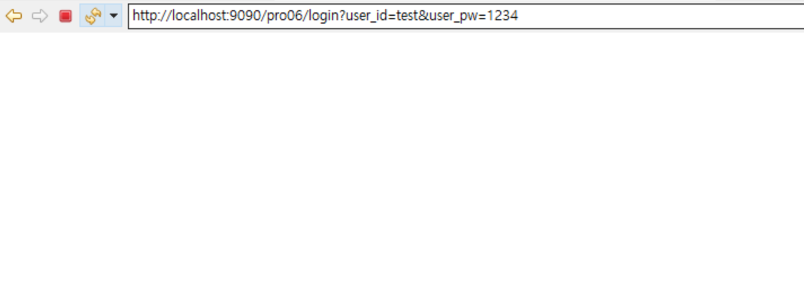
            

### 5.3.2 여러 개의 값을 전송할 때의 요청 처리

- 여러 개의 값을 전송할 때의 요청 처리 실습
    1. 여러 개의 데이터를 입력할 html을 생성
    2. html에 코드 작성
       
        <input.html>
        
        ```html
        <!DOCTYPE html>
        <html>
        <head>
        <meta charset="UTF-8">
        <title>여러 가지 input 타입 표시창</title>
        </head>
        <body>
        <form name="frmInput" method="get" action="input">
           아이디  :<input type="text" name="user_id"><br>
           비밀번호:<input type="password" name="user_pw"><br>
           <input type="checkbox" name="subject" value="java" checked >자바
           <input type="checkbox" name="subject" value="C언어">C언어
           <input type="checkbox" name="subject" value="JSP">JSP
           <input type="checkbox" name="subject" value="안드로이드">안드로이드 
           <br><br>
           <input type="submit" value="전송">   
           <input type="reset" value="초기화">
          </form>
        </body>
        </html>
        ```
        
        - 전송을 클릭하면 action 태그에서 설정한 input 서블릿으로 전송
    3. 매핑 이름이 input인 서블릿 클래스 생성
    4. 서블릿 클래스에 코드 작성
       
        <InputServlet.java>
        
        ```java
        package sec01.ex01;
        
        import java.io.IOException;
        import javax.servlet.ServletException;
        import javax.servlet.annotation.WebServlet;
        import javax.servlet.http.HttpServlet;
        import javax.servlet.http.HttpServletRequest;
        import javax.servlet.http.HttpServletResponse;
        
        @WebServlet("/input")
        public class InputServlet  extends HttpServlet{
           public void init() throws ServletException {
              System.out.println("init 메서드 호출");
           }
        
           protected void doGet(HttpServletRequest request, HttpServletResponse response) 
                                                    throws ServletException, IOException {
              request.setCharacterEncoding("utf-8");
              String user_id=request.getParameter("user_id");
              String user_pw=request.getParameter("user_pw"); 
              System.out.println("아이디:"+user_id);
              System.out.println("비밀번호:"+user_pw);
              String[] subject=request.getParameterValues("subject"); 
              for(String str:subject){
                 System.out.println("선택한 과목:"+str);
              }
           }
        
           public void destroy() {
              System.out.println("destroy 메서드 호출");
           }
        }
        ```
        
        - 한 개씩 전송된 값은 `request.getParameter("input 태그의 name")` 이용
        - 하나의 name으로 여러 값을 전송하는 경우 `request.getParameterValues("input 태그의 name")` 이용
    5. 브라우저에서 html 요청
       
        (현재 실습의 경우 input.html)
        
        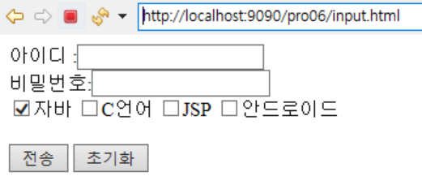
        
    6. 아이디, 비밀번호, 체크 설정 후 전송을 클릭하면 콘솔에 결과 값 출력
       
        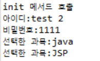
        

### 5.3.3 getParameterNames() 메서드를 이용한 요청 처리

- getParameterNames() 메서드를 이용한 요청 처리
    - 서블릿에서 매개변수가 많으면 일일이 관리하기 힘듦
      
        ⇒ getParameterNames() 이용
        
    1. getParameterNames()를 사용할 서블릿 생성
    
    2. 서블릿에 코드 작성
       
        <InputServlet2.java>
        
        ```java
        package sec01.ex01;
        
        import java.io.IOException;
        import java.util.Enumeration;
        
        import javax.servlet.ServletException;
        import javax.servlet.annotation.WebServlet;
        import javax.servlet.http.HttpServlet;
        import javax.servlet.http.HttpServletRequest;
        import javax.servlet.http.HttpServletResponse;
        
        @WebServlet("/input2")	
        public class InputServlet2 extends HttpServlet{
           public void init() throws ServletException {
              System.out.println("init 메서드 호출");
           }
        
           protected void doGet(HttpServletRequest request, HttpServletResponse response) 
                                                    throws ServletException, IOException {
              request.setCharacterEncoding("utf-8");
              Enumeration enu=request.getParameterNames();
              while(enu.hasMoreElements()){
        		String name=(String)enu.nextElement();
        		String []values=request.getParameterValues(name);		
        		for(String value:values){
        		   System.out.println("name="+name+",value="+value);
        		}   
              }
           }
           public void destroy() {
              System.out.println("destroy 메서드 호출");
           }
        }
        ```
        
        - `Enumeration enu = request.getParameterNames();` : 전송되어 온 name 속성들만 Enumeration 타입으로 받아 옴
        - 각 name을 하나씩 가져와 대응해서 전송되어 온 값을 출력하는 부분
          
            ```java
            while(enu.hasMoreElements()){
            		String name=(String)enu.nextElement();
            		String []values=request.getParameterValues(name);		
            		for(String value:values){
            		   System.out.println("name="+name+",value="+value);
            		}   
                  }
            ```
        
    3. 여러 개의 값을 전송할 때 만든 html에서 서블릿 매핑 이름을 input2로 설정하였기 때문에 action 태그에서 input을 input2로 수정
    
    4. 브라우저에서 html을 요청하고 값을 입력한 후 전송을 클릭하면 콘솔 창에서 결과 값 출력
       
        
        
        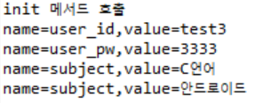

## 5.4 서블릿의 응답 처리 방법

### 5.4.1 서블릿 응답 처리 방법

- 응답 처리 방법
    1. `doGet()` 이나 `doPost()` 메서드 안에서 처리
    2. javax.servlet.http.HttpServletResponse 객체 이용
    3. `setContentType()` 을 이용해 클라이언트에게 전송할 데이터 종류 지정
    4. 클라이언트와 서블릿의 통신은 자바의 I/O의 스트림 이용
- MIME-TYPE
    - 톰캣 컨테이너에서 미리 설정해 놓은 데이터 종류
    - 톰캣 컨테이너에서 미리 제공하는 여러 가지 전송 데이터 종류 중 하나를 지정해서 웹브라우저로 전송하면 처리 속도가 향상됨
    - 지정 예시
        - HTML로 전송 시 : text/html
        - 일반 텍스트로 전송 시 : text/plain
        - XML 데이터로 전송 시 : application/xml

### 5.4.2 HttpServletResponse를 이용한 서블릿 응답 실습

- 서블릿이 클라이언트에 응답하는 과정
    1. `setContentType()` 을 이용해 MIME-TYPE 지정
    2. 데이터를 출력할 `PrintWriter` 객체 생성
    3. 출력 데이터를 HTML 형식으로 만듦
    4. `PrintWriter`의 `print()`나 `println()`을 이용해 데이터 출력
- HttpServletResponse를 이용한 응답
    1. 새로운 서블릿 클래스를 생성한 후 코드 작성
       
        <LoginServlet2.java>
        
        ```java
        package sec02.ex01;
        
        import java.io.IOException;
        import java.io.PrintWriter;
        
        import javax.servlet.ServletException;
        import javax.servlet.annotation.WebServlet;
        import javax.servlet.http.HttpServlet;
        import javax.servlet.http.HttpServletRequest;
        import javax.servlet.http.HttpServletResponse;
        
        /**
         * Servlet implementation class LoginServlet2
         */
        @WebServlet("/login2")
        public class LoginServlet2 extends HttpServlet {
        	private static final long serialVersionUID = 1L;
        
        	public void init() throws ServletException {
        		System.out.println("init 메서드 호출");
        	}
        
        	protected void doGet(HttpServletRequest request, HttpServletResponse response) throws ServletException, IOException {
        		request.setCharacterEncoding("utf-8");
        		response.setContentType("text/html;charset=utf-8");
        		PrintWriter out = response.getWriter();
        
        		String id = request.getParameter("user_id");
        		String pw = request.getParameter("user_pw");
        
        		String data = "<html>";
        		data += "<body>";
        		data += "아이디 : " + id;
        		data += "<br>";
        		data += "비밀번호 : " + pw;
        		data += "</html>";
        		data += "</body>";
        		out.print(data);
        	}
        
        	public void destroy() {
        		System.out.println("destroy 메서드 호출");
        	}
        
        }
        ```
        
        - 응답은 `HttpServletResponse` 객체 이용
        - `response.setContentType("text/html;charset=utf-8")` : 응답할 데이터 종류가 HTML임을 설정
        - `PrinWriter out = response.getWriter();` : `getWriter()`를 이용해 출력 스트림 `PrintWriter` 객체 받음
        - 브라우저로 출력할 데이터를 문자열로 연결해서 HTML 태그 만드는 부분
          
            ```java
            String data = "<html>";
            		data += "<body>";
            		data += "아이디 : " + id;
            		data += "<br>";
            		data += "비밀번호 : " + pw;
            		data += "</html>";
            		data += "</body>";
            ```
            
        - `out.print(data)` " HTML 태그 문자열을 브라우저로 출력
    2. 앞서 서블릿의 매핑 이름을 login2로 하였기 때문에 이전 실습에서 만든 로그인 html에서 action 태그를 login에서 login2로 변경
       
        <login.html>
        
        ```html
        <!DOCTYPE html>
        <html>
        <head>
        <meta charset="UTF-8">
        <title>로그인창</title>
        </head>
        <body>
          <form name="frmLogin" method="get" action="login2"  encType="UTF-8">
        	   아이디  :<input type="text" name="user_id"><br>
             비밀번호:<input type="password" name="user_pw" ><br>
            <input type="submit" value="로그인">  <input type="reset" value="다시입력">
          </form>
        </body>
        </html>
        ```
        
    3. 브라우저에서 데이터를 입력한 후 로그인 클릭
       
        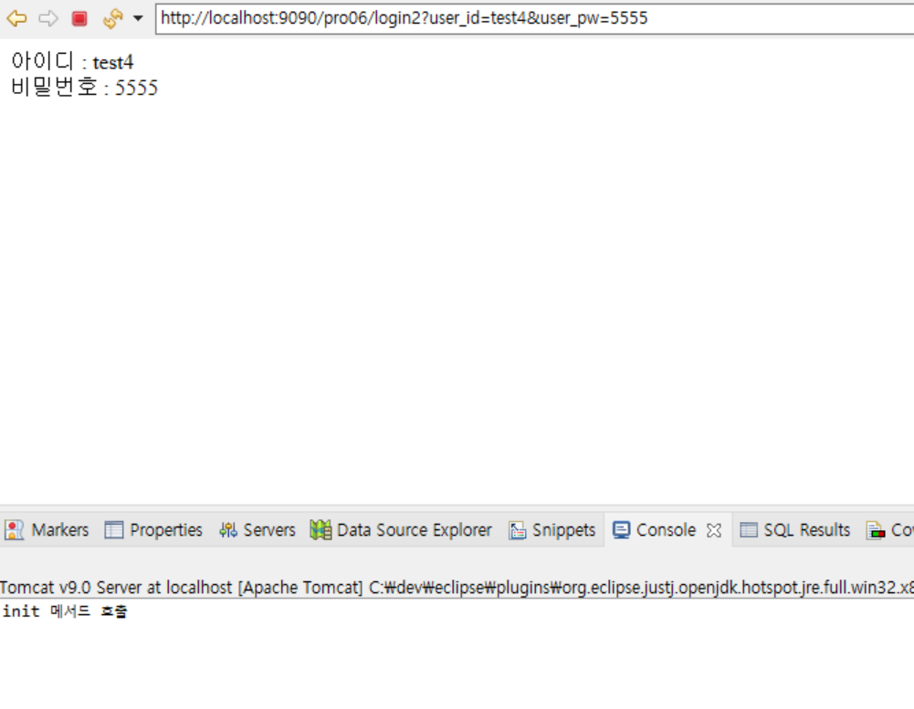
        

## 5.5 웹 브라우저에서 서블릿으로 데이터 전송하기

### 5.5.1 GET/POST전송 방식

- GET 방식
    - URL 주소에 데이터를 붙여서 전송하는 방식
      
        (URL 뒤에 name=value 형태로 전송)
        
    - 여러 개의 데이터를 전송할 때는 '&'로 구분해서 전송
    - 사용이 쉽고 브라우저에 직접 입력해서 전송할 수도 있음
    - 서블릿에서는 `doGet()` 이용해 데이터 처리
    - 데이터가 노출되어 보안에 취약
      
        ⇒ 보안과 관련 없는 간단한 데이터를 쉽게 전송 시 사용
    
- POST 방식
    - 데이터를 숨겨서 전송하는 방식
      
        (TCP/IP 프로토콜 데이터의 body 영역에 숨겨진 채 전송)
        
    - 처리 속도가 GET 방식보다 느림
    - 서블릿에서는 `doPost()`를 이용해 처리
    - 보안성이 좋음
      
        ⇒ 보안과 관련된 데이터를 전송하는 데 많이 사용
        

### 5.5.2 GET 방식으로 서블릿에 요청

- GET 방식으로 데이터 전송
    - html의 `<form>` 태그에서 method 속성이 get으로 설정되어 있으면 서블릿에 GET 방식으로 데이터를 전송하겠다는 의미
      
        ```html
        <form name="frmLogin" method="get" action="login2"  encType="UTF-8">
        	   아이디  :<input type="text" name="user_id"><br>
             비밀번호:<input type="password" name="user_pw" ><br>
            <input type="submit" value="로그인">  <input type="reset" value="다시입력">
          </form>
        ```
        
    - 서블릿에서는 GET 방식으로 전송된 데이터를 `doGet()` 메서드를 이용해 처리
      
        ```java
        protected void doGet(HttpServletRequest request, HttpServletResponse response) throws ServletException, IOException {
        		request.setCharacterEncoding("utf-8");
        		response.setContentType("text/html;charset=utf-8");
        		PrintWriter out = response.getWriter();
        
        		String id = request.getParameter("user_id");
        		String pw = request.getParameter("user_pw");
        
        		String data = "<html>";
        		data += "<body>";
        		data += "아이디 : " + id;
        		data += "<br>";
        		data += "비밀번호 : " + pw;
        		data += "</html>";
        		data += "</body>";
        		out.print(data);
        	}
        ```
        
    - 브라우저 주소 창을 보면 'name=value" 쌍으로 붙어서 전송됨
      
        `http://localhost:9090/pro06/login2?user_id=test4&user_pw=5555`
        

### 5.5.3 POST 방식으로 서블릿에 요청

- POST 방식으로 서블릿에 요청 실습
    1. 패키지를 만들고 서블릿 클래스 생성
    2. 서블릿 클래스에 코드 작성
       
        <LoginServlet3.java>
        
        ```java
        package sec03.ex01;
        
        import java.io.IOException;
        
        import javax.servlet.ServletException;
        import javax.servlet.annotation.WebServlet;
        import javax.servlet.http.HttpServlet;
        import javax.servlet.http.HttpServletRequest;
        import javax.servlet.http.HttpServletResponse;
        
        /**
         * Servlet implementation class LoginServlet3
         */
        @WebServlet("/login3")
        public class LoginServlet3 extends HttpServlet {
        	public void init() throws ServletException {
        		System.out.println("init 메서드 호출");
        	}
        
        	protected void doPost(HttpServletRequest request, HttpServletResponse response)	throws ServletException, IOException {
        		request.setCharacterEncoding("utf-8");
        		String user_id = request.getParameter("user_id");
        		String user_pw = request.getParameter("user_pw");
        		System.out.println("아이디:" + user_id);
        		System.out.println("비밀번호:" + user_pw);
        	}
        
        	public void destroy() {
        		System.out.println("destroy 메서드 호출");
        	}
        }
        ```
        
        - POST 방식으로 전송된 데이터를 처리하기 위해 `doPost()` 이용
    3. 로그인 html은 이전에 생성한 파일을 편집해서 사용. 서블릿 매핑 이름을 앞에서 login3로 설정하였기 때문에 action 태그도 login3로 수정하고, method는 post로 수정
       
        <login.html>
        
        ```html
        <!DOCTYPE html>
        <html>
        <head>
        <meta charset="UTF-8">
        <title>로그인창</title>
        </head>
        <body>
          <form name="frmLogin" method="post" action="login3"  encType="UTF-8">
        	   아이디  :<input type="text" name="user_id"><br>
             비밀번호:<input type="password" name="user_pw" ><br>
            <input type="submit" value="로그인">  <input type="reset" value="다시입력">
          </form>
        </body>
        </html>
        ```
        
    4. 브라우저에 데이터를 입력하고 로그인 클릭한 후 주소창을 보면 아무것도 표시되지 않는 것을 알 수 있음
       
        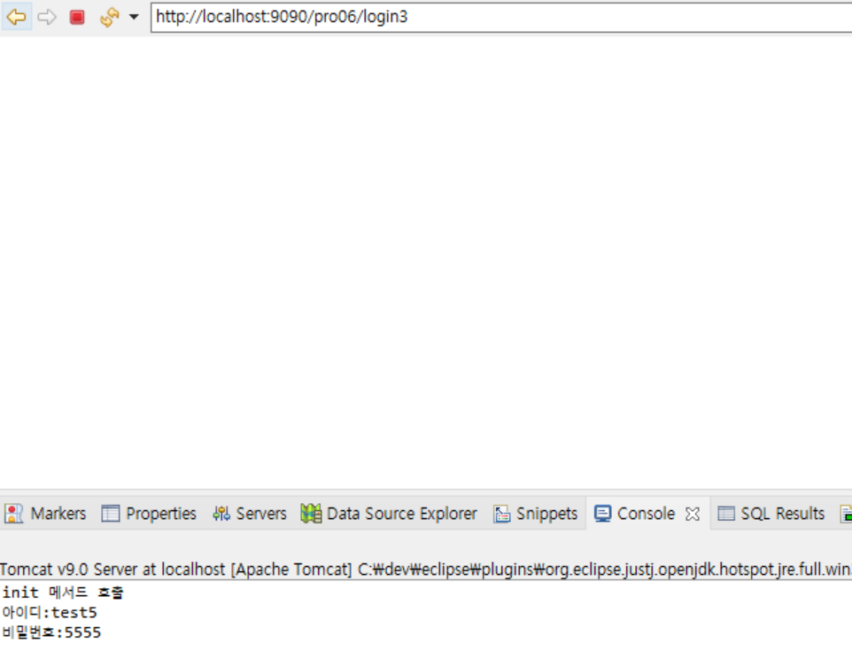
        

## 5.6 GET 방식과 POST 방식 요청 동시에 처리하기

- GET 방식과 POST 방식 요청 동시 처리
    1. 앞서 실습한 로그인 html의 method는 `get`, action은 `login4`로 수정
       
        ```html
        <!DOCTYPE html>
        <html>
        <head>
        <meta charset="UTF-8">
        <title>로그인창</title>
        </head>
        <body>
          <form name="frmLogin" method="get" action="login4"  encType="UTF-8">
        	   아이디  :<input type="text" name="user_id"><br>
             비밀번호:<input type="password" name="user_pw" ><br>
            <input type="submit" value="로그인">  <input type="reset" value="다시입력">
          </form>
        </body>
        </html>
        ```
        
    2. 패키지에 새로운 서블릿을 만드는데 앞서 html에서 login4로 매핑 이름을 설정하였기 때문에 맞춰서 생성
    3. 서블릿에 코드 작성
       
        ```java
        package sec03.ex02;
        
        import java.io.IOException;
        
        import javax.servlet.ServletException;
        import javax.servlet.annotation.WebServlet;
        import javax.servlet.http.HttpServlet;
        import javax.servlet.http.HttpServletRequest;
        import javax.servlet.http.HttpServletResponse;
        
        /**
         * Servlet implementation class LoginServlet4
         */
        @WebServlet("/login4")
        public class LoginServlet4 extends HttpServlet {
        	public void init() throws ServletException {
        		System.out.println("init 메서드 호출");
        	}
        
        	protected void doGet(HttpServletRequest request, HttpServletResponse response) throws ServletException, IOException {
        		System.out.println("doGet 메서드 호출");
        		doHandle(request, response);
        	}
        
        	protected void doPost(HttpServletRequest request, HttpServletResponse response) throws ServletException, IOException {
        		System.out.println("doPost 메서드 호출");
        		doHandle(request, response);
        	}
        
        	private void doHandle(HttpServletRequest request, HttpServletResponse response) throws ServletException, IOException {
        		request.setCharacterEncoding("utf-8");
        		System.out.println("doHandle 메서드 호출");
        		String user_id = request.getParameter("user_id");
        		String user_pw = request.getParameter("user_pw");
        		System.out.println("아이디:" + user_id);
        		System.out.println("비밀번호:" + user_pw);
        	}
        
        	public void destroy() {
        		System.out.println("destroy 메서드 호출");
        	}
        }
        ```
        
        - `doHandle(request, response)` : GET 방식으로 요청될 때와 POST 방식으로 요청될 때 모두 `doHandle()`를 호출하도록 함
    4.  확인하기
        1. GET 방식으로 요청한 결과
            - html의 메서드를 `get`으로 수정한 후 브라우저의 출력 결과 관찰
              
                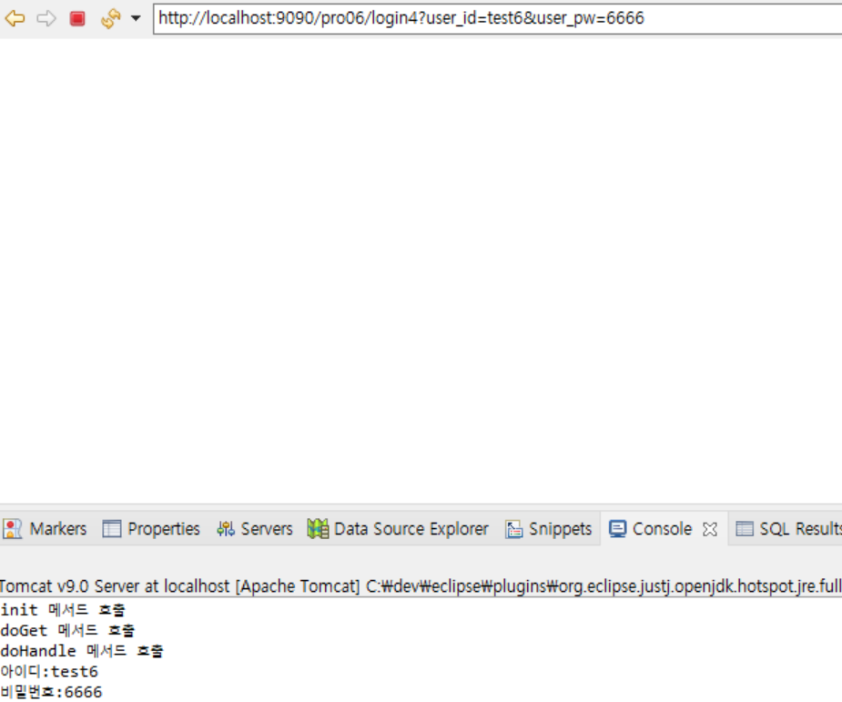
            
        2. POST 방식으로 요청한 결과
            - html의 메서드를 `post`로 수정한 후 브라우저의 출력 결과 관찰
              
                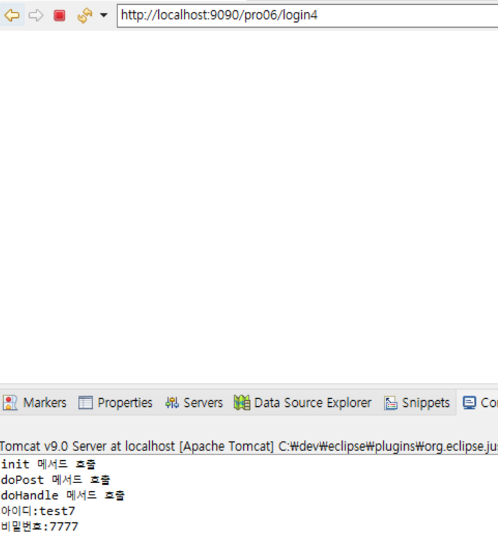
                

## 5.7 자바스크립트로 서블릿에 요청하기

### 5.7.1 자바스크립트로 서블릿에 요청

- 자바스크립트로 서블릿에 요청
    1. 새로운 서블릿 클래스, 로그인 html 생성
    2. 새로운 로그인 html에 코드 작성
       
        <login2.html>
        
        ```html
        <!DOCTYPE html>
        <html>
        <head>
        <meta charset="UTF-8">
        <script type="text/javascript" >
           function fn_validate(){	
              var frmLogin=document.frmLogin;
              var user_id=frmLogin.user_id.value;
              var user_pw=frmLogin.user_pw.value;
        
              if((user_id.length==0 ||user_id=="") ||(user_pw.length==0 ||user_pw=="")){
        	 alert("아이디와 비밀번호는 필수입니다.");
              }else{
        	frmLogin.method="post";
        	frmLogin.action="login5";
        	frmLogin.submit();
              }
           }
        </script>
        
        <title>로그인창</title>
        </head>
        <body>
          <form name="frmLogin" method="post" action="login" encType="UTF-8">
        	아이디  :<input type="text" name="user_id"><br>
            비밀번호:<input type="password" name="user_pw"><br>
            <input type="button" onClick="fn_validate()" value="로그인">
            <input type="reset" value="다시입력">
            <input type="hidden" name="user_address" value="서울시 성북구" />
          </form>
        </body>
        </html>
        ```
        
        - `var frmLogin=document.frmLogin` : `<form>` 태그의 name 속성으로 `<form>`태그 객체를 받아 옴
        - `<form>` 태그 내 `<input>` 태그의 name속성으로 입력한 ID와 비밀번호를 받아 옴
          
            ```jsx
            			var user_id=frmLogin.user_id.value;
                  var user_pw=frmLogin.user_pw.value;
            ```
            
        - `frmLogin.method = "post"` : `<form>` 태그의 전송 방식을 post로 설정
        - `frmLogin.action = "login5"` : action 속성을 매핑 이름이 `login5`로 설정
        - `frmLogin.submit();` : 자바스크립트에서 서블릿으로 전송
    3. 새로운 서블릿 클래스에 코드 작성
       
        ```java
        package sec03.ex03;
        
        import java.io.IOException;
        import java.io.PrintWriter;
        
        import javax.servlet.ServletException;
        import javax.servlet.annotation.WebServlet;
        import javax.servlet.http.HttpServlet;
        import javax.servlet.http.HttpServletRequest;
        import javax.servlet.http.HttpServletResponse;
        
        @WebServlet("/login5")
        public class LoginServlet5 extends HttpServlet {
        	public void init() {
        		System.out.println("init 메서드 호출");
        	}
        
        	protected void doPost(HttpServletRequest request, HttpServletResponse response) throws ServletException, IOException {
        		request.setCharacterEncoding("utf-8");
        		response.setContentType("text/html;charset=utf-8");
        		PrintWriter out = response.getWriter();
        		String id = request.getParameter("user_id");
        		String pw = request.getParameter("user_pw");
        		String address = request.getParameter("user_address");
        		System.out.println("아이디   : " + id);
        		System.out.println("비밀번호 : " + pw);
        
        		String data = "<html>";
        		data += "<body>";
        		data += "아이디 : " + id;
        		data += "<br>";
        		data += "비밀번호 : " + pw;
        		data += "<br>";
        		data += "주소 : " + address;
        		data += "</html>";
        		data += "</body>";
        		out.print(data);
        	}
        
        	public void destroy() {
        		System.out.println("destroy 메서드 호출");
        	}
        }
        ```
        
    4. 확인하기
        1. 아무것도 입력하지 않으면
           
            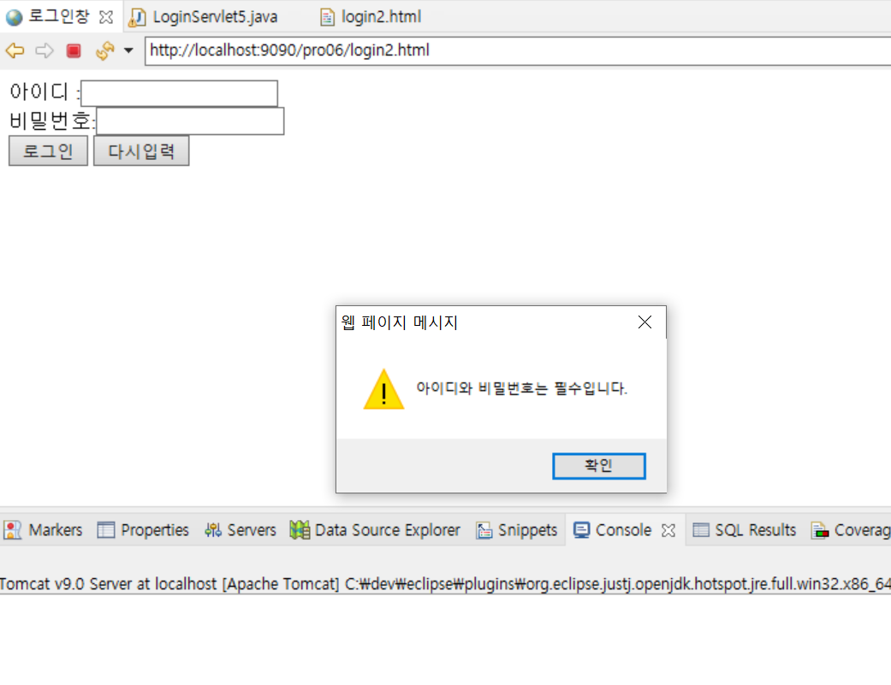
            
        2. 아이디와 비밀번호를 입력하면
           
            
            

## 5.8 서블릿을 이용한 여러 가지 실습 예제

### 5.8.1 서블릿에 로그인 요청 시 유효성 검사하기

- login.html (새로운 폴더에서 새롭게 생성한 html)
  
    ```html
    <!DOCTYPE html>
    <html>
    <head>
    <meta charset="UTF-8">
    <title>로그인창</title>
    </head>
    <body>
      <form name="frmLogin" method="post" action="/pro06/loginTest"  encType="UTF-8">
    	아이디  :<input type="text" name="user_id"><br>
           비밀번호:<input type="password" name="user_pw" ><br>
        <input type="submit" value="로그인">  <input type="reset" value="다시입력">
      </form>
    </body>
    </html>
    ```
    
    - `action="/pro06/loginTest"` : 본 예제의 html 파일이 WebContent 내 별도 파일에 저장한 상황이라 매핑 이름 앞에 프로젝트 이름을 적어야 함
- LoginTest.java (서블릿)
  
    ```java
    package sec04.ex01;
    
    import java.io.IOException;
    import java.io.PrintWriter;
    
    import javax.servlet.ServletException;
    import javax.servlet.annotation.WebServlet;
    import javax.servlet.http.HttpServlet;
    import javax.servlet.http.HttpServletRequest;
    import javax.servlet.http.HttpServletResponse;
    
    @WebServlet("/loginTest")
    public class LoginTest extends HttpServlet{  
       public void init(){	
          System.out.println("init 메서드 호출");
       }
    
       protected void doPost(HttpServletRequest request, HttpServletResponse response) 
                                                      throws IOException, ServletException{
          request.setCharacterEncoding("utf-8");   
          response.setContentType("text/html;charset=utf-8");  
          PrintWriter out = response.getWriter();				
          String id = request.getParameter("user_id");  
          String pw = request.getParameter("user_pw");  
    		
          System.out.println("아이디   : "+ id);  
          System.out.println("패스워드 : "+ pw);
    	
         if(id!= null &&(id.length()!=0)){
    		out.print("<html>");  
    		out.print("<body>");
    		out.print( id +" 님!! 로그인 하셨습니다." );
    		out.print("</html>");
    		out.print("</body>");
          }else{
    		out.print("<html>");  
    		out.print("<body>");
    		out.print("아이디를 입력하세요!!!" ) ;
    		out.print("<br>");
    		out.print("<a href='http://localhost:9090/pro06/test01/login.html'>로그인창으로 이동  </a>");
    		out.print("</html>");
    		out.print("</body>");
          }
       }
    
       public void destroy(){
          System.out.println("destroy 메서드 호출");
       }
    }
    ```
    
    - ID가 없으면 다시 로그인창으로 이동하는 부분
      
        ```java
        else{
        		out.print("<html>");  
        		out.print("<body>");
        		out.print("아이디를 입력하세요!!!" ) ;
        		out.print("<br>");
        		out.print("<a href='http://localhost:8090/pro06/test01/login.html'>로그인창으로 이동  </a>");
        		out.print("</html>");
        		out.print("</body>");
              }
        ```
    
- 확인하기
    1. 아이디를 입력하지 않은 경우
       
        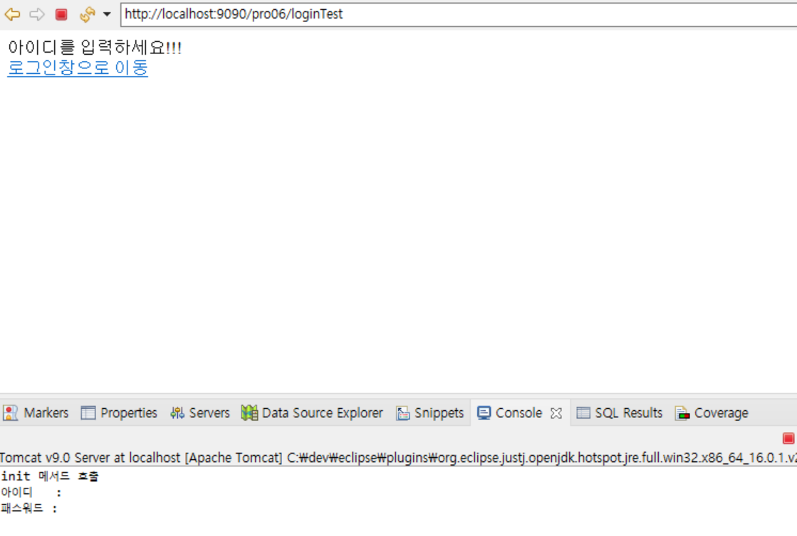
        
    2. 데이터를 입력한 경우
       
        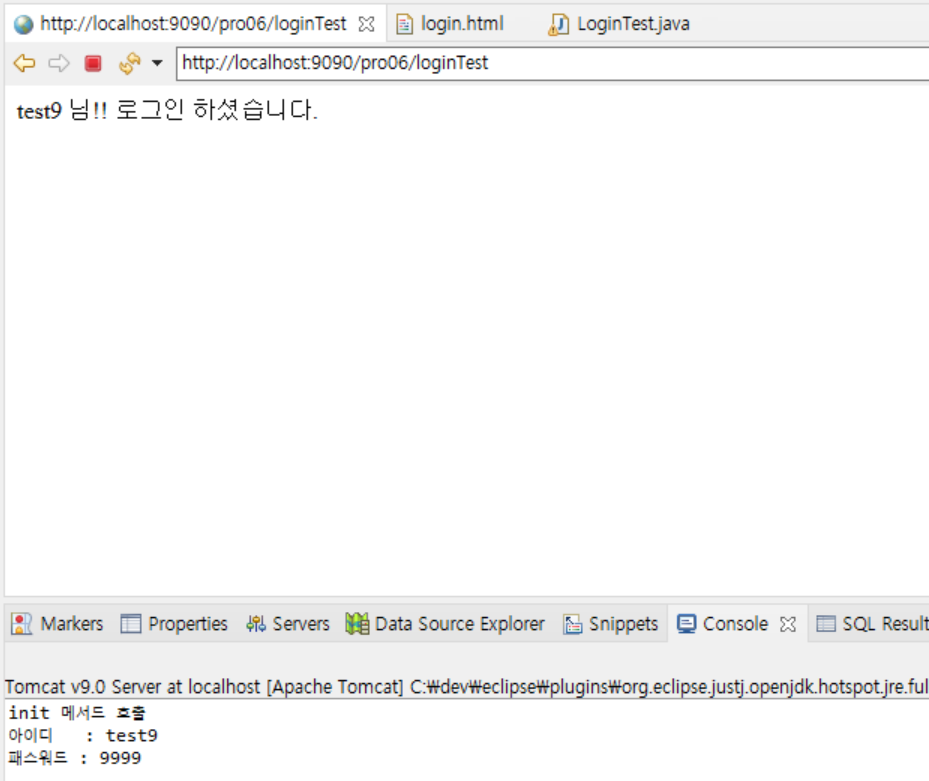
        

### 5.8.2 서블릿으로 로그인 요청 시 관리자 화면 나타내기

- LoginTest2.java
  
    ```java
    package sec04.ex01;
    
    import java.io.IOException;
    import java.io.PrintWriter;
    
    import javax.servlet.ServletException;
    import javax.servlet.annotation.WebServlet;
    import javax.servlet.http.HttpServlet;
    import javax.servlet.http.HttpServletRequest;
    import javax.servlet.http.HttpServletResponse;
    
    @WebServlet("/loginTest2")
    public class LoginTest2 extends HttpServlet{  
       public void init(){	
          System.out.println("init 메서드 호출");
       }
    
       protected void doPost(HttpServletRequest request, HttpServletResponse response) throws IOException, ServletException{
          request.setCharacterEncoding("utf-8");   
          response.setContentType("text/html;charset=utf-8");  
          PrintWriter out = response.getWriter();				
          String id = request.getParameter("user_id");  
          String pw = request.getParameter("user_pw");  
    		
          System.out.println("아이디   : "+ id);  // 콘솔에 출력한다.
          System.out.println("패스워드 : "+ pw);
    
          if(id!= null &&(id.length()!=0)){
    		 if(id.equals("admin")){
    		   out.print("<html>");
    		   out.print("<body>");
    	 	   out.print( "<font size='12'>관리자로 로그인 하셨습니다!! </font>" );
    		   out.print("<br>");
    		   out.print("<input type=button value='회원정보 수정하기'  />");
    		   out.print("<input type=button value='회원정보 삭제하기'  />");
    		   out.print("</html>");
    		   out.print("</body>");
    		 }else{
    		   out.print("<html>");
    		   out.print("<body>");
    		   out.print( id +" 님!! 로그인 하셨습니다." );
    		   out.print("</html>");
    		   out.print("</body>");
    		 }     
          }else{
    		out.print("<html>");  
    		out.print("<body>");
    		out.print("ID와 비밀번호를 입력하세요!!!" ) ;
    		out.print("<br>");
    		out.print("<a href='http://localhost:8090/pro06/test01/login.html'> 로그인창으로 이동  </a>");
    		out.print("</html>");
    		out.print("</body>");
          }
       }
       public void destroy(){
          System.out.println("destroy 메서드 호출");
       }
    }
    ```
    
    - 아이디가 admin이면 관리자 창을 보여주는 부분
      
        ```java
        if(id.equals("admin")){
        		   out.print("<html>");
        		   out.print("<body>");
        	 	   out.print( "<font size='12'>관리자로 로그인 하셨습니다!! </font>" );
        		   out.print("<br>");
        		   out.print("<input type=button value='회원정보 수정하기'  />");
        		   out.print("<input type=button value='회원정보 삭제하기'  />");
        		   out.print("</html>");
        		   out.print("</body>");
        		 }
        ```
        
    - 아이디가 admin이 아닌 일반 사용자 경우 성공 메시지를 보여주는 부분
      
        ```java
        else{
        		   out.print("<html>");
        		   out.print("<body>");
        		   out.print( id +" 님!! 로그인 하셨습니다." );
        		   out.print("</html>");
        		   out.print("</body>");
        		 } 
        ```
    
- 확인하기
    - 앞서 실습한 login.html에서 매핑 이름을 loginTest2로 수정
    1. 아이디를 admin으로 입력한 경우
       
        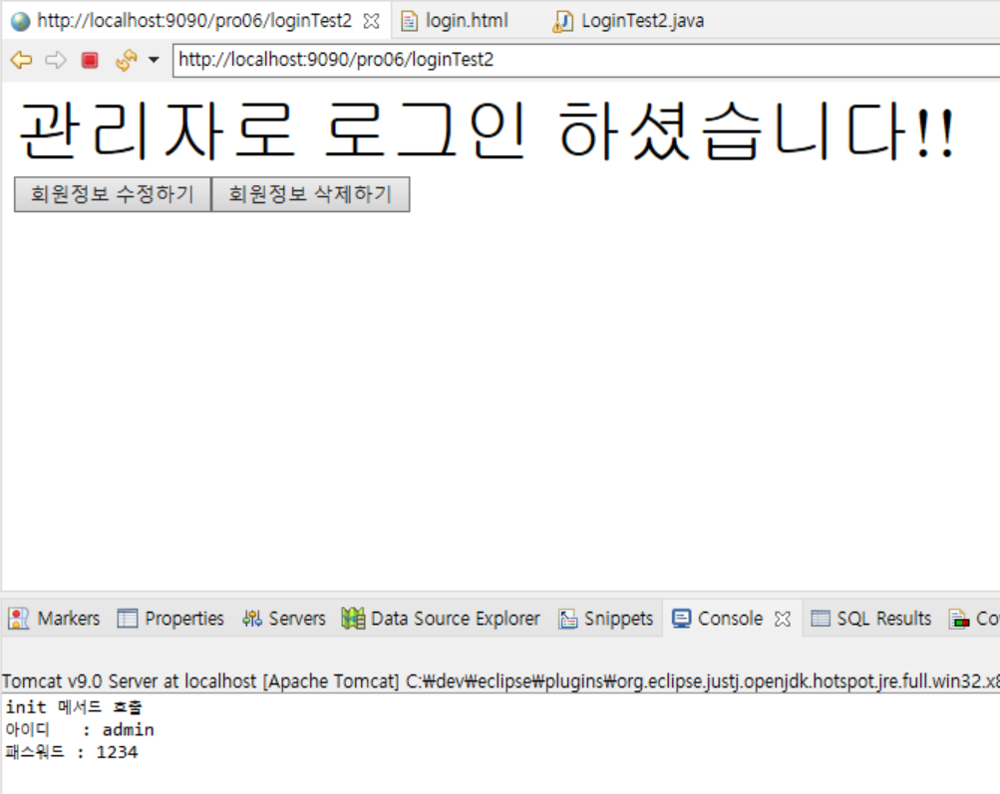
        
    2. 일반 아이디로 입력한 경우
       
        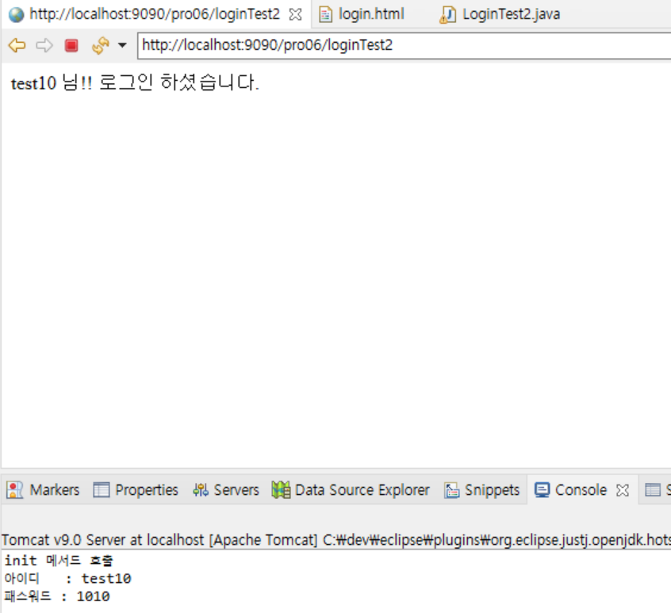
        

### 5.8.3 서블릿으로 요청 시 구구단 출력하기

- 구구단의 단수를 입력 받는 html
  
    <gugu.html>
    
    ```html
    <!DOCTYPE html>
    <html>
    <head>
       <title>단수 입력창</title>
    </head>
    <body>
       <h1>출력할 구구단의 수를 지정해 주세요.</h1>
        <form method="get" action="/pro06/guguTest">
           출력할 구구단  :<input type=text  name="dan" /> <br>
        <input type ="submit" value="구구단출력">	 
        </form>
      </body>
    </html>
    ```
    
    - 매핑 이름이 guguTest인 서블릿으로 전송
- 서블릿
  
    <GuguTest.java>
    
    ```java
    package sec04.ex01;
    
    import java.io.IOException;
    import java.io.PrintWriter;
    
    import javax.servlet.ServletException;
    import javax.servlet.annotation.WebServlet;
    import javax.servlet.http.HttpServlet;
    import javax.servlet.http.HttpServletRequest;
    import javax.servlet.http.HttpServletResponse;
    
    @WebServlet("/guguTest")
    public class GuguTest extends HttpServlet {
    	public void init() {
    		System.out.println("init 메서드 호출");
    	}
    
    	protected void doGet(HttpServletRequest request, HttpServletResponse response) throws IOException, ServletException {
    		request.setCharacterEncoding("utf-8");
    		response.setContentType("text/html;charset=utf-8");
    		PrintWriter out = response.getWriter();
    		int dan = Integer.parseInt(request.getParameter("dan"));
    
    		out.print(" <table border=1 width=800 align=center>");
    		out.print("<tr align=center bgcolor='#FFFF66'>");
    		out.print("<td colspan=2>" + dan + " 단 출력  </td>");
    		out.print("</tr>");
    
    		for (int i = 1; i < 10; i++) {
    			out.print("<tr align=center>");
    			out.print("<td width=400>");
    			out.print(dan + " *  " + i);
    			out.print("</td>");
    			out.print("<td width=400>");
    			out.print(i * dan);
    			out.print("</td>");
    			out.print("</tr>");
    		}
    
    		out.print("</table>");
    	}
    
    	public void destroy() {
    		System.out.println("destroy 메서드 호출");
    	}
    }
    ```
    
    - `int dan = Integer.parseInt(request.getParameter("dan"));` : 전송된 dan의 값을 받아 옴
    - 반복문을 통한 테이블 행 출력
      
        ```java
        for (int i = 1; i < 10; i++) {
        			out.print("<tr align=center>");
        			out.print("<td width=400>");
        			out.print(dan + " *  " + i);
        			out.print("</td>");
        			out.print("<td width=400>");
        			out.print(i * dan);
        			out.print("</td>");
        			out.print("</tr>");
        		}
        ```
    
- 확인하기
    1. 입력창
       
        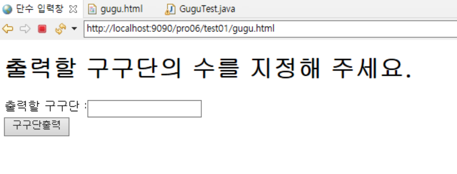
        
    2. 결과창
       
        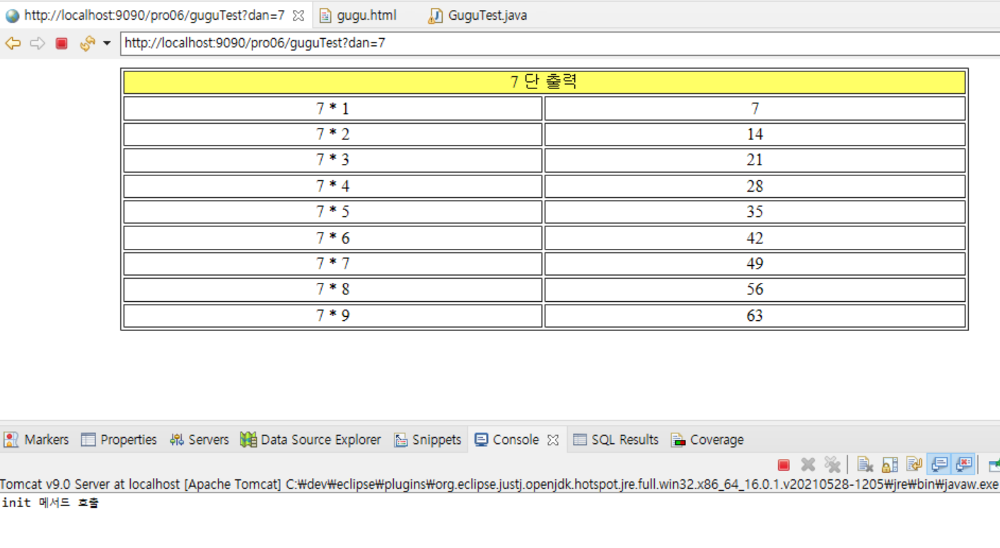
        

---