# Chapter 6. 서블릿 비즈니스 로직 처리

## 6.1 서블릿의 비즈니스 로직 처리 방법

### 6.1.1 서블릿 비즈니스 처리 작업

- 서블릿 비즈니스 처리 작업
    - 서블릿이 클라이언트로부터 요청을 받으면 그 요청에 대해 작업을 수행하는 것

## 6.2 서블릿의 데이터베이스 연동하기

### 6.2.1 서블릿으로 회원 정보 테이블의 회원 정보 조회

- 서블릿의 데이터베이스 연동 과정
  
    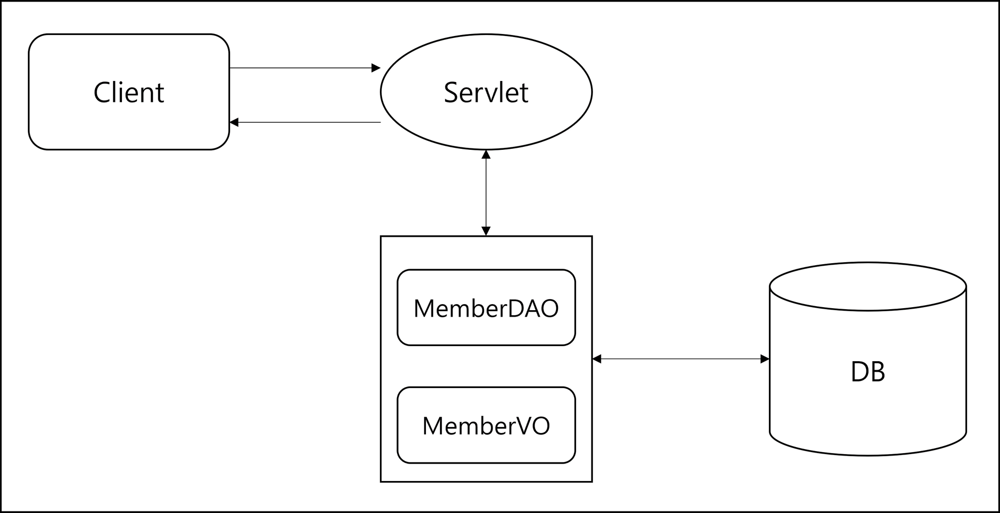
    
- 회원 정보 조회 과정
  
    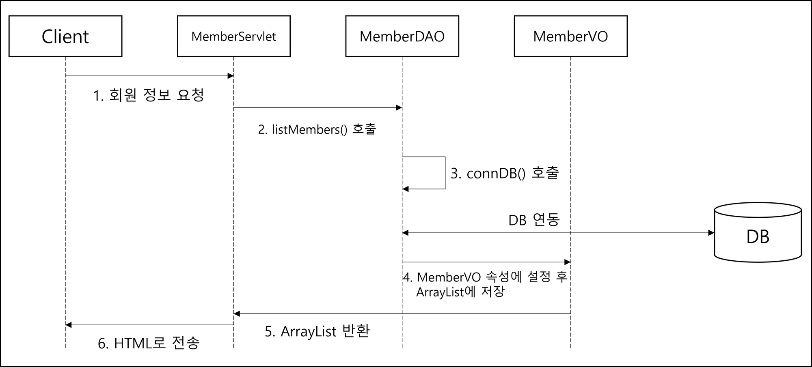
    
    1. 브라우저가 서블릿에게 회원 정보를 요청
    2. MemberServlet은 요청을 받은 후 MemberDAO 객체를 생성하여 `listMembers()` 호출
    3. `listMembers()`에서 다시 `connDB()` 메서드 호출하여 DB와 연결 후 SQL 문을 실행해 회원 정보 조회
    4. 조회된 회원 정보를 MemberVO 속성에서 설정한 후 다시 `ArrayList`에 저장
    5. `ArrayList`를 다시 MemberServlet으로 반환한 후 `ArrayList`의 MemberVO를 차례대로 가져와 회원 정보를 HTML 태그의 문자열로 만듦
    6. 만들어진 HTML 태그를 웹 브라우저로 전송해서 회원 정보 출력
- 회원 정보 조회 실습
    1. MySQL에서 회원 테이블과 회원 정보를 입력하기 위해 Workbench 실행
    2. 미리 만들어 놓은 접속 이름을 클릭하거나 직접 연결 정보를 입력한 후 접속
    3. 접속한 후 테이블 생성 SQL 문 입력
       
        ```sql
        --회원 테이블 생성
        create table t_member(
            id varchar2(10) primary key,
            pwd varchar2(10),
            name varchar2(50),
            email varchar2(50),
            joinDate date default sysdate
        );
        
        -- 회원 정보 추가
        insert into t_member values ('hong', '1212', '홍길동', 'hong@gmail.com', sysdate);
        insert into t_member values ('lee', '1212', '이순신', 'lee@test.com', sysdate);
        insert into t_member values ('kim', '1212', '김유신', 'kim@web.com', sysdate);
        
        commit;
        
        select * from t_member;
        ```
        
    4. SQL 실행 결과 확인
       
        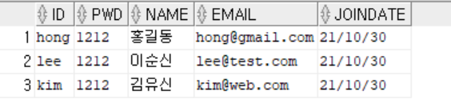
        
    5. 이클립스에서 새로운 프로젝트를 생성한 후 DB와 연동하는데 필요한 드라이버 ojdbc6.jar을 /WebContent/WEB-INF/lib 폴더에 삽입
    6. MemberDAO, MemberServlet, MemberVO 클래스 각각 생성
    7. MemberServlet 클래스 작성
       
        <MemberServlet.java>
        
        ```java
        package sec01.ex01;
        
        import java.io.IOException;
        import java.io.PrintWriter;
        import java.sql.Date;
        import java.util.List;
        
        import javax.servlet.ServletException;
        import javax.servlet.annotation.WebServlet;
        import javax.servlet.http.HttpServlet;
        import javax.servlet.http.HttpServletRequest;
        import javax.servlet.http.HttpServletResponse;
        
        /*@WebServlet("/member")*/
        public class MemberServlet extends HttpServlet {
        	protected void doGet(HttpServletRequest request,HttpServletResponse response)
                                                            throws ServletException, IOException {
              response.setContentType("text/html;charset=utf-8");
              PrintWriter out=response.getWriter();	
              MemberDAO dao=new MemberDAO();
              List<MemberVO> list=dao.listMembers();
        	
              out.print("<html><body>");
              out.print("<table  border=1><tr align='center' bgcolor='lightgreen'>");
              out.print("<td>아이디</td><td>비밀번호</td><td>이름</td><td>이메일</td><td>가입일</td></tr>");
             
             for (int i=0; i<list.size();i++){
        		MemberVO memberVO=(MemberVO) list.get(i);
        		String id=memberVO.getId();
        		String pwd = memberVO.getPwd();
        		String name=memberVO.getName();
        		String email=memberVO.getEmail();
        		Date joinDate = memberVO.getJoinDate();
        		out.print("<tr><td>"+id+"</td><td>"+
        			                pwd+"</td><td>"+
        			                name+"</td><td>"+
        			                email+"</td><td>"+
        			                joinDate+"</td></tr>");		
              }
              out.print("</table></body></html>");
           }
        }
        ```
        
        - `MemberDAO dao = new MemberDAO()` : SQL 문으로 조회할 MemberDAO 객체 생성
        - `List<MemberVO> list = dao.listMembers();` : `listMembers()` 메서드로 회원 정보 조회
        - 조회한 회원 정보를 리스트로 출력
          
            ```java
             for (int i=0; i<list.size();i++){
            		MemberVO memberVO=(MemberVO) list.get(i);
            		String id=memberVO.getId();
            		String pwd = memberVO.getPwd();
            		String name=memberVO.getName();
            		String email=memberVO.getEmail();
            		Date joinDate = memberVO.getJoinDate();
            		out.print("<tr><td>"+id+"</td><td>"+
            			                pwd+"</td><td>"+
            			                name+"</td><td>"+
            			                email+"</td><td>"+
            			                joinDate+"</td></tr>");		
                  }
            ```
        
    8. MemberDAO 클래스 작성
       
        <MemberDAO.java>
        
        ```java
        package sec01.ex01;
        
        import java.sql.Connection;
        import java.sql.Date;
        import java.sql.DriverManager;
        import java.sql.ResultSet;
        import java.sql.Statement;
        import java.util.ArrayList;
        import java.util.List;
        
        public class MemberDAO {
        	private static final String driver = "oracle.jdbc.driver.OracleDriver";
        	private static final String url = "jdbc:oracle:thin:@localhost:1521:XE";
        	private static final String user = "HR";
        	private static final String pwd = "1234";
        	private Connection con;
        	private Statement stmt;
        
        	public List<MemberVO> listMembers() {
        		List<MemberVO> list = new ArrayList<MemberVO>();
        		try {
        			connDB();
        			String query = "select * from t_member ";
        			System.out.println(query);
        			ResultSet rs = stmt.executeQuery(query);
        			while (rs.next()) {
        				String id = rs.getString("id");
        				String pwd = rs.getString("pwd");
        				String name = rs.getString("name");
        				String email = rs.getString("email");
        				Date joinDate = rs.getDate("joinDate");
        				MemberVO vo = new MemberVO();
        				vo.setId(id);
        				vo.setPwd(pwd);
        				vo.setName(name);
        				vo.setEmail(email);
        				vo.setJoinDate(joinDate);
        				list.add(vo);
        			}
        			rs.close();
        			stmt.close();
        			con.close();
        		} catch (Exception e) {
        			e.printStackTrace();
        		}
        		return list;
        	}
        
        	private void connDB() {
        		try {
        			Class.forName(driver);
        			System.out.println("Oracle 드라이버 로딩 성공");
        			con = DriverManager.getConnection(url, user, pwd);
        			System.out.println("Connection 생성 성공");
        			stmt = con.createStatement();
        			System.out.println("Statement 생성 성공");
        		} catch (Exception e) {
        			e.printStackTrace();
        		}
        	}
        }
        ```
        
        - `connDB();` : DB 연결
        - `ResultSet rs = stmt.executeQuery(query);` : SQL 문으로 회원 정보 조회
        - 조회한 레코드의 각 컬럼 값을 받아 오는 부분
          
            ```java
            String id = rs.getString("id");
            				String pwd = rs.getString("pwd");
            				String name = rs.getString("name");
            				String email = rs.getString("email");
            				Date joinDate = rs.getDate("joinDate");
            ```
            
        - 각 컬럼 값을 다시 MemberVO 객체의 속성에 설정
          
            ```java
            MemberVO vo = new MemberVO();
            				vo.setId(id);
            				vo.setPwd(pwd);
            				vo.setName(name);
            				vo.setEmail(email);
            				vo.setJoinDate(joinDate);
            ```
            
        - `list.add(vo);` : 설정된 MemberVO 객체를 다시 ArrayList에 저장
        - `return list;` : 조회된 레코드의 개수만큼 MemberVO 객체를 저장한 ArrayList 반환
    9. MemberVO 클래스 작성
       
        <MemberVO.java>
        
        ```java
        package sec01.ex01;
        
        import java.sql.Date;
        
        public class MemberVO {
        	private String id;
        	private String pwd;
        	private String name;
        	private String email;
        	private Date joinDate;
        	
        	public MemberVO() {
        		System.out.println("MemberVO 생성자 호출");
        	}
        
        	public String getId() {
        		return id;
        	}
        
        	public void setId(String id) {
        		this.id = id;
        	}
        
        	public String getPwd() {
        		return pwd;
        	}
        
        	public void setPwd(String pwd) {
        		this.pwd = pwd;
        	}
        
        	public String getName() {
        		return name;
        	}
        
        	public void setName(String name) {
        		this.name = name;
        	}
        
        	public String getEmail() {
        		return email;
        	}
        
        	public void setEmail(String email) {
        		this.email = email;
        	}
        
        	public Date getJoinDate() {
        		return joinDate;
        	}
        
        	public void setJoinDate(Date joinDate) {
        		this.joinDate = joinDate;
        	}
        
        	
        }
        ```
        
        - 테이블의 컬럼 이름과 동일한 자료형과 이름으로 속성들을 선언
- 실습 결과 확인
  
    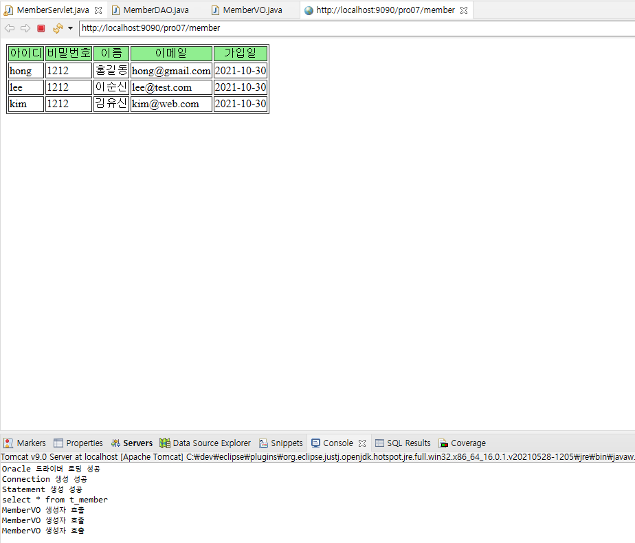
    

### 6.2.2 PreparedStatement를 이용한 회원 정보 실습

- PreparedStatement 인터페이스 특징
    - Statement를 이용해서 데이터베이스와 연동할 경우에는 연동할 때마다 DBMS에서 다시 SQL 문을 컴파일해야 함
      
        ⇒ 속도 저하
        
    - PreparedStatement 인터페이스를 사용하면 SQL 문을 미리 컴파일해서 재사용하므로 Statement 인터페이스보다 훨씬 빠르게 데이터베이스 작업을 수행할 수 있음
    - Statement 인터페이스를 상속하므로 지금까지 사용한 메서드를 그대로 사용
    - 컴파일된 SQL 문을 DBMS에 전달하여 성능 향상
    - Statement보다 SQL 문을 작성하기 더 간단함
- 회원 정보 조회 실습(PreparedStatement 이용)
    1. 7.2.1에서 사용한 서블릿과 VO는 그대로 사용
    2. PreparedStatement를 이용해 MemberDAO 수정
       
        ```java
        package sec01.ex02;
        
        import java.sql.Connection;
        import java.sql.Date;
        import java.sql.DriverManager;
        import java.sql.PreparedStatement;
        import java.sql.ResultSet;
        import java.util.ArrayList;
        import java.util.List;
        
        public class MemberDAO {
        	
        	private static final String driver = "oracle.jdbc.driver.OracleDriver";
        	private static final String url = "jdbc:oracle:thin:@localhost:1521:XE";
        	private static final String user = "HR";
        	private static final String pwd = "1234";
        	
        	private Connection con;
        	private PreparedStatement pstmt;
        
        	public List listMembers() {
        		List list = new ArrayList();
        		try {
        			connDB();
        			String query = "select * from t_member ";
        			System.out.println("prepareStatememt: " + query);
        			pstmt = con.prepareStatement(query);
        			ResultSet rs = pstmt.executeQuery();
        			while (rs.next()) {
        				String id = rs.getString("id");
        				String pwd = rs.getString("pwd");
        				String name = rs.getString("name");
        				String email = rs.getString("email");
        				Date joinDate = rs.getDate("joinDate");
        				MemberVO vo = new MemberVO();
        				vo.setId(id);
        				vo.setPwd(pwd);
        				vo.setName(name);
        				vo.setEmail(email);
        				vo.setJoinDate(joinDate);
        				list.add(vo);
        			}
        			rs.close();
        			pstmt.close();
        			con.close();
        		} catch (Exception e) {
        			e.printStackTrace();
        		}
        		return list;
        	}
        
        	private void connDB() {
        		try {
        			Class.forName(driver);
        			System.out.println("Oracle 드라이버 로딩 성공");
        			con = DriverManager.getConnection(url, user, pwd);
        			System.out.println("Connection 생성 성공");
        		} catch (Exception e) {
        			e.printStackTrace();
        		}
        	}
        }
        ```
        
        - `pstmt = con.prepareStatement(query);` :  `prepareStatement()`에 SQL문을 전달해서 PreparedStatement 객체 생성
        - `excuteQuery()` 메서드를 호출해 미리 설정한 SQL 문 실행
- 실습 결과 확인
  
    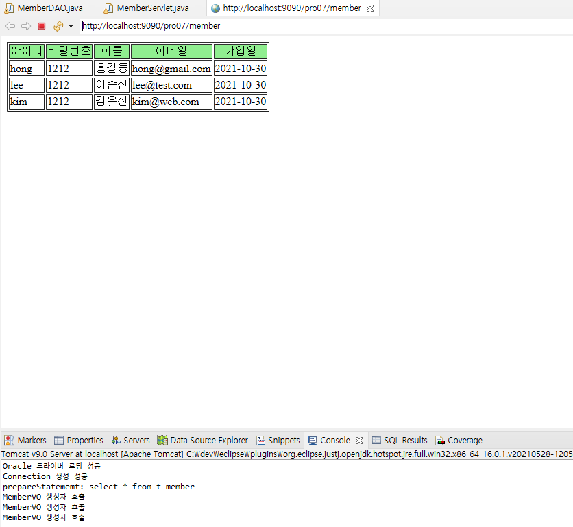
    

## 6.3 DataSource를 이용해 DB 연동하기

### 6.3.1 커넥션풀 동작 과정

- 커넥션풀(Connection Pool) 개념
    - 애플리케이션이 필요할 때마다 DB에 연결하여 작업하면 DB 연결에 시간이 많이 걸려 비효율적임
      
        ⇒ 웹 애플리케이션이 실행됨가 동시에 연동할 DB와의 연결을 미리 설정해두어 필요할 때마다 연결해 놓은 상태를 이용해 빠르게 DB와 연동하여 작업 수행하는 방법으로 개선
        
    - 커넥션풀 : 미리 DB와 연결시킨 상태를 유지하는 것
- 동작 과정
  
    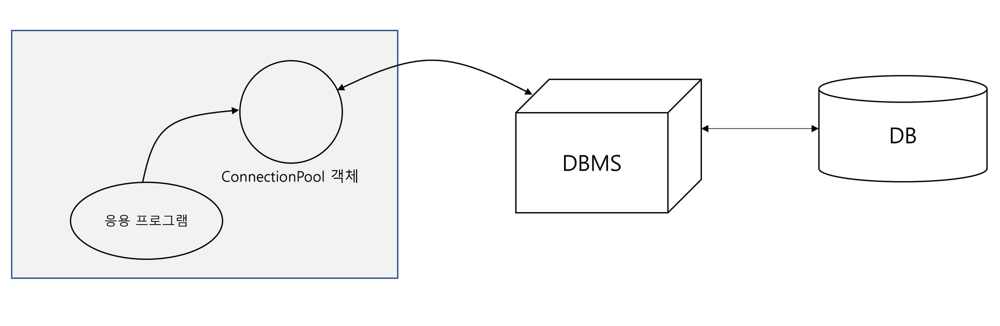
    
    1. 톰캣 컨테이너를 실행한 후 응용 프로그램 실행
    2. 톰캣 컨테이너 실행 시 CoonectionPool 객체 생성
    3. 생성된 커낵션 객체는 DBMS와 연결
    4. DB와 연동 작업이 필요할 경우 응용 프로그램은 ConnectionPool에서 제공하는 메서드를 호출하여 연동

### 6.3.2 JNDI

- JNDI 개념
    - 웹 애플리케이션 실행 시 톰캣이 만들어 놓은 ConnectionPool 객체에 접근할 때 이용
    - 필요한 자원을 키/값 쌍으로 저장한 후 필요할 때 키를 이용해 값을 얻는 방법
    - 미리 접근할 자원에 키를 지정한 후 애플리케이션이 실행 중일 때 키를 이용해 자원에 접근해서 작업 수행

### 6.3.3 톰캣의 DataSource 설정 및 사용 방법

- 톰캣 ConnectionPool 설정 과정
    1. JDBC 드라이버를 /WEB-INF/lib 폴더에 설치
    2. ConnectionPool과 관련된 jar 파일을 /WEB-INF/lib 폴더에 설치
    3. CATALINA_HOME/context.xml에 Connection 객체 생성 시 연결할 DB 정보를 JNDI로 설정
    4. DAO 클래스에서 DB와 연동 시 미리 설정한 JNDI라는 이름으로 DB와 연결해서 작업

### 6.3.4 이클립스에서 톰캣 DataSource 설정

- 톰캣 DataSource 설정
  
    <context.xml>
    
    ```xml
    <?xml version="1.0" encoding="UTF-8"?>
    <!--
      Licensed to the Apache Software Foundation (ASF) under one or more
      contributor license agreements.  See the NOTICE file distributed with
      this work for additional information regarding copyright ownership.
      The ASF licenses this file to You under the Apache License, Version 2.0
      (the "License"); you may not use this file except in compliance with
      the License.  You may obtain a copy of the License at
    
          http://www.apache.org/licenses/LICENSE-2.0
    
      Unless required by applicable law or agreed to in writing, software
      distributed under the License is distributed on an "AS IS" BASIS,
      WITHOUT WARRANTIES OR CONDITIONS OF ANY KIND, either express or implied.
      See the License for the specific language governing permissions and
      limitations under the License.
    --><!-- The contents of this file will be loaded for each web application --><Context>
    
        <!-- Default set of monitored resources. If one of these changes, the    -->
        <!-- web application will be reloaded.                                   -->
        <WatchedResource>WEB-INF/web.xml</WatchedResource>
        <WatchedResource>WEB-INF/tomcat-web.xml</WatchedResource>
        <WatchedResource>${catalina.base}/conf/web.xml</WatchedResource>
    
        <!-- Uncomment this to disable session persistence across Tomcat restarts -->
        <!--
        <Manager pathname="" />
        -->
        <Resource
        	name="jdbc/oracle"
        	auth="Container"
        	type="javax.sql.DataSource"
        	driverClassName="oracle.jdbc.OracleDriver"
        	url="jdbc:oracle:thin:@localhost:1521:XE"
        	username="HR"
        	password="1234"
        	maxActive="50"
        	maxWait="-1"
        />
    </Context>
    ```
    

### 6.3.5 톰캣의 DataSource로 연동해 회원 정보 조회 실습

- DataSource를 통한 회원 정보 조회
    1. 새로운 패키지를 생성하고 앞서 수행한 실습에서 만든 MemberDAO, MemberVO, MemberServlet 복사 및 붙여넣기
    2. MemberServlet 클래스의 매핑 이름이 겹치므로 수정
    3. MemberDAO 수정
       
        <MemberDAO.java>
        
        ```java
        package sec02.ex01;
        
        import java.sql.Connection;
        import java.sql.Date;
        import java.sql.DriverManager;
        import java.sql.PreparedStatement;
        import java.sql.ResultSet;
        import java.util.ArrayList;
        import java.util.List;
        
        import javax.naming.Context;
        import javax.naming.InitialContext;
        import javax.sql.DataSource;
        
        public class MemberDAO {
        	/*
        	private static final String driver = "oracle.jdbc.driver.OracleDriver";
        	private static final String url = "jdbc:oracle:thin:@localhost:1521:XE";
        	private static final String user = "HR";
        	private static final String pwd = "1234";
        	*/
        	
        	private Connection con;
        	private PreparedStatement pstmt;
        	private DataSource dataFactory;
        	
        	public MemberDAO() {
        		try {
        			Context ctx = new InitialContext();
        			Context envContext = (Context) ctx.lookup("java:/comp/env");
        			dataFactory = (DataSource) envContext.lookup("jdbc/oracle");
        		} catch (Exception e) {
        			e.printStackTrace();
        		}
        	}
        
        	public List listMembers() {
        		List list = new ArrayList();
        		try {
        			//connDB();
        			con=dataFactory.getConnection();
        			String query = "select * from t_member ";
        			System.out.println("prepareStatememt: " + query);
        			pstmt = con.prepareStatement(query);
        			ResultSet rs = pstmt.executeQuery();
        			while (rs.next()) {
        				String id = rs.getString("id");
        				String pwd = rs.getString("pwd");
        				String name = rs.getString("name");
        				String email = rs.getString("email");
        				Date joinDate = rs.getDate("joinDate");
        				MemberVO vo = new MemberVO();
        				vo.setId(id);
        				vo.setPwd(pwd);
        				vo.setName(name);
        				vo.setEmail(email);
        				vo.setJoinDate(joinDate);
        				list.add(vo);
        			}
        			rs.close();
        			pstmt.close();
        			con.close();
        		} catch (Exception e) {
        			e.printStackTrace();
        		}
        		return list;
        	}
        
        	/*
        	private void connDB() {
        		try {
        			Class.forName(driver);
        			System.out.println("Oracle 드라이버 로딩 성공");
        			con = DriverManager.getConnection(url, user, pwd);
        			System.out.println("Connection 생성 성공");
        		} catch (Exception e) {
        			e.printStackTrace();
        		}
        	}
        	*/
        	
        }
        ```
        
        - JNDI에 접근하기 위해 기본 경로(java:/comp/env) 지정
          
            ```java
            			Context ctx = new InitialContext();
            			Context envContext = (Context) ctx.lookup("java:/comp/env");
            ```
            
        - `("jdbc/oracle")` : context.xml에 설정한 name 값인 jdbc/oracle을 이용해 톰캣이 미리 연결한 DataSouce 받아 옴
        - `con=dataFactory.getConnection();` : DataSource를 이용해 DB에 연결
- 실습 결과 확인
  
    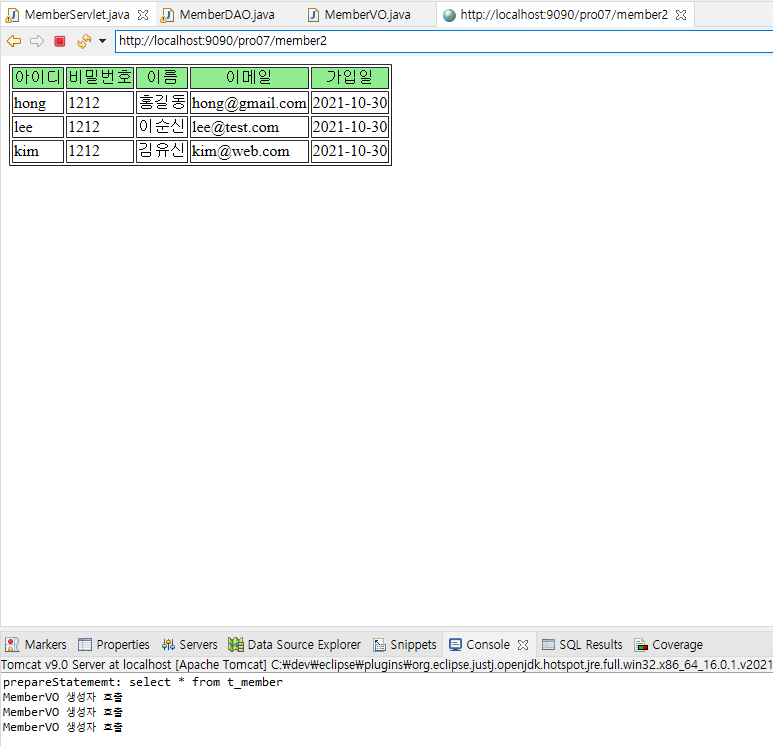
    

## 6.4 DataSource 이용해 회원 정보 등록하기

### 6.4.1 DataSource를 이용해 회원 정보 등록 실습

- DataSource를 이용한 회원 정보 등록
    1. 새로운 패키지를 만들고 이전에 만든 MemberVO 클래스 복사 및 붙여넣기
    2. 회원가입창을 만들기 위한 html 작성
       
        <memberForm.html>
        
        ```html
        <!DOCTYPE html>
        <html>
        <head>
        <meta charset="UTF-8">
        <title>회원 가입창</title>
        <script type="text/javascript">
        function fn_sendMember(){
           var frmMember=document.frmMember;
           var id=frmMember.id.value;
           var pwd=frmMember.pwd.value;
           var name=frmMember.name.value;
           var email=frmMember.email.value;
           if(id.length==0 ||id==""){
              alert("아이디는 필수입니다.");
           }else if(pwd.length==0 ||pwd==""){
              alert("비밀번호는 필수입니다.");
           }
           else if(name.length==0 ||name==""){
              alert("이름은 필수입니다.");
           }else if(email.length==0 ||email==""){
              alert("이메일은 필수입니다.");
           }else{
              frmMember.method="post";
              frmMember.action="member3";
              frmMember.submit();
           } 
        }
        </script>
        </head>
        <body>
          <form name="frmMember">
          <table>
        	   <th>회원 가입창</th>
        	  <tr>
        		<td>아이디</td>
        		<td><input type="text" name="id"></td>
        	  </tr>
        	  <tr>
        		<td>비밀번호</td>
        		<td><input type="password" name="pwd"></td>
        	  </tr>
        	  <tr>
        		<td>이름</td>
        		<td><input type="text" name="name"></td>
        	  </tr>
        	    <tr>
        		<td>이메일</td>
        		<td><input type="text" name="email"></td>
        	  </tr>
          </table>
           <input type="button" value="가입하기" onclick="fn_sendMember()">
           <input type="reset" value="다시입력">
           <input  type="hidden" name="command" value="addMember" />	
          </form>
         </body>
        </html>
        ```
        
    3. MemberServlet 클래스 작성
       
        <MemberServlet.java>
        
        ```java
        package sec02.ex02;
        
        import java.io.IOException;
        import java.io.PrintWriter;
        import java.sql.Date;
        import java.sql.Timestamp;
        import java.util.ArrayList;
        import java.util.List;
        
        import javax.servlet.ServletException;
        import javax.servlet.annotation.WebServlet;
        import javax.servlet.http.HttpServlet;
        import javax.servlet.http.HttpServletRequest;
        import javax.servlet.http.HttpServletResponse;
        
        @WebServlet("/member3")
        public class MemberServlet extends HttpServlet {
        	protected void doGet(HttpServletRequest request, HttpServletResponse response) throws ServletException, IOException {
        		doHandle(request, response);
        	}
        
        	protected void doPost(HttpServletRequest request, HttpServletResponse response) throws ServletException, IOException {
        		doHandle(request, response);
        	}
        
        	private void doHandle(HttpServletRequest request,HttpServletResponse response)  throws ServletException, IOException {
              request.setCharacterEncoding("utf-8");
              response.setContentType("text/html;charset=utf-8");
              MemberDAO dao=new MemberDAO();
              PrintWriter out=response.getWriter();
              String command=request.getParameter("command");
              if(command!= null && command.equals("addMember")){
        		 String _id=request.getParameter("id");
        		 String _pwd=request.getParameter("pwd");
        		 String _name=request.getParameter("name");
        		 String _email=request.getParameter("email");
        		 
        		 MemberVO vo=new MemberVO();
        		 vo.setId(_id);
        		 vo.setPwd(_pwd);
        		 vo.setName(_name);
        		 vo.setEmail(_email);
        	     dao.addMember(vo);
              }else if(command!= null && command.equals("delMember")) {
            	  String id = request.getParameter("id");
            	  dao.delMember(id);
              }
               List list=dao.listMembers();
             out.print("<html><body>");
             out.print("<table border=1><tr align='center' bgcolor='lightgreen'>");
             out.print("<td>아이디</td><td>비밀번호</td><td>이름</td><td>이메일</td><td>가입일</td><td >삭제</td></tr>");
            
             for (int i=0; i<list.size();i++){
         		MemberVO memberVO=(MemberVO) list.get(i);
         		String id=memberVO.getId();
         		String pwd = memberVO.getPwd();
         		String name = memberVO.getName();
         		String email =memberVO.getEmail();
         		Date joinDate = memberVO.getJoinDate();
         		out.print("<tr><td>"+id+"</td><td>"
         			                +pwd+"</td><td>"
         			                +name+"</td><td>"
         			                +email+"</td><td>"
         			                +joinDate+"</td><td>"
         		                    +"<a href='/pro07/member3?command=delMember&id="+id+"'>삭제 </a></td></tr>");
        
         	 }
         	 out.print("</table></body></html>");
             out.print("<a href='/pro07/memberForm.html'>새 회원 등록하기</a>");
           }
        }
        ```
        
        - `String command=request.getParameter("command");` : command 값을 받아 옴
        - `command!= null && command.equals("addMember")` : command가 null이 아니고 addMember이면 전송된 값들을 받아 옴
        - 전송된 값을 받아 MemberVO 객체에 저장한 후 SQL문을 이용해 전달
          
            ```java
            String _id=request.getParameter("id");
            		 String _pwd=request.getParameter("pwd");
            		 String _name=request.getParameter("name");
            		 String _email=request.getParameter("email");
            		 
            		 MemberVO vo=new MemberVO();
            		 vo.setId(_id);
            		 vo.setPwd(_pwd);
            		 vo.setName(_name);
            		 vo.setEmail(_email);
            	     dao.addMember(vo);
            ```
            
        - `out.print("<a href='/pro07/memberForm.html'>새 회원 등록하기</a">);` : 클릭하면 다시 회원가입 창으로 이동
    4. MemberDAO 작성하기
       
        <MemberDAO.java>
        
        ```java
        package sec02.ex02;
        
        import java.sql.Connection;
        import java.sql.Date;
        import java.sql.PreparedStatement;
        import java.sql.ResultSet;
        import java.util.ArrayList;
        import java.util.List;
        
        import javax.naming.Context;
        import javax.naming.InitialContext;
        import javax.sql.DataSource;
        
        public class MemberDAO {
        	private Connection con;
        	private PreparedStatement pstmt;
        	private DataSource dataFactory;
        
        	public MemberDAO() {
        		try {
        			Context ctx = new InitialContext();
        			Context envContext = (Context) ctx.lookup("java:/comp/env");
        			dataFactory = (DataSource) envContext.lookup("jdbc/oracle");
        		} catch (Exception e) {
        			e.printStackTrace();
        		}
        	}
        
        	public List<MemberVO> listMembers() {
        		List<MemberVO> list = new ArrayList<MemberVO>();
        		try {
        			// connDB();
        			con = dataFactory.getConnection();
        			String query = "select * from t_member ";
        			System.out.println("prepareStatememt: " + query);
        			pstmt = con.prepareStatement(query);
        			ResultSet rs = pstmt.executeQuery();
        			while (rs.next()) {
        				String id = rs.getString("id");
        				String pwd = rs.getString("pwd");
        				String name = rs.getString("name");
        				String email = rs.getString("email");
        				Date joinDate = rs.getDate("joinDate");
        				MemberVO vo = new MemberVO();
        				vo.setId(id);
        				vo.setPwd(pwd);
        				vo.setName(name);
        				vo.setEmail(email);
        				vo.setJoinDate(joinDate);
        				list.add(vo);
        			}
        			rs.close();
        			pstmt.close();
        			con.close();
        		} catch (Exception e) {
        			e.printStackTrace();
        		}
        		return list;
        	}
        
        	public void addMember(MemberVO memberVO) {
        		try {
        			con = dataFactory.getConnection();
        			String id = memberVO.getId();
        			String pwd = memberVO.getPwd();
        			String name = memberVO.getName();
        			String email = memberVO.getEmail();
        			String query = "insert into t_member";
        			query += " (id,pwd,name,email)";
        			query += " values(?,?,?,?)";
        			System.out.println("prepareStatememt: " + query);
        			pstmt = con.prepareStatement(query);
        			pstmt.setString(1, id);
        			pstmt.setString(2, pwd);
        			pstmt.setString(3, name);
        			pstmt.setString(4, email);
        			pstmt.executeUpdate();
        			pstmt.close();
        		} catch (Exception e) {
        			e.printStackTrace();
        		}
        	}
        
        }
        ```
        
        - PrepareStatement에서 insert 문 사용
            1. ? 사용
            2. ?는 순서대로 대응
            3. ?에 대응하는 값을 지정하기 위해 setter 이용
            4. `setter()`의 첫 번째 인자는 ? 순서 지정
            5. ?은 1부터 시작
            6. insert, delete, update는 `executeUpdate()` 호출
        - DB 연결 : `con = dataFactory.getConnection();`
        - 회원 정보 받아 오기
          
            ```java
            			String id = memberVO.getId();
            			String pwd = memberVO.getPwd();
            			String name = memberVO.getName();
            			String email = memberVO.getEmail();
            ```
            
        - insert문을 문자열로 만듦
          
            ```java
            			String query = "insert into t_member";
            			query += " (id,pwd,name,email)";
            			query += " values(?,?,?,?)";
            ```
            
        - ?에 순서대로 회원 정보 세팅
          
            ```java
            			pstmt.setString(1, id);
            			pstmt.setString(2, pwd);
            			pstmt.setString(3, name);
            			pstmt.setString(4, email);
            ```
            
        - 회원 정보를 테이블에 추가 : `pstmt.executeUpdate();`
- 실습 결과 확인
    1. 회원 정보 입력, 가입
       
        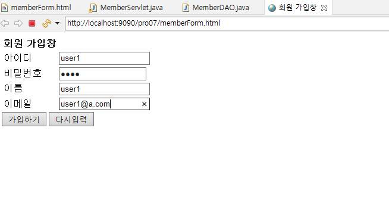
        
    2. 출력 결과
       
        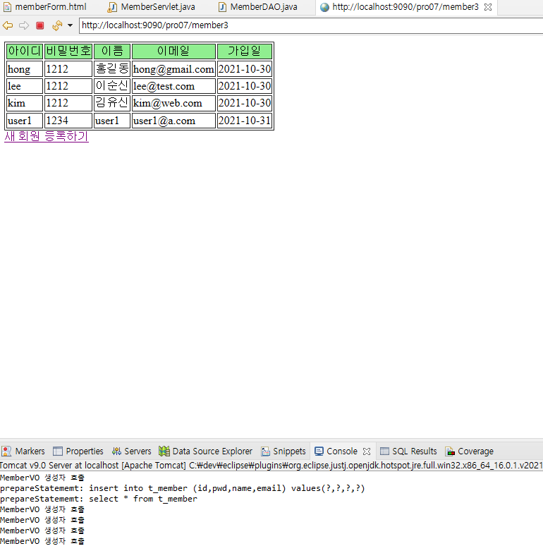
        

## 6.5 회원 정보 삭제하기

### 6.5.1 회원 정보 삭제 실습

- 회원 정보 삭제
    1. MemberServlet 클래스 수정
       
        ```java
        package sec02.ex02;
        
        import java.io.IOException;
        import java.io.PrintWriter;
        import java.sql.Date;
        import java.sql.Timestamp;
        import java.util.ArrayList;
        import java.util.List;
        
        import javax.servlet.ServletException;
        import javax.servlet.annotation.WebServlet;
        import javax.servlet.http.HttpServlet;
        import javax.servlet.http.HttpServletRequest;
        import javax.servlet.http.HttpServletResponse;
        
        @WebServlet("/member3")
        public class MemberServlet extends HttpServlet {
        	protected void doGet(HttpServletRequest request, HttpServletResponse response) throws ServletException, IOException {
        		doHandle(request, response);
        	}
        
        	protected void doPost(HttpServletRequest request, HttpServletResponse response) throws ServletException, IOException {
        		doHandle(request, response);
        	}
        
        	private void doHandle(HttpServletRequest request,HttpServletResponse response)  throws ServletException, IOException {
              request.setCharacterEncoding("utf-8");
              response.setContentType("text/html;charset=utf-8");
              MemberDAO dao=new MemberDAO();
              PrintWriter out=response.getWriter();
              String command=request.getParameter("command");
              if(command!= null && command.equals("addMember")){
        		 String _id=request.getParameter("id");
        		 String _pwd=request.getParameter("pwd");
        		 String _name=request.getParameter("name");
        		 String _email=request.getParameter("email");
        		 
        		 MemberVO vo=new MemberVO();
        		 vo.setId(_id);
        		 vo.setPwd(_pwd);
        		 vo.setName(_name);
        		 vo.setEmail(_email);
        	     dao.addMember(vo);
              } else if(command!=null && command.equals("delMember")) {
            	  String id = request.getParameter("id");
            	  dao.delMember(id);
              }
               List list=dao.listMembers();
             out.print("<html><body>");
             out.print("<table border=1><tr align='center' bgcolor='lightgreen'>");
             out.print("<td>아이디</td><td>비밀번호</td><td>이름</td><td>이메일</td><td>가입일</td><td>삭제</td></tr>");
            
             for (int i=0; i<list.size();i++){
         		MemberVO memberVO=(MemberVO) list.get(i);
         		String id=memberVO.getId();
         		String pwd = memberVO.getPwd();
         		String name = memberVO.getName();
         		String email =memberVO.getEmail();
         		Date joinDate = memberVO.getJoinDate();
         		out.print("<tr><td>"+id+"</td><td>"
         			                +pwd+"</td><td>"
         			                +name+"</td><td>"
         			                +email+"</td><td>"
         			                +joinDate+"</td><td>"
         			                +"<a href='pro07/member3?command=delMember&id="+id+"'>삭제 </a></td></tr>");
        
         	 }
         	 out.print("</table></body></html>");
             out.print("<a href='/pro07/memberForm.html'>새 회원 등록하기</a>");
           }
        }
        ```
        
        - command 값이 delMember인 경우 ID를 가져와 SQL 문으로 전달해서 삭제
          
            ```java
            else if(command!=null && command.equals("delMember")) {
                	  String id = request.getParameter("id");
                	  dao.delMember(id);
                  }
            ```
            
        - `+"<a href='pro07/member3?command=delMember&id="+id+"'>삭제 </a></td></tr>");` : 삭제를 클릭하면 command 값과 회원 ID를 서블릿으로 전송
    2. MemberDAO 클래스 수정
       
        ```java
        package sec02.ex02;
        
        import java.sql.Connection;
        import java.sql.Date;
        import java.sql.PreparedStatement;
        import java.sql.ResultSet;
        import java.util.ArrayList;
        import java.util.List;
        
        import javax.naming.Context;
        import javax.naming.InitialContext;
        import javax.sql.DataSource;
        
        public class MemberDAO {
        	private Connection con;
        	private PreparedStatement pstmt;
        	private DataSource dataFactory;
        
        	public MemberDAO() {
        		try {
        			Context ctx = new InitialContext();
        			Context envContext = (Context) ctx.lookup("java:/comp/env");
        			dataFactory = (DataSource) envContext.lookup("jdbc/oracle");
        		} catch (Exception e) {
        			e.printStackTrace();
        		}
        	}
        
        	public List<MemberVO> listMembers() {
        		List<MemberVO> list = new ArrayList<MemberVO>();
        		try {
        			// connDB();
        			con = dataFactory.getConnection();
        			String query = "select * from t_member ";
        			System.out.println("prepareStatememt: " + query);
        			pstmt = con.prepareStatement(query);
        			ResultSet rs = pstmt.executeQuery();
        			while (rs.next()) {
        				String id = rs.getString("id");
        				String pwd = rs.getString("pwd");
        				String name = rs.getString("name");
        				String email = rs.getString("email");
        				Date joinDate = rs.getDate("joinDate");
        				MemberVO vo = new MemberVO();
        				vo.setId(id);
        				vo.setPwd(pwd);
        				vo.setName(name);
        				vo.setEmail(email);
        				vo.setJoinDate(joinDate);
        				list.add(vo);
        			}
        			rs.close();
        			pstmt.close();
        			con.close();
        		} catch (Exception e) {
        			e.printStackTrace();
        		}
        		return list;
        	}
        
        	public void addMember(MemberVO memberVO) {
        		try {
        			con = dataFactory.getConnection();
        			String id = memberVO.getId();
        			String pwd = memberVO.getPwd();
        			String name = memberVO.getName();
        			String email = memberVO.getEmail();
        			String query = "insert into t_member";
        			query += " (id,pwd,name,email)";
        			query += " values(?,?,?,?)";
        			System.out.println("prepareStatememt: " + query);
        			pstmt = con.prepareStatement(query);
        			pstmt.setString(1, id);
        			pstmt.setString(2, pwd);
        			pstmt.setString(3, name);
        			pstmt.setString(4, email);
        			pstmt.executeUpdate();
        			pstmt.close();
        		} catch (Exception e) {
        			e.printStackTrace();
        		}
        	}
        
        	public void delMember(String id) {
        		try {
        			con = dataFactory.getConnection();
        			String query = "delete from t_member" + " where id=?";
        			System.out.println("prepareStatememt:" + query);
        			pstmt = con.prepareStatement(query);
        			pstmt.setString(1, id);
        			pstmt.executeUpdate();
        			pstmt.close();
        		} catch (Exception e) {
        			e.printStackTrace();
        		}
        	}
        
        }
        ```
    
- 실습 결과 확인
    1. 삭제 요청
       
        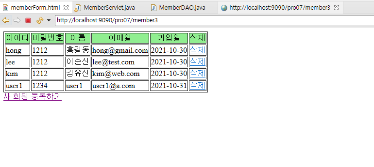
        
    2. 결과
       
        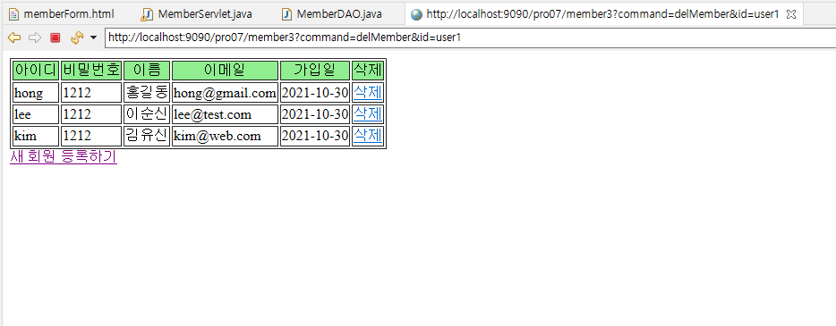
        

---