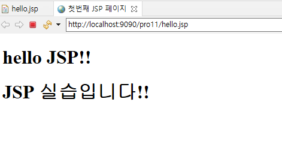

# 8. JSP 정의와 구성 요소

## 8.1 JSP 등장 배경

### 8.1.1 서블릿으로 화면 구현 시 문제점

- 서블릿으로 화면 구현 시 문제점
    - 화면 기능이 복잡해지면 코드 구현도 복잡해짐
    - 디자이너 입장에서 화면 구현 시 자바 코드로 인해 작업이 어려움
    - 서블릿에 비즈니스 로직과 화면 기능이 같이 있어 유지 관리가 어려움
- 해결책
    - 비즈니스 로직과 결과를 보여주는 화면 분리
    - 비즈니스 로직과 화면을 분리함으로써 개발자는 비즈니스 로직 구현에 집중하고 디자이너는 화면 기능 구현에 집중
    - 개발 후 재사용성과 유지관리 수월

### 8.1.2 JSP 구성요소

- JSP 구성요소
    - HTML 태그
    - CSS
    - JavaScript
    - JSP 기본 태그
    - JSP 액션 태그
    - 커스텀 태그

## 8.2 JSP의 3단계 작업 과정

### 8.2.1 톰캣 컨테이너에서 JSP 변환 과정

- 변화 과정
    1. 변환 단계 : 컨테이너가 JSP 파일을 Java 파일로 변환
    2. 컴파일 단계 : 컨테이너가 변환된 Java 파일을 클래스 파일로 컴파일
    3. 실행 단계 : 컨테이너가 클래스 파일을 실행하여 결과를 브라우저로 전송해 출력

### 8.2.2 이클립스에서 JSP 변환 과정 실습

- JSP 변환 과정 실습
    1. WebContent 폴더에 JSP 파일(hello.jsp) 생성
    2. JSP 파일에 간단한 HTML 태그 작성
       
        ```html
        <%@ page language="java" contentType="text/html; charset=UTF-8"
            pageEncoding="UTF-8"%>
        <!DOCTYPE html>
        <html>
        <head>
        <meta charset="UTF-8">
        <title>첫번째 JSP 페이지</title>
        </head>
        <body>
          <h1>hello JSP!!</h1>
          <h1>JSP 실습입니다!!</h1>
        </body>
        </html>
        ```
    
- 실습 결과
  
    
    

---