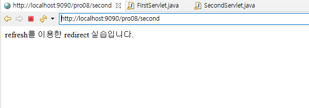

# 8. 서블릿 확장 API 사용하기

## 8.1 서블릿 포워드 기능 사용하기

### 8.1.1 포워드 기능

- 포워드(forward)
    - 하나의 서블릿에서 다른 서블릿이나 JSP와 연동하는 방법
    - 요청에 대한 추가 작업을 다른 서블릿에게 수행하게 함
    - 요청에 포함된 정보를 다른 서블릿이나 JSP와 공유할 수 있음
    - 요청에 대한 정보를 포함시켜 다른 서블릿에게 전달할 수 있음

## 8.2 서블릿의 여러 가지 포워드 방법

### 8.2.1 포워드 방법

- redirect 방법
    - HttpServletResponse 객체의 `sendRedirect()` 메서드 이용
    - 웹 브라우저에 재요청하는 방식
    - 형식 : `sendRedirect("포워드할 서블릿 또는 JSP")`
- Refresh 방법
    - HttpServletResponse 객체의 `addHeader()` 메서드 이용
    - 웹 브라우저에 재요청하는 방식
    - 형식 : `response.addHeader("Refresh", 경과시간(초);url=요청할 서블릿 또는 JSP")`
- location 방법
    - 자바스크립트 location 객체의 href 속성 이용
    - 자바스크립트에서 재요청하는 방식
    - 형식 : `location.href='요청할 서블릿 또는 JSP'`
- dispatch 방법
    - 일반적으로 포워딩 기능 지칭
    - 서블릿이 직접 요청하는 방법
    - RequestDispatcher 클래스의 forward() 메서드 이용
    - 형식
      
        ```java
        RequestDispatcher dis = request.getRequestDispatcher("포워드할 서블릿 또는 JSP");
        dis.forward(request,response);
        ```
    
- 비교
    - redirect, Refresh, location 방법은 서블릿이 웹 브라우저를 거쳐 다른 서블릿이나 JSP에게 요청하는 방법
    - dispatch 방법은 서블릿에서 클라이언트를 거치지 않고 다른 서블릿에게 요청하는 방법

### 8.2.2 redirect를 이용한 포워딩

- redirect 포워딩 과정
  
    
    
    1. 클라이언트의 브라우저에서 첫 번째 서블릿 요청
    2. 첫 번째 서블릿은 `sendRedirect()` 메서드를 이용해 두 번째 서블릿을 브라우저를 통해 요청
    3. 브라우저는 `sendRedirect()` 메서드가 지정한 두 번째 서블릿을 다시 요청
- 실습
    1. 새로운 프로젝트, 패키지 생성한 후 2개의 서블릿 클래스 추가
    2. 첫 번째 서블릿 클래스 작성
       
        <FirstServlet.java>
        
        ```java
        package sec01.ex01;
        
        import java.io.IOException;
        import java.io.PrintWriter;
        
        import javax.servlet.ServletException;
        import javax.servlet.annotation.WebServlet;
        import javax.servlet.http.HttpServlet;
        import javax.servlet.http.HttpServletRequest;
        import javax.servlet.http.HttpServletResponse;
        
        @WebServlet("/first")
        public class FirstServlet extends HttpServlet{
        	protected void doGet(HttpServletRequest request, HttpServletResponse response) 
                                                                         throws ServletException, IOException {
              response.setContentType("text/html;charset=utf-8");
              PrintWriter out = response.getWriter();
              response.sendRedirect("second");
           }
        }
        ```
        
        - `response.sendRedirect("second");` : `sendRedirect()` 메서드를 이용해 웹 브라우저에게 다른 서블릿인 second로 재요청
    3. 두 번째 서블릿 클래스 작성
       
        <SecondServlet.java>
        
        ```java
        package sec01.ex01;
        
        import java.io.IOException;
        import java.io.PrintWriter;
        
        import javax.servlet.ServletException;
        import javax.servlet.annotation.WebServlet;
        import javax.servlet.http.HttpServlet;
        import javax.servlet.http.HttpServletRequest;
        import javax.servlet.http.HttpServletResponse;
        
        @WebServlet("/second")
        public class SecondServlet extends HttpServlet{
        	protected void doGet(HttpServletRequest request, HttpServletResponse response)  throws  ServletException, IOException {
              response.setContentType("text/html;charset=utf-8");
              PrintWriter out = response.getWriter();
        
              out.println("<html><body>");
              out.println("sendRedirect를 이용한 redirect 실습입니다.");
              out.println("</body></html>");
           }
        }
        ```
    
- 실습 결과
  
    
    

### 8.2.3 refresh를 이용한 포워딩

- refresh 포워딩 과정
  
    
    
    1. 브라우저에 첫 번째 서블릿 요청
    2. 첫 번째 서블릿은 `addHeader()` 메서드를 이용해 두 번째 서블릿을 브라우저를 통해 요청
    3. 브라우저는 `addHeader()` 메서드가 지정한 두 번째 서블릿을 다시 요청
- 실습
    1. 실습을 위한 패키지를 만들고 두 개의 서블릿 클래스 추가
    2. 첫 번째 서블릿 클래스 작성
       
        <FirstServlet.java>
        
        ```java
        package sec01.ex02;
        
        import java.io.IOException;
        import java.io.PrintWriter;
        
        import javax.servlet.ServletException;
        import javax.servlet.annotation.WebServlet;
        import javax.servlet.http.HttpServlet;
        import javax.servlet.http.HttpServletRequest;
        import javax.servlet.http.HttpServletResponse;
        
        @WebServlet("/first")
        public class FirstServlet extends HttpServlet{
        	protected void doGet(HttpServletRequest request, HttpServletResponse response) 
                                                                         throws ServletException,  IOException{
              response.setContentType("text/html;charset=utf-8");
              PrintWriter out = response.getWriter();
              response.addHeader("Refresh","1;url=second");
           }
        }
        ```
        
        - `response.addHeader("Refresh","1;url=second");` : 브라우저에 1초 후 서블릿 second로 재요청
    3. 두 번째 서블릿 클래스 작성
       
        <SecondServlet.java>
        
        ```java
        package sec01.ex02;
        
        import java.io.IOException;
        import java.io.PrintWriter;
        
        import javax.servlet.ServletException;
        import javax.servlet.annotation.WebServlet;
        import javax.servlet.http.HttpServlet;
        import javax.servlet.http.HttpServletRequest;
        import javax.servlet.http.HttpServletResponse;
        
        @WebServlet("/second")
        public class SecondServlet extends HttpServlet{
        	protected void doGet(HttpServletRequest request, HttpServletResponse response)  throws  ServletException, IOException {
              response.setContentType("text/html;charset=utf-8");
              PrintWriter out = response.getWriter();
        
              out.println("<html><body>");
              out.println("refresh를 이용한 redirect 실습입니다.");
              out.println("</body></html>");
           }
        }
        ```
    
- 실습 결과
  
    
    

### 8.2.4 location을 이용한 포워딩

- 실습
    1. 실습을 위한 패키지와 두 개의 서블릿 클래스 생성
    2. 첫 번째 서블릿 클래스 작성
       
        ```java
        package sec01.ex03;
        
        import java.io.IOException;
        import java.io.PrintWriter;
        
        import javax.servlet.ServletException;
        import javax.servlet.annotation.WebServlet;
        import javax.servlet.http.HttpServlet;
        import javax.servlet.http.HttpServletRequest;
        import javax.servlet.http.HttpServletResponse;
        
        @WebServlet("/first")
        public class FirstServlet extends HttpServlet{
        	protected void doGet(HttpServletRequest request, HttpServletResponse response) throws  ServletException, IOException {
              response.setContentType("text/html;charset=utf-8");
              PrintWriter out = response.getWriter();
              out.print("<script type='text/javascript'>");
              out.print("location.href='second';");
              out.print("</script>");
           }
        }
        ```
        
        - 자바스크립트 location의 href 속성에 서블릿 second를 설정해 재요청
          
            ```java
            			out.print("<script type='text/javascript'>");
                  out.print("location.href='second';");
                  out.print("</script>");
            ```
        
    3. 두 번째 서블릿 클래스 작성
       
        ```java
        package sec01.ex03;
        
        import java.io.IOException;
        import java.io.PrintWriter;
        
        import javax.servlet.ServletException;
        import javax.servlet.annotation.WebServlet;
        import javax.servlet.http.HttpServlet;
        import javax.servlet.http.HttpServletRequest;
        import javax.servlet.http.HttpServletResponse;
        
        @WebServlet("/second")
        public class SecondServlet extends HttpServlet{
        	protected void doGet(HttpServletRequest request, HttpServletResponse response) throws  ServletException, IOException {
              response.setContentType("text/html;charset=utf-8");
              PrintWriter out = response.getWriter();
        
              out.println("<html><body>");
              out.println("location을 이용한 redirect 실습입니다.");
              out.println("</body></html>");
           }
        }
        ```
    
- 실습 결과
  
    
    

### 8.2.5 redirect 방식으로 다른 서블릿에게 데이터 전달

- redirect 방식으로 다른 서블릿에게 데이터 전달
    1. 첫 번째 서블릿 클래스 작성
       
        ```java
        package sec02.ex01;
        
        import java.io.IOException;
        import java.io.PrintWriter;
        
        import javax.servlet.ServletException;
        import javax.servlet.annotation.WebServlet;
        import javax.servlet.http.HttpServlet;
        import javax.servlet.http.HttpServletRequest;
        import javax.servlet.http.HttpServletResponse;
        
        @WebServlet("/first")
        public class FirstServlet extends HttpServlet{
        	protected void doGet(HttpServletRequest request, HttpServletResponse response)  throws  ServletException, IOException {
              response.setContentType("text/html;charset=utf-8");
              PrintWriter out = response.getWriter();
              response.sendRedirect("second?name=lee");
           }
        }
        ```
        
        - `response.sendRedirect("second?name=lee");` : GET 방식을 이용해 이름/값 쌍으로 데이터를 다른 서블릿으로 전달
    2. 두 번째 서블릿 클래스 작성
       
        ```java
        package sec02.ex01;
        
        import java.io.IOException;
        import java.io.PrintWriter;
        
        import javax.servlet.ServletException;
        import javax.servlet.annotation.WebServlet;
        import javax.servlet.http.HttpServlet;
        import javax.servlet.http.HttpServletRequest;
        import javax.servlet.http.HttpServletResponse;
        
        @WebServlet("/second")
        public class SecondServlet extends HttpServlet{
        	protected void doGet(HttpServletRequest request, HttpServletResponse response)  throws  ServletException, IOException {
              response.setContentType("text/html;charset=utf-8");
              PrintWriter out = response.getWriter();
              out.println("<html><body>");
              String name=request.getParameter("name");
              out.println("</body></html>");
              out.println("이름:"+name);
              out.println("<br>");
              out.println("</body></html>");
        
           }
        }
        ```
        
        - `String name=request.getParameter("name");` : 첫 번째 서블릿에서 name으로 전달된 lee를 받음
- 실습 결과
  
    
    

## 8.3 dispatch를 이용한 포워드 방법

### 8.3.1 dispatch를 이용한 포워딩 과정

- dispatch를 이용한 포워딩 과정
  
    
    
    1. 브라우저에서 첫 번째 서블릿에 요청
    2. 첫 번째 서블릿은 `RequestDispatcher`를 이용해 두 번째 서블릿으로 포워드

### 8.3.2 서블릿을 이용한 dispatch 포워딩 실습

- 실습 1
    1. 실습을 위한 패키지, 2개의 서블릿 생성
    2. 첫 번째 서블릿 클래스 작성
       
        ```java
        package sec03.ex01;
        
        import java.io.IOException;
        
        import javax.servlet.RequestDispatcher;
        import javax.servlet.ServletException;
        import javax.servlet.annotation.WebServlet;
        import javax.servlet.http.HttpServlet;
        import javax.servlet.http.HttpServletRequest;
        import javax.servlet.http.HttpServletResponse;
        
        @WebServlet("/first")
        public class FirstServlet extends HttpServlet{
        	protected void doGet(HttpServletRequest request, HttpServletResponse response)  throws  ServletException, IOException { 
              response.setContentType("text/html;charset=utf-8");
              RequestDispatcher dispatch = request.getRequestDispatcher("second");  
              dispatch.forward(request, response);
           }
        }
        ```
        
        - dispatch 방법을 이용해 second로 전달
          
            ```java
            			RequestDispatcher dispatch = request.getRequestDispatcher("second?name=lee");  
                  dispatch.forward(request, response);
            ```
        
    3. 두 번째 서블릿 클래스 작성
       
        ```java
        package sec03.ex01;
        
        import java.io.IOException;
        import java.io.PrintWriter;
        
        import javax.servlet.ServletException;
        import javax.servlet.annotation.WebServlet;
        import javax.servlet.http.HttpServlet;
        import javax.servlet.http.HttpServletRequest;
        import javax.servlet.http.HttpServletResponse;
        
        @WebServlet("/second")
        public class SecondServlet extends HttpServlet{
        	protected void doGet(HttpServletRequest request, HttpServletResponse response)  throws  ServletException, IOException {
              response.setContentType("text/html;charset=utf-8");
              PrintWriter out = response.getWriter();
        
        	    out.println("<html><body>");
              out.println("dispatch를 이용한 forward 실습입니다.");
              out.println("</body></html>");
        
           }
        }
        ```
    
- 실습 1 결과
  
    
    
    - 서블릿의 포워드가 서버에서 수행되었기 때문에 URL이 변경되지 않음
- 실습 2
    1. 첫 번째 서블릿 클래스 수정
       
        ```java
        package sec03.ex01;
        
        import java.io.IOException;
        
        import javax.servlet.RequestDispatcher;
        import javax.servlet.ServletException;
        import javax.servlet.annotation.WebServlet;
        import javax.servlet.http.HttpServlet;
        import javax.servlet.http.HttpServletRequest;
        import javax.servlet.http.HttpServletResponse;
        
        @WebServlet("/first")
        public class FirstServlet extends HttpServlet{
        	protected void doGet(HttpServletRequest request, HttpServletResponse response)  throws  ServletException, IOException { 
              response.setContentType("text/html;charset=utf-8");
              RequestDispatcher dispatch = request.getRequestDispatcher("second?name=lee");  
              dispatch.forward(request, response);
           }
        }
        ```
        
    2. 두 번째 서블릿 클래스 수정
       
        ```java
        package sec03.ex01;
        
        import java.io.IOException;
        import java.io.PrintWriter;
        
        import javax.servlet.ServletException;
        import javax.servlet.annotation.WebServlet;
        import javax.servlet.http.HttpServlet;
        import javax.servlet.http.HttpServletRequest;
        import javax.servlet.http.HttpServletResponse;
        
        @WebServlet("/second")
        public class SecondServlet extends HttpServlet{
        	protected void doGet(HttpServletRequest request, HttpServletResponse response)  throws  ServletException, IOException {
              response.setContentType("text/html;charset=utf-8");
              PrintWriter out = response.getWriter();
              
        		
        		  String name=request.getParameter("name");
        			out.println("<html><body>");
        		  out.println("이름:"+name); out.println("<br>");
        		  out.println("dispatch를 이용한 forward 실습입니다.");
        			out.println("</body></html>");
        		 
        
           }
        }
        ```
    
- 실습 2 결과
  
    
    
    - GET 방식으로 dispatch를 해도 URL은 변경되지 않음

## 8.4 바인딩

### 8.4.1 바인딩 개념

- 바인딩 개념
    - GET 방식은 대량의 데이터를 공유하거나 전달할 때 불편함
      
        ⇒ 바인딩(binding) 기능 사용
        
    - 웹 프로그램 실행 시 자원을 서블릿 관련 객체에 저장하는 방법
- 바인딩 관련 메서드
    1. `setAttribute(String name, Object obj)` : 자원을 각 객체에 바인딩
    2. `getAttribute(String name)` : 각 객체에 바인딩된 자원을 name으로 가져옴
    3. `removeAttribute(String name)` : 각 객체에 바인딩된 자원을 name으로 제거

### 8.4.2 HttpServletRequest를 이용한 redirect 포워딩 시 바인딩

- redirect 포워딩 시 바인딩
    1. 첫 번째 서블릿 클래스 작성
       
        ```java
        package sec04.ex01;
        
        import java.io.IOException;
        
        import javax.servlet.RequestDispatcher;
        import javax.servlet.ServletException;
        import javax.servlet.annotation.WebServlet;
        import javax.servlet.http.HttpServlet;
        import javax.servlet.http.HttpServletRequest;
        import javax.servlet.http.HttpServletResponse;
        
        @WebServlet("/first")
        public class FirstServlet extends HttpServlet {
        	protected void doGet(HttpServletRequest request, HttpServletResponse response)  throws  ServletException, IOException {
        		request.setCharacterEncoding("utf-8");
        		response.setContentType("text/html;charset=utf-8");
        		request.setAttribute("address", "서울시 성북구");
        		response.sendRedirect("second");
        
        	}
        }
        ```
        
        - `request.setAttribute("address", "서울시 성북구");` : 브라우저에서 요청한 request 객체에 address의 값으로 서울시 성북구를 바인딩
        - `response.sendRedirect("second");` : 두 번째 서블릿으로 전달
    2. 두 번째 서블릿 클래스 작성
       
        ```java
        package sec04.ex01;
        
        import java.io.IOException;
        import java.io.PrintWriter;
        
        import javax.servlet.ServletException;
        import javax.servlet.annotation.WebServlet;
        import javax.servlet.http.HttpServlet;
        import javax.servlet.http.HttpServletRequest;
        import javax.servlet.http.HttpServletResponse;
        
        @WebServlet("/second")
        public class SecondServlet extends HttpServlet {
        	protected void doGet(HttpServletRequest request, HttpServletResponse response)  throws  ServletException, IOException {
        		request.setCharacterEncoding("utf-8");
        		response.setContentType("text/html;charset=utf-8");
        		PrintWriter out = response.getWriter();
        		String address = (String) request.getAttribute("address");
        		out.println("<html><body>");
        		out.println("주소:" + address);
        		out.println("<br>");
        		out.println("redirect를 이용한 바인딩 실습입니다.");
        		out.println("</body></html>");
        
        	}
        }
        ```
        
        - `String address = (String) request.getAttribute("address");` : 전달된 request에서 address의 값을 가져옴
- 실습 결과
  
    
    
    - 브라우저에서 요청할 때 서블릿에 전달되는 첫 번째 request는 재요청되는 두 번째 request와는 다른 요청
      
        ⇒ redirect 방식으로 서블릿에서 바인딩한 데이터를 다른 서블릿으로 전송할 수 없음
        

### 8.4.3 HttpServletRequest를 이용한 dispatch 포워딩 시 바인딩

- dispatch 포워딩 시 바인딩
    1. 첫 번째 서블릿 클래스 작성
       
        ```java
        package sec04.ex02;
        
        import java.io.IOException;
        
        import javax.servlet.RequestDispatcher;
        import javax.servlet.ServletException;
        import javax.servlet.annotation.WebServlet;
        import javax.servlet.http.HttpServlet;
        import javax.servlet.http.HttpServletRequest;
        import javax.servlet.http.HttpServletResponse;
        
        @WebServlet("/first")
        public class FirstServlet extends HttpServlet {
        	protected void doGet(HttpServletRequest request, HttpServletResponse response)  throws  ServletException, IOException {
        		request.setCharacterEncoding("utf-8");
        		response.setContentType("text/html;charset=utf-8");
        		request.setAttribute("address", "서울시 성북구");
        		RequestDispatcher dispatch = request.getRequestDispatcher("second");
        		dispatch.forward(request, response);
        	}
        }
        ```
        
        - `request.setAttribute("address", "서울시 성북구");` : 브라우저의 최초 요청 request에 바인딩
        - 바인딩된 request를 다시 두 번째 서블릿으로 포워드
          
            ```java
            		RequestDispatcher dispatch = request.getRequestDispatcher("second");
            		dispatch.forward(request, response);
            ```
        
    2. 두 번째 서블릿 클래스 작성
       
        ```java
        package sec04.ex02;
        
        import java.io.IOException;
        import java.io.PrintWriter;
        
        import javax.servlet.ServletException;
        import javax.servlet.annotation.WebServlet;
        import javax.servlet.http.HttpServlet;
        import javax.servlet.http.HttpServletRequest;
        import javax.servlet.http.HttpServletResponse;
        
        @WebServlet("/second")
        public class SecondServlet extends HttpServlet {
        	protected void doGet(HttpServletRequest request, HttpServletResponse response)  throws  ServletException, IOException {
        		request.setCharacterEncoding("utf-8");
        		response.setContentType("text/html;charset=utf-8");
        		PrintWriter out = response.getWriter();
        		String address = (String) request.getAttribute("address");
        		out.println("<html><body>");
        		out.println("주소:" + address);
        		out.println("<br>");
        		out.println("dispatch를 이용한 바인딩 실습입니다.");
        		out.println("</body></html>");
        
        	}
        }
        ```
    
- 실습 결과
  
    
    
    - dispatch 포워딩은 첫 번째 서블릿에서 두 번째 서블릿으로 전달되는 request가 브라우저를 거치지 않고 바로 전달
      
        ⇒ 바인딩된 데이터가 그대로 전달
        

### 8.4.4 두 서블릿 간 회원 정보 조회 바인딩 실습

- 두 서블릿 간 회원 정보 조회 바인딩
    1. MemberDAO, MemberServlet, MemberVO 복사
    2. MemberServlet 클래스 작성
       
        <MemberServlet.java>
        
        ```java
        package sec04.ex03;
        
        import java.io.IOException;
        import java.io.PrintWriter;
        import java.util.ArrayList;
        import java.util.List;
        
        import javax.servlet.RequestDispatcher;
        import javax.servlet.ServletException;
        import javax.servlet.annotation.WebServlet;
        import javax.servlet.http.HttpServlet;
        import javax.servlet.http.HttpServletRequest;
        import javax.servlet.http.HttpServletResponse;
        
        @WebServlet("/member")
        public class MemberServlet extends HttpServlet {
        	protected void doGet(HttpServletRequest request, HttpServletResponse response) throws ServletException, IOException {
        		doHandle(request, response);
        	}
        
        	protected void doPost(HttpServletRequest request, HttpServletResponse response) throws ServletException, IOException {
        		doHandle(request, response);
        	}
        
        	private void doHandle(HttpServletRequest request, HttpServletResponse response)
        			throws ServletException, IOException {
        		request.setCharacterEncoding("utf-8");
        		response.setContentType("text/html;charset=utf-8");
        		PrintWriter out = response.getWriter();
        		MemberDAO dao = new MemberDAO();
        		List membersList = dao.listMembers();
        		request.setAttribute("membersList", membersList);
        		RequestDispatcher dispatch = request.getRequestDispatcher("viewMembers");
        		dispatch.forward(request, response);
        	}
        }
        ```
        
        - `request.setAttribute("membersList", membersList);` : 조회된 회원 정보를 ArrayList 객체에 저장한 후 request에 바인딩
        - 바인딩한 request를 ViewMembers 서블릿으로 포워딩
          
            ```java
            		RequestDispatcher dispatch = request.getRequestDispatcher("viewMembers");
            		dispatch.forward(request, response);
            ```
        
    3. ViewServlet 클래스 작성
       
        <ViewServlet.java>
        
        ```java
        package sec04.ex03;
        
        import java.io.IOException;
        import java.io.PrintWriter;
        import java.sql.Date;
        import java.sql.Timestamp;
        import java.util.List;
        
        import javax.servlet.ServletException;
        import javax.servlet.annotation.WebServlet;
        import javax.servlet.http.HttpServlet;
        import javax.servlet.http.HttpServletRequest;
        import javax.servlet.http.HttpServletResponse;
        
        @WebServlet("/viewMembers")
        public class ViewServlet extends HttpServlet {
        	protected void doGet(HttpServletRequest request,HttpServletResponse response)
        		                                            throws ServletException, IOException {
        	      request.setCharacterEncoding("utf-8");		
        	      response.setContentType("text/html;charset=utf-8");
        	      PrintWriter out=response.getWriter();
        		List membersList = (List) request.getAttribute("membersList");
        		out.print("<html><body>");
        		out.print("<table border=1><tr align='center' bgcolor='lightgreen'>");
        		out.print("<td>아이디</td><td>비밀번호</td><td>이름</td><td>이메일</td><td>가입일</td><td >삭제</td></tr>");
        		for (int i = 0; i < membersList.size(); i++) {
        			MemberVO memberVO = (MemberVO) membersList.get(i);
        			String id = memberVO.getId();
        			String pwd = memberVO.getPwd();
        			String name = memberVO.getName();
        			String email = memberVO.getEmail();
        			Date joinDate = memberVO.getJoinDate();
        			out.print("<tr><td>" + id + "</td><td>" + pwd + "</td><td>" + name + "</td><td>" + email + "</td><td>"
        					+ joinDate + "</td><td>" + "<a href='/pro08/member3?command=delMember&id=" + id
        					+ "'>삭제 </a></td></tr>");
        
        		}
        		out.print("</table></body></html>");
        		out.print("<a href='/pro08/memberForm.html'>새 회원 등록하기</a");
        	}
        }
        ```
    
- 실습 결과
  
    
    

## 8.5 ServletContext와 ServletConfig 사용법

### 8.5.1 ServletContext 클래스

- ServletContext 클래스 특징
    - javax.servlet.ServletContext로 정의
    - 서블릿과 컨테이너 간의 연동을 위해 사용
    - 컨텍스트 마다 하나의 ServletContext가 생성
    - 서블릿끼리 자원 공유하는데 사용
    - 컨테이너 실행 시 생성되고 컨테이너 종료 시 소멸
- ServletContext가 제공하는 기능
    - 서블릿에서 파일 접근
    - 자원 바인딩
    - 로그 파일
    - 컨텍스트에서 제공하는 설정 정보
- ServletContext에서 제공하는 메서드
    1. `getAttribute(String name)` : 주어진 name으로 바인딩된 value를 가져옴
    2. `getAttributeNames()` : 바인딩된 속성들의 name 반환
    3. `getContext(String uripath)` : 제정된 uripath에 해당되는 객체 반환
    4. `getInitParameter(String name)` : name에 해당되는 매개변수의 초기화 값 반환
    5. `getInitPrameterNames()` : 컨택스트의 초기화 관련 매개변수들의 이름을 String 객체가 지정된 Enumeration 타입으로 반환
    6. `getMajorVersion()` : 서블릿 컨테이너가 지원하는 주요 서블릿 API 버전 반환
    7. `getRealPath(String path)` : 지정된 path에 해당되는 실제 경로 반환
    8. `getResource(String path)` : 지정된 path에 해당되는 Resource 반환
    9. `getServerInfo()` : 현재 서블릿이 실행되고 있는 서블릿 컨테이너의 이름과 버전 반환
    10. `getServletContextName()` : 배치 관리자가 지정한 ServletContext에 대한 해당 애플리케이션의 이름 반환
    11. `log(String msg)` : 로그 파일에 로그 기록
    12. `removeAttribute(String name)` : 해당 name으로 ServletContext에 바인딩된 객체 제거
    13. `setAttribute(String name, Object object)` : 해당 name으로 객체를 ServletContext에 바인딩
    14. `setInitParameter(String name, String value)` : 주어진 name으로 value를 컨텍스트 초기화 매개변수로 설정

### 8.5.2 ServletContext 바인딩 기능

- ServletContext 바인딩
    1. GetServletContext, SetServletContext 클래스 생성
    2. SetServletContext 클래스 작성
       
        <SetServletContext.java>
        
        ```java
        package sec05.ex01;
        
        import java.io.IOException;
        import java.io.PrintWriter;
        import java.util.ArrayList;
        import java.util.List;
        
        import javax.servlet.ServletContext;
        import javax.servlet.ServletException;
        import javax.servlet.annotation.WebServlet;
        import javax.servlet.http.HttpServlet;
        import javax.servlet.http.HttpServletRequest;
        import javax.servlet.http.HttpServletResponse;
        
        @WebServlet("/cset")
        public class SetServletContext extends HttpServlet {
        	protected void doGet(HttpServletRequest request, HttpServletResponse response) throws ServletException, IOException {
        		response.setContentType("text/html;charset=utf-8");
        		PrintWriter out = response.getWriter();
        		ServletContext context = getServletContext();
        
        		List member = new ArrayList();
        		member.add("이순신");
        		member.add(30);
        		context.setAttribute("member", member);
        
        		out.print("<html><body>");
        		out.print("이순신과 30 설정");
        		out.print("</body></html>");
        	}
        }
        ```
        
        - `ServletContext context = getServletContext();` : ServletContext 객체 가져옴
        - `context.setAttribute("member", member);` : 데이터 바인딩
    3. GetServletContext 클래스 작성
       
        <GetServletContext.java>
        
        ```java
        package sec05.ex01;
        
        import java.io.IOException;
        import java.io.PrintWriter;
        import java.util.ArrayList;
        import java.util.List;
        
        import javax.servlet.ServletContext;
        import javax.servlet.ServletException;
        import javax.servlet.annotation.WebServlet;
        import javax.servlet.http.HttpServlet;
        import javax.servlet.http.HttpServletRequest;
        import javax.servlet.http.HttpServletResponse;
        
        @WebServlet("/cget")
        public class GetServletContext extends HttpServlet{
        	protected void doGet(HttpServletRequest request, HttpServletResponse response) throws  ServletException, IOException {
              response.setContentType("text/html;charset=utf-8");
              PrintWriter out = response.getWriter();
        	
              ServletContext context = getServletContext();				 
              List member = (ArrayList)context.getAttribute("member");
              String name = (String)member.get(0);
              int age = (Integer)member.get(1);
              out.print("<html><body>");
              out.print(name +"<br>");
              out.print(age + "<br>");
              out.print("</body></html>");
           } 
        }
        ```
        
        - `ServletContext context = getServletContext();` : ServletContext 객체 가져옴
        - `List member = (ArrayList)context.getAttribute("member");` : member로 바인딩된 회원 정보 가져옴
- 바인딩 결과
    1. 매핑 이름을 cset으로 요청
       
        
        
    2. 매핑 이름을 cget으로 요청
       
        
    
- ServletContext에 바인딩된 데이터
    - 모든 서블릿들이 접근 가능
    - 모든 사용자가 공통으로 사용하는 데이터는 ServletContext에 바인딩해 놓고 사용하면 편리

### 8.5.3 ServletContext의 매개변수 설정 기능

- ServletContext의 매개변수 설정
    1. ContextParamServlet 클래스 파일과 web.xml 파일 준비
    2. web.xml 항목 설정
       
        ```xml
        <?xml version="1.0" encoding="UTF-8"?>
        <web-app xmlns:xsi="http://www.w3.org/2001/XMLSchema-instance"
        	xmlns="http://java.sun.com/xml/ns/javaee"
        	xsi:schemaLocation="http://java.sun.com/xml/ns/javaee http://java.sun.com/xml/ns/javaee/web-app_3_0.xsd"
        	id="WebApp_ID" version="3.0">
        <!-- 
        	<servlet>
        		<servlet-name>loadConfig</servlet-name>
        		<servlet-class>sec06.ex02.LoadAppConfig</servlet-class>
        		<load-on-startup>1</load-on-startup>
        	</servlet>
         -->
        	<context-param>
        		<param-name>menu_member</param-name>
        		<param-value>회원등록  회원조회 회원수정</param-value>
        	</context-param>
        	<context-param>
        		<param-name>menu_order</param-name>
        		<param-value>주문조회  주문등록 주문수정 주문취소</param-value>
        	</context-param>
        	<context-param>
        		<param-name>menu_goods</param-name>
        		<param-value>상품조회  상품등록 상품수정 상품삭제</param-value>
        	</context-param>
        </web-app>
        ```
        
        - `<context-param>` 태그 안에 다시 `<param-name>`과 `<param-value>` 태그로 초기 값 설정
    3. ContextParamServlet 클래스 작성
       
        <ContextParamServlet.java>
        
        ```java
        package sec05.ex02;
        
        import java.io.IOException;
        import java.io.PrintWriter;
        
        import javax.servlet.ServletContext;
        import javax.servlet.ServletException;
        import javax.servlet.annotation.WebServlet;
        import javax.servlet.http.HttpServlet;
        import javax.servlet.http.HttpServletRequest;
        import javax.servlet.http.HttpServletResponse;
        
        @WebServlet("/initMenu")
        public class ContextParamServlet extends HttpServlet {	
        	protected  void doGet(HttpServletRequest request,HttpServletResponse response) throws ServletException,  IOException {
              request.setCharacterEncoding("utf-8");
              response.setContentType("text/html;charset=utf-8");
              PrintWriter out = response.getWriter();
              ServletContext context = getServletContext();
        
              String menu_member = context.getInitParameter("menu_member");
              String menu_order = context.getInitParameter("menu_order");
              String menu_goods =context.getInitParameter("menu_goods");
        
              out.print("<html><body>");
              out.print("<table border=1 cellspacing=0><tr>메뉴 이름</tr>");
              out.print("<tr><td>" + menu_member + "</td></tr>");
              out.print("<tr><td>" + menu_order + "</td></tr>");
              out.print("<tr><td>" + menu_goods + "</td></tr>");
              out.print("</tr></table></body></html>");	
           }
        }
        ```
        
        - web.xml의 `<param-name>` 태그의 이름으로 `<param-value>`태그의 값을 받아옴
          
            ```java
            			String menu_member = context.getInitParameter("menu_member");
                  String menu_order = context.getInitParameter("menu_order");
                  String menu_goods =context.getInitParameter("menu_goods");
            ```
    
- 결과
  
    
    

### 8.5.4 ServletContext의 파일 입출력 기능

- ServletContext의 파일 입출력 기능
    1. WEB-INF 폴더 안에 bin 폴더 생성
    2.  bin 폴더 안에 init.txt 파일 생성
    3. init.txt 파일 작성
       
        
        
    4. ContextFileServlet 클래스 생성
    5. ContextFileServlet 클래스 작성
       
        ```java
        package sec05.ex03;
        
        import java.io.BufferedReader;
        import java.io.IOException;
        import java.io.InputStream;
        import java.io.InputStreamReader;
        import java.io.PrintWriter;
        import java.util.StringTokenizer;
        
        import javax.servlet.ServletContext;
        import javax.servlet.ServletException;
        import javax.servlet.annotation.WebServlet;
        import javax.servlet.http.HttpServlet;
        import javax.servlet.http.HttpServletRequest;
        import javax.servlet.http.HttpServletResponse;
        
        @WebServlet("/cfile")
        public class ContextFileServlet extends HttpServlet {
        	protected void doGet(HttpServletRequest request, HttpServletResponse response) throws ServletException, IOException {
        		response.setContentType("text/html;charset=euc-kr");
        		PrintWriter out = response.getWriter();
        		ServletContext context = getServletContext();
        		InputStream is = context.getResourceAsStream("/WEB-INF/bin/init.txt");
        		BufferedReader buffer = new BufferedReader(new InputStreamReader(is));
        
        		String menu = null;
        		String menu_member = null;
        		String menu_order = null;
        		String menu_goods = null;
        		while ((menu = buffer.readLine()) != null) {
        			StringTokenizer tokens = new StringTokenizer(menu, ",");
        			menu_member = tokens.nextToken();
        			menu_order = tokens.nextToken();
        			menu_goods = tokens.nextToken();
        		}
        		out.print("<html><body>");
        		out.print(menu_member + "<br>");
        		out.print(menu_order + "<br>");
        		out.print(menu_goods + "<br>");
        		out.print("</body></html>");
        		out.close();
        	}
        }
        ```
        
        - `InputStream is = context.getResourceAsStream("/WEB-INF/bin/init.txt");` : 해당 위치의 파일을 읽어 들임
        - 콤마(,)를 구분자로 하여 메뉴 항목 분리
          
            ```java
            		while ((menu = buffer.readLine()) != null) {
            			StringTokenizer tokens = new StringTokenizer(menu, ",");
            			menu_member = tokens.nextToken();
            			menu_order = tokens.nextToken();
            			menu_goods = tokens.nextToken();
            		}
            ```
    
- 결과 출력
  
    
    

### 8.5.5 ServletConfig

- ServletConfig 개념
    - 각 Servlet 객체에 대해 생성
    - ServletConfig 인터페이스를 GenericServlet 클래스가 구현
    - javax.servlet 패키지에 인터페이스로 선언되어 있음
    - 각 서블릿에서만 접근 가능하고 공유는 불가능
- ServletConfig 기능
    - ServletContext 객체를 얻는 기능
    - 서블릿에 대한 초기화 작업 기능

### 8.5.6 @WebServlet 애너테이션을 이용한 서블릿 설정

- @WebServlet 구성 요소
    - urlPatterns : 매핑 이름
    - name : 서블릿 이름
    - loadOnStartup : 서블릿이 로드되는 순서
    - initParams : @WebinitParam 애너테이션을 이용해 매개변수 추가
    - description : 서블릿에 대한 설명
- @WebServlet 애너테이션을 이용한 설정
    1. 패키지를 생성하고 우클릭하여 New → Servlet 선택
    2. 클래스 이름(InitParamServlet) 입력한 후 Next
    3. add 클릭
    4. name과 value에 데이터 입력한 후 OK
    5. 다시 add를 클릭하여 추가 데이터 입력한 후 OK
    6. URL mapping에서 추가되어 있는 매핑 이름을 선택하여 Remove를 클릭해 삭제
    7. 새로운 매핑 이름을 추가하기 위해 Add 클릭
    8. 2개의 매핑 이름을 입력하고 OK 클릭
    9. 매핑 이름이 추가된 것을 확인하고 Next
    10. Inherited abstract methods, doGet 옵션을 체크한 후 Finish
- 설정 결과 확인
  
    ```java
    @WebServlet(name="initParamServlet",
            urlPatterns = { "/sInit", "/sInit2" }, initParams = {
    		@WebInitParam(name = "email", value = "admin@jweb.com"), 
    		@WebInitParam(name = "tel", value = "010-1111-2222") })
    ```
    
- InitParamServlet 클래스 작성
  
    <InitParamServlet.java>
    
    ```java
    package sec06.ex01;
    
    import java.io.IOException;
    import java.io.PrintWriter;
    
    import javax.servlet.ServletException;
    import javax.servlet.annotation.WebInitParam;
    import javax.servlet.annotation.WebServlet;
    import javax.servlet.http.HttpServlet;
    import javax.servlet.http.HttpServletRequest;
    import javax.servlet.http.HttpServletResponse;
    
    /**
     * Servlet implementation class InitParamServlet
     */
    @WebServlet(name="initParamServlet",
            urlPatterns = { "/sInit", "/sInit2" }, initParams = {
    		@WebInitParam(name = "email", value = "admin@jweb.com"), 
    		@WebInitParam(name = "tel", value = "010-1111-2222") })
    public class InitParamServlet extends HttpServlet {
    	protected void doGet(HttpServletRequest request, HttpServletResponse response) throws ServletException, IOException {
    		response.setContentType("text/html;charset=utf-8");
    		PrintWriter out = response.getWriter();
    		String email = getInitParameter("email");
    		String tel = getInitParameter("tel");
    		out.print("<html><body>");
    		out.print("<table><tr>");
    		out.print("<td>email: </td><td>" + email + "</td></tr>");
    		out.print("<tr><td>휴대전화: </td><td>" + tel + "</td>");
    		out.print("</tr></table></body></html>");
    
    	}
    
    	
    }
    ```
    
    - `urlPatterns = { "/sInit", "/sInit2" }` : url Patterns를 이용해 매핑 이름을 여러 개 설정할 수 있음
    - @WebInitParam을 이용해 여러 개의 매개변수를 설정
      
        ```java
        		@WebInitParam(name = "email", value = "admin@jweb.com"), 
        		@WebInitParam(name = "tel", value = "010-1111-2222") })
        ```
        
    - 설정한 매개변수를 name으로 값을 가져옴
      
        ```java
        		String email = getInitParameter("email");
        		String tel = getInitParameter("tel");
        ```
    
- 매핑 결과
    1. `/sInit`으로 요청
       
        
        
    2. `/sInit2`로 요청
       
        
        

## 8.6 load-on-startup 기능 사용하기

### 8.6.1 애너테이션을 이용하는 방법

- load-on-startup 특징
    - 톰캣 컨테이너가 실행되면서 미리 서블릿을 실행
    - 지정한 숫자가 0보다 크면 톰캣 컨테이너가 실행되면서 서블릿이 초기화됨
    - 지정한 숫자는 우선순위를 의미하며 작은 숫자부터 먼저 초기화됨
- 애너테이션 이용해 web.xml에서 공통 메뉴 읽기
    1. 패키지를 생성하고 New→Servlet 선택
    2. 클래스 이름(LoadAppConfig)를 입력하고 Next
    3. URL mapping을 loadConfig로 변경하고 Next
    4. Inherited abstract methods, init, doGet 옵션을 체크한 후 Finish
    5. LoadAppConfig 클래스 작성
       
        ```java
        package sec06.ex02;
        
        import java.io.IOException;
        import java.io.PrintWriter;
        
        import javax.servlet.ServletConfig;
        import javax.servlet.ServletContext;
        import javax.servlet.ServletException;
        import javax.servlet.annotation.WebServlet;
        import javax.servlet.http.HttpServlet;
        import javax.servlet.http.HttpServletRequest;
        import javax.servlet.http.HttpServletResponse;
        
        /**
         * Servlet implementation class LoadAppConfig
         */
        @WebServlet(name = "loadConfig", urlPatterns = { "/loadConfig"},loadOnStartup=1)
        //@WebServlet(name = "loadConfig", urlPatterns = { "/loadConfig"})
        public class LoadAppConfig extends HttpServlet {
        	private ServletContext context;
        	/**
        	 * @see Servlet#init(ServletConfig)
        	 */
        	@Override
        	public void init(ServletConfig config) throws ServletException {
        		System.out.println("LoadAppConfig의 init 메서드 호출");
        		context = config.getServletContext();
        		String menu_member = context.getInitParameter("menu_member");
        		String menu_order = context.getInitParameter("menu_order");
        		String menu_goods = context.getInitParameter("menu_goods");
        		
        		context.setAttribute("menu_member", menu_member);
        		context.setAttribute("menu_order", menu_order);
        		context.setAttribute("menu_goods", menu_goods);
        	}
        
        	/**
        	 * @see HttpServlet#doGet(HttpServletRequest request, HttpServletResponse
        	 *      response)
        	 */
        	protected void doGet(HttpServletRequest request, HttpServletResponse response) throws ServletException, IOException {
        		request.setCharacterEncoding("utf-8");
        		response.setContentType("text/html;charset=utf-8");
        		PrintWriter out = response.getWriter();
        		
        		String menu_member = (String)context.getAttribute("menu_member");
        		String menu_order = (String)context.getAttribute("menu_order");
        		String menu_goods = (String)context.getAttribute("menu_goods");
        
        		out.print("<html><body>");
        		out.print("<table border=1 cellspacing=0><tr>메뉴 이름</tr>");
        		out.print("<tr><td>" + menu_member + "</td></tr>");
        		out.print("<tr><td>" + menu_order + "</td></tr>");
        		out.print("<tr><td>" + menu_goods + "</td></tr>");
        		out.print("</tr></table></body></html>");
        	}
        
        }
        ```
        
        - `loadOnStartup=1` : 우선순위 1
        - `private ServletContext context` : 변수 context를 전역 변수로 선언
        - `context = config.getServletContext();` : `init()` 메서드에서 Servlet 객체를 얻음
        - `getInitParameter()` 메서드로 web.xml 메뉴 정보 읽어 들임
          
            ```java
            		String menu_member = context.getInitParameter("menu_member");
            		String menu_order = context.getInitParameter("menu_order");
            		String menu_goods = context.getInitParameter("menu_goods");
            ```
            
        - 바인딩
          
            ```java
            		context.setAttribute("menu_member", menu_member);
            		context.setAttribute("menu_order", menu_order);
            		context.setAttribute("menu_goods", menu_goods);
            ```
    
- 결과 출력
  
    
    

### 8.6.2 web.xml에 설정하는 방법

- web.xml 설정
  
    ```xml
    <?xml version="1.0" encoding="UTF-8"?>
    <web-app xmlns:xsi="http://www.w3.org/2001/XMLSchema-instance"
    	xmlns="http://java.sun.com/xml/ns/javaee"
    	xsi:schemaLocation="http://java.sun.com/xml/ns/javaee http://java.sun.com/xml/ns/javaee/web-app_3_0.xsd"
    	id="WebApp_ID" version="3.0">
    <!-- 
    	<servlet>
    		<servlet-name>loadConfig</servlet-name>
    		<servlet-class>sec06.ex02.LoadAppConfig</servlet-class>
    		<load-on-startup>1</load-on-startup>
    	</servlet>
     -->
    	<context-param>
    		<param-name>menu_member</param-name>
    		<param-value>회원등록  회원조회 회원수정</param-value>
    	</context-param>
    	<context-param>
    		<param-name>menu_order</param-name>
    		<param-value>주문조회  주문등록 주문수정 주문취소</param-value>
    	</context-param>
    	<context-param>
    		<param-name>menu_goods</param-name>
    		<param-value>상품조회  상품등록 상품수정 상품삭제</param-value>
    	</context-param>
    </web-app>
    ```
    

---