# 9. JSP script elements

## 9.1 JSP 스크립트 요소

### 9.1.1 JSP 스크립트 요소

- 개념
    - JSP 페이지에서 여러 가지 동적인 처리를 제공하는 기능
    - `<% %>` 기호 안에 자바 코드로 구현
    - `<% %>` : 스크립트릿
- 요소
    - 선언문 : JSP에서 변수나 메서드를 선언할 때 사용
    - 스크립트릿 : JSP에서 자바 코드를 작성할 때 사용
    - 표현식 : JSP에서 변수의 값을 출력할 때 사용

## 9.2 선언문 사용하기

### 9.2.1 JSP에서 선언문 실습

- 선언문 실습
    1. hello.jsp 생성
    2. hello.jsp 작성
       
        ```jsp
        <%@ page language="java" contentType="text/html; charset=UTF-8"
            pageEncoding="UTF-8"%>
        
        <%!
           String name = "듀크";
           public String getName(){ return name;}
        %>    
        
        <!DOCTYPE html>
        <html>
          <head>
            <meta charset="UTF-8">
            <title>선언문 연습</title>
          </head>
          <body>
              <h1>안녕하세요 <%=name %>님!!</h1>
          </body>
        </html>
        ```
        
        - 선언문
          
            ```html
            <%!
               String name = "듀크";
               public String getName(){ return name;}
            %>
            ```
    
- 실행 결과
  
    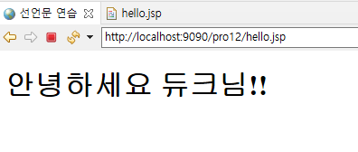

## 9.3 스크립트릿 사용하기

### 9.3.1 JSP에서 스크립트릿 실습

- 스크립트릿 실습
    1. hello2.jsp 파일 생성
    2. hello2.jsp 파일 작성
       
        ```jsp
        <%@ page language="java" contentType="text/html; charset=UTF-8"
            pageEncoding="UTF-8"%>
        <%!
           String name = "이순신";
           public String getName(){ return name;}
        %>  
        <% String age=request.getParameter("age"); %>  
        
        <!DOCTYPE html>
        <html>
        <head>
        <meta charset="UTF-8">
            <title>스크립틀릿 연습</title>
        </head>
        <body>
            <h1>안녕하세요 <%=name %>님!!</h1>
            <h1>나이는 <%=age %>살입니다!!</h1>’
        </body>
        </html>
        ```
        

## 9.4 표현식 사용하기

### 9.4.1 JSP 페이지에서 표현식 실습

- 표현식 실습
    - hello3.jsp 작성
      
        ```jsp
        <%@ page language="java" contentType="text/html; charset=UTF-8"
            pageEncoding="UTF-8"%>
        <%!
           String name = "이순신";
           public String getName(){ return name;}
        %>  
        <% String age=request.getParameter("age"); %>  
        
        <!DOCTYPE html>
        <html>
        <head>
           <meta charset="UTF-8">
           <title>표현식 연습</title>
        </head>
        <body>
           <h1>안녕하세요 <%=name %>님!!</h1>
           <h1>나이는 <%=age %>살입니다!!</h1>
           <h1>키는 <%=180 %>cm입니다!!</h1>
           <h1>나이+10은 <%=Integer.parseInt(age)+10 %>살입니다!!</h1>
        </body>
        </html>
        ```
        
        - `<%=Integer.parseInt(age)+10 %>` : age 값에 10을 더한 값을 출력
        - `<%= %>` 안에는 세미콜론(;)이 있으면 안됨

## 9.5 JSP 주석문 사용하기

### 9.5.1 JSP 페이지에서 주석문 사용하기

- JSP 주석문
    - JSP 페이지에서 사용되는 주석문 : HTML 주석, Java 주석, JSP 주석
    - 코드 : `<%-- 내용 --%>`

## 9.6 스크립트 요소 이용해 실습하기

### 9.6.1 로그인 예제

- 로그인 실습 1
    1. login.html, result.jsp, result2.jsp, result3.jsp 생성
    2. login.html 작성
       
        ```jsp
        <!DOCTYPE html>
        <html>
        <head>
        <meta charset="UTF-8">
        <title>로그인창</title>
        </head>
        <body>
          <form name="frmLogin" method="post" action="result.jsp" encType="utf-8">
              아이디  :<input type="text" name="user_id"><br>
              비밀번호:<input type="password" name="user_pw"><br>
               <input type="submit" value="로그인">
               <input type="reset" value="다시입력">
          </form>
        </body>
        </html>
        ```
        
        - `action="result.jsp` : 입력한 아이디와 비밀번호를 result.jsp로 전송
    3. result.jsp 작성
       
        ```jsp
        <%@ page language="java" contentType="text/html; charset=UTF-8"
            pageEncoding="UTF-8"%>
        
        <!DOCTYPE html>
        <html>
        <head>
          <meta charset="UTF-8">
          <title>결과출력창</title>
        </head>
        <body>
           <h1>결과 출력</h1>
           <%
              request.setCharacterEncoding("utf-8");
              String user_id=request.getParameter("user_id");
              String user_pw=request.getParameter("user_pw");
           %>	
            <h1>아이디  : <%= user_id %></h1>
            <h1>비밀번호: <%= user_pw %></h1>
        </body>
        </html>
        ```
        
        - `getParameter()` 메서드를 이용해 입력한 정보 가져오기
          
            ```java
            			String user_id=request.getParameter("user_id");
                  		String user_pw=request.getParameter("user_pw");
            ```
            
        - `<%= user_id%>` : ID를 표현식으로 출력
        - `<%= user_pw%>` : 비밀번호를 표현식으로 출력
- 실습 1 결과
    - 입력값 : ID - hong / pw - 1234
      
        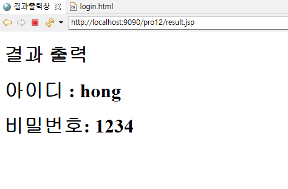
    
- 로그인 실습 2
    - ID가 정상적으로 입력되었는지 체크하는 로직 추가
      
        <result2.jsp>
        
        ```html
        <%@ page language="java" contentType="text/html; charset=UTF-8"
              pageEncoding="UTF-8"%>
        <%
           request.setCharacterEncoding( "utf-8" );
           String user_id = request.getParameter("user_id");
           String user_pw = request.getParameter("user_pw");
        %>    
        <!DOCTYPE html>
        <html>
        <head>
           <meta charset="UTF-8">
           <title>결과출력창</title>   
        </head>
        <body>
        <%
             if(user_id==null || user_id.length()==0){
        %>
              아이디를 입력하세요.<br>
        <a href="/pro12/login.html">로그인하기</a>
        <%
             }else{
        %>
        <h1> 환영합니다. <%=user_id %> 님!!!</h1>
        <%
            }
        %>
        </body>
        </html>
        ```
        
        - `if(user_id==null || user_id.length()==0)` : ID가 정상적으로 입력되었는지 체크
- 실습 2 결과
    1. 아이디를 정상적으로 입력한 경우
        - 입력값 : id - hong / pw - 1234
          
            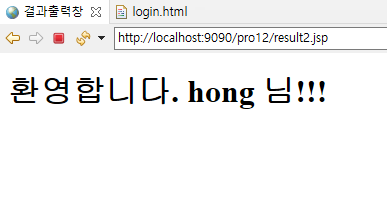
        
    2. 아이디를 입력하지 않은 경우
       
        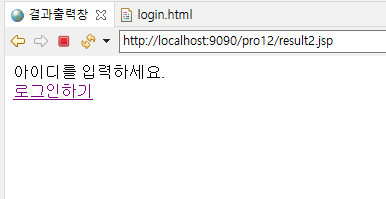
    
- 로그인 실습 3
    - 입력한 아이디가 admin인지 체크
      
        <result3.jsp>
        
        ```html
        <%@ page language="java" contentType="text/html; charset=UTF-8"
            pageEncoding="UTF-8"%>
        <%
           request.setCharacterEncoding( "utf-8" );
           String user_id = request.getParameter("user_id");
           String user_pw = request.getParameter("user_pw");
        %>     
        <!DOCTYPE html>
        <html>
        <head>
        	<title>결과출력창</title>
        	<meta charset="UTF-8">
        </head>
        <body>
        <%
         if(user_id == null || user_id.length()==0){
        %>
           아이디를 입력하세요.<br>
           <a href="/pro12 /login.html">로그인하기</a>
        <%
         }else{
            if(user_id.equals("admin")){
        %>
        	   <h1>관리자로 로그인 했습니다.</h1>
        	   <form>
        	     <input type=button value="회원정보 삭제하기"  />
        	     <input type=button value="회원정보 수정하기"  />
        	  </form>
        <%
            }else{
        %>
            <h1> 환영합니다. <%=user_id %> 님!!!</h1>
        <%
            }
         }
        %>
        </body>
        </html>
        ```
        
        - `if(user_id.equals("admin"))` : 입력한 ID가 admin인지 체크
- 실습 3 결과
    1. admin으로 로그인 한 경우
        - 입력값 : ID - admin / PW - 1234
          
            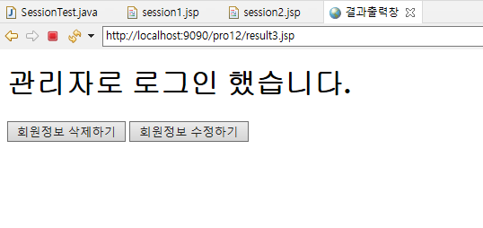
        
    2. 다른 ID로 로그인 한 경우
        - 입력값 : ID - kim / PW - 1234
          
            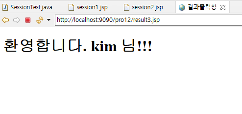
            

## 9.7 내장 객체(내장 변수) 기능

### 9.7.1 JSP에서 제공하는 내장 객체

- JSP에서 제공하는 내장 객체
    1. `request`
        - 서블릿 타입 : javax.servlet.http.HttpServletRequest
        - 내용 : 클라이언트의 요청 정보 저장
    2. `response`
        - 서블릿 타입 : javax.servlet.http.HttpServletResponse
        - 내용 : 응답 정보를 저장
    3. `out`
        - 서블릿 타입 : javax.servlet.jsp.JspWriter
        - 내용 : JSP 페이지에서 결과를 출력
    4. `session`
        - 서블릿 타입 : javax.servlet.http.HttpSession
        - 내용 : 세션 정보를 저장
    5. `application`
        - 서블릿 타입 : javax.servlet.ServletContext
        - 내용 : 컨텍스트 정보 저장
    6. `pageContext`
        - 서블릿 타입 : javax.servlet.jsp.PageContext
        - 내용 : JSP 페이지에 대한 정보를 저장
    7. `page`
        - 서블릿 타입 : javax.lang.Object
        - 내용 : JSP 페이지의 서블릿 인스턴스 저장
    8. `config`
        - 서블릿 타입 : javax.servlet.ServletConfig
        - 내용 : JSP 페이지에 대한 설정 정보를 저장
    9. `exception`
        - 서블릿 타입 : java.lang.Exception
        - 내용 : 예외 발생 시 예외 처리
- 스코프
    1. `page`
        - 서블릿 : this
        - 스코프 : 한 번의 요청에 대해 하나의 JSP 페이지를 공유
    2. `request`
        - 서블릿 : HttpServletRequest
        - 스코프 : 한 번의 요청에 대해 같은 요청을 공유하는 JSP 페이지를 공유
    3. `session`
        - 서블릿 : HttpSession
        - 스코프 : 같은 브라우저에서 공유
    4. `application`
        - 서블릿 : ServletContext
        - 스코프 : 같은 애플리케이션에서 공유

### 9.7.2 session 내장 객체에 데이터 바인딩 실습

- session 내장 객체에 데이터 바인딩 실습
    1. SessionTest 클래스 작성
       
        ```java
        package sec01.ex01;
        
        import java.io.IOException;
        import java.io.PrintWriter;
        
        import javax.servlet.ServletException;
        import javax.servlet.annotation.WebServlet;
        import javax.servlet.http.HttpServlet;
        import javax.servlet.http.HttpServletRequest;
        import javax.servlet.http.HttpServletResponse;
        import javax.servlet.http.HttpSession;
        
        /**
         * Servlet implementation class SessionTest
         */
        @WebServlet("/sess")
        public class SessionTest extends HttpServlet {
        	private static final long serialVersionUID = 1L;
        
        	/**
        	 * @see HttpServlet#doGet(HttpServletRequest request, HttpServletResponse response)
        	 */
        	protected void doGet(HttpServletRequest request, HttpServletResponse response) throws ServletException, IOException {
        		response.setContentType("text/html;charset=utf-8");
        		PrintWriter pw = response.getWriter();
        		HttpSession session = request.getSession();
        		session.setAttribute("name", "이순신");
        		
        		pw.println("<html><body>");
        		pw.println("<h1>세션에 이름을 바인딩합니다.</h1>");
        		pw.println("<a href='/pro12/test01/session1.jsp'>첫번째 페이지로 이동하기 </a>");
        		pw.println("</body></html>"); 
        		
        	}
        
        }
        ```
        
        - `HttpSession session = request.getSession();` : session 객체를 가져옴
        - `session.setAttribute("name", "이순신");` : session 객체에 name을 바인딩
    2. session1.jsp 작성
       
        ```jsp
        <%@ page language="java" contentType="text/html; charset=UTF-8"
            pageEncoding="UTF-8"%>
        <%
         String name=(String)session.getAttribute("name");
         session.setAttribute("address","서울시 강남구"); 
        %>     
        
        <!DOCTYPE html>     
        <html>
        <head>
        <meta charset="UTF-8">
        <title>session 내장 객체 테스트1</title>
        </head>
        <body>
        이름은 <%=name %>입니다.<br>
        <a href=session2.jsp>두번째 페이지로 이동</a>
        </body>
        </html>
        ```
        
        - `String name=(String)session.getAttribute("name");` : session 객체에 바인딩된 name 값을 가져옴
        - `session.setAttribute("address","서울시 강남구");` : session 객체에 address를 바인딩
    3. session2.jsp 작성
       
        ```jsp
        <%@ page language="java" contentType="text/html; charset=UTF-8"
            pageEncoding="UTF-8"%>
        <%
        
        String name=(String)session.getAttribute("name");
        String address = (String)session.getAttribute("address");
        
        %>    
         
        <!DOCTYPE html>     
        <html>
        <head>
        <meta charset="UTF-8">
        <title>session 내장 객체 테스트2</title>
        </head>
        <body>
        이름은 <%=name %>입니다.<br>
        주소는 <%=address %>입니다. 
        </body>
        </html>
        ```
        
        - session 객체에 바인딩된 값 가져오기
          
            ```java
            String name=(String)session.getAttribute("name");
            String address = (String)session.getAttribute("address");
            ```
    
- 실습 결과
    1. 최초 서블릿 요청
       
        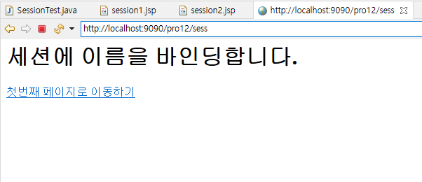
        
    2. 첫번째 페이지로 이동하기 클릭
       
        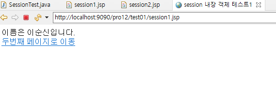
        
        - 서블릿에서 바인딩한 name이 출력됨
    3. 두번째 페이지로 이동 클릭
       
        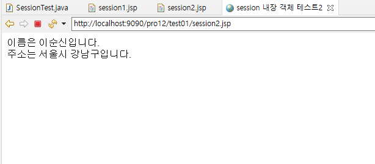
        
        - 서블릿에서 바인딩한 name이 출력됨
        - 첫 번째 JSP에서 바인딩한 address가 출력됨

### 9.7.3 application 내장 객체에 데이터 바인딩 실습

- application 내장 객체에 데이터 바인딩 실습
    1. appTest1.jsp, appTest2.jsp 파일 생성
    2. appTest1.jsp 파일 작성
       
        ```jsp
        <%@ page language="java" contentType="text/html; charset=UTF-8"
            pageEncoding="UTF-8"%>
        <%
          session.setAttribute("name","이순신");
          application.setAttribute("address","서울시 성동구");
        %>    
        
        <!DOCTYPE html>     
        <html>
        <head>
        <meta charset="UTF-8">
        <title>내장 객체 스코프 테스트1</title>
        </head>
        <body>
        <h1>이름과 주소를 저장합니다.</h1>
        <a href=appTest2.jsp>두번째 웹페이지로 이동</a>
        </body>
        </html>
        ```
        
        - `session.setAttribute("name","이순신");` : session 객체에 name 바인딩
        - `application.setAttribute("address","서울시 성동구");` : application 객체에 address 바인딩
    
    2. appTest2.jsp 작성
    
    ```jsp
    <%@ page language="java" contentType="text/html; charset=UTF-8"
        pageEncoding="UTF-8"%>
    <%
        String name=(String)session.getAttribute("name");
        String address=(String )application.getAttribute("address");
    %>    
    
    <!DOCTYPE html>     
    <html>
    <head>
    <meta charset="UTF-8">
    <title>내장 객체 스코프 테스트2</title>
    </head>
    <body>
    <h1>이름은 <%=name %>입니다.</h1>
    <h1>주소는 <%=address %>입니다.</h1>
    </body>
    </html>
    ```
    
    - 첫 번째 웹 페이지에서 저장한 데이터를 session과 application 객체에서 가져옴
      
        ```java
        		String name=(String)session.getAttribute("name");
            	String address=(String )application.getAttribute("address");
        ```
    
- 실습 결과
    1. 첫 번째 브라우저에서 요청(appTest1.jsp)
       
        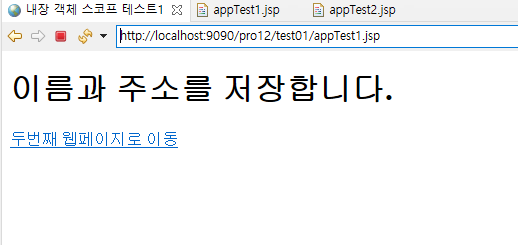
        
    2. 두 번째 브라우저에 요청(appTest2.jsp)
        1. 동일한 브라우저에서 요청 시
           
            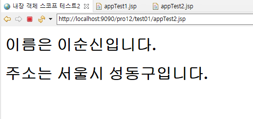
            
            - session과 application에 접근 가능
        2. 다른 브라우저에서 요청 시
           
            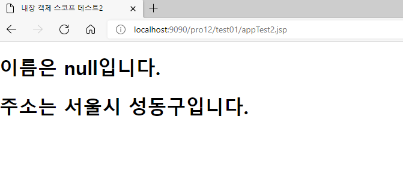
            
            - 다른 브라우저에서 요청 시 application 값에만 접근 가능
              
                ⇒ session 내장 객체의 스코프는 같은 브라우저 / application 내장 객체의 스코프는 애플리케이션 전체
                

### 9.7.4 request 내장 객체에 데이터 바인딩 실습

- request 내장 객체에 데이터 바인딩 실습
    1. request1.jsp, request2.jsp 파일 생성
    2. request1.jsp 작성
       
        ```jsp
        <%@ page language="java" contentType="text/html; charset=UTF-8"
            import="javax.servlet.RequestDispatcher"
            pageEncoding="UTF-8"
            %>
        <%
          request.setAttribute("name","이순신");
          request.setAttribute("address","서울시 강남구"); 
        %>       
        
        <!DOCTYPE html>
        <html>
        <head>
        <meta charset="UTF-8">
        <title>첫 번째 JSP</title>
        </head>
        <body>
        
        <%
          RequestDispatcher dispatch = request.getRequestDispatcher("request2.jsp");  
          dispatch.forward(request, response);
        %>
        </body>
        </html>
        ```
        
        - request 객체에 name과 address 바인딩
          
            ```java
            	request.setAttribute("name","이순신");
              	request.setAttribute("address","서울시 강남구");
            ```
            
        - request 객체를 다른 JSP로 포워딩
          
            ```java
            	RequestDispatcher dispatch = request.getRequestDispatcher("request2.jsp"); 
            	dispatch.forward(request, response);
            ```
        
    3. request2.jsp 작성
       
        ```jsp
        <%@ page language="java" contentType="text/html; charset=UTF-8"
            pageEncoding="UTF-8"%>
        <%
           String name=(String)request.getAttribute("name");
           String address=(String )request.getAttribute("address");
        %> 
        
        <!DOCTYPE html>      
        <html>
        <head>
        <meta charset="UTF-8">
        <title>두 번째 JSP</title>
        </head>
        <body>
           <h1>이름은 <%=name %>입니다.</h1>
           <h1>주소는 <%=address %>입니다.</h1>
        </body>
        </html>
        ```
        
        - 첫 번째 JSP 페이지에서 포워딩된 request 객체에서 정보 가져옴
          
            ```java
            	String name=(String)request.getAttribute("name");
              	String address=(String )request.getAttribute("address");
            ```
    
- 실습 결과
  
    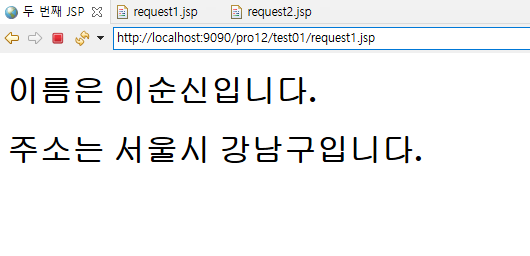
    
    - request1.jsp에 요청하면 request 객체에 바인딩한 후 request2.jsp로 포워딩하여 name과 address 출력

### 9.7.5 out 내장 객체에 데이터 바인딩 실습

- out 내장 객체에 데이터 바인딩 실습
    1. out1.jsp, out2.jsp 생성
    2. out1.jsp 작성
       
        ```jsp
        <%@ page language="java" contentType="text/html; charset=UTF-8"
            pageEncoding="UTF-8"%>
        <!DOCTYPE html>      
        <html>
        <head>
          <title>데이터입력창</title>
        <meta charset="UTF-8">
        </head>
        <body>
           <form method="post" action="out2.jsp">
             이름:<input type="text" name="name"><br>
             나이: <input type="text" name="age"><br>
             <input type ="submit" value="전송">
           </form>
        </body>
        </html>
        ```
        
    3. out2.jsp 작성
       
        ```jsp
        <%@ page language="java" contentType="text/html; charset=UTF-8"
            pageEncoding="UTF-8"%>
        <%
           request.setCharacterEncoding( "utf-8" );
           String name=request.getParameter("name");
           String age=request.getParameter("age");
        %> 
        
        <!DOCTYPE html>          
        <html>
        <head>
        <meta charset="UTF-8">
          <title>데이터출력창</title>
        </head>
        <body>
        <%
         if(name!=null ||name.length()!=0){
        %>
             <h1><%=name %> ,<%=age %>  </h1>
        <%
        }else{
        %>
            <h1>이름을 입력하세요</h1>
        <%
        }
        %>
        
        <%
         if(name!=null ||name.length()!=0){
        %>
            <h1><% out.println(name+" , "+age); %></h1>
        <%
        }else{
        %>
            <h1>이름을 입력하세요</h1>
        <%
        }
        %>
        </body>
        </html>
        ```
    
- 실습 결과
    1. 이름과 나이 전송
       
        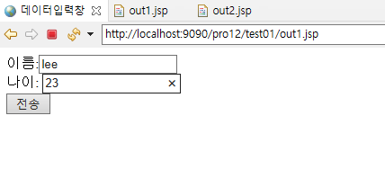
        
    2. 표현식과 out 내장 객체로 출력
       
        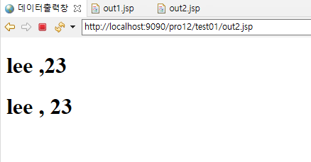
        
        - out 내장 객체를 이용해 스크립트릿으로 출력하면 복잡한 코드를 상대적으로 간단하게 출력할 수 있음

## 9.8 JSP 페이지 예외 처리하기

### 9.8.1 JSP 페이지 예외 처리 과정

- 예외 처리 사이트의 필요성
    - 페이지에 오류 메시지가 출력되면 사용자 입장에서 큰 문제가 발생한 것으로 인식
      
        ⇒ 사이트에 대한 신뢰도 저하
    
- JSP 예외 처리 페이지 제작 과정
    1. 예외 처리 담당 JSP 생성 : `<%@ page isErrorPage='true' %>`
    2. 예외 발생 시 예외 처리 담당 JSP 파일 지정 : `<%@ page errorPage='JSP파일명'@>`

### 9.8.2 JSP 페이지 예외 처리 실습

- JSP 페이지 예외 처리
    1. add.html, add.jsp, addException.jsp 생성
    2. add.html 작성
       
        ```jsp
        <!DOCTYPE html>          
        <html>
        <head>
        <title>합계</title>
        </head>
        <body>
        자연수를 입력하세요.
        <form action='add.jsp'>
        	1 부터 <input type='text' name='num'>
        	<input type='submit' value='계산하기'>
        </form>
        </body>
        </html>
        ```
        
    3. add.jsp 작성
       
        ```jsp
        <%@ page language="java" contentType="text/html; charset=UTF-8"
            pageEncoding="UTF-8" %>
        <%@ page errorPage="addException.jsp"%>  
             
        <% 
           int num = Integer.parseInt(request.getParameter("num"));
           int sum=0;
           for(int i =1 ; i<= num ; i++){
              sum = sum + i;
           }
        %>
        
        <!DOCTYPE html>          
        <html>
        <head>
            <title>합계 구하기</title>
        </head>
        <body>
        <h2>합계 구하기</h2>
        <h1>1부터 <%=num  %>까지의 합은 <%=sum  %>입니다</h1>
        </body>
        </html>
        ```
        
        - 예외 발생 시 예외 처리할 JSP 페이지 지정 : `errorPage="addException.jsp`
    4. addException.jsp 작성
       
        ```jsp
        <%@ page language="java" contentType="text/html; charset=UTF-8"
            pageEncoding="UTF-8" %>
        <%@ page isErrorPage="true" %>
            
        
        <!DOCTYPE html>          
        <html>
        <head>
           <title>에러 페이지</title>
        </head>
        <body>
           ======= toString() 내용 ======= <br>
           <h1><%=exception.toString()  %> </h1>
           ============ getMessage()내용 ==========<br>
           <h1><%=exception.getMessage()%> </h1>
           ============= printStackTrace() 내용 =======<br>
           <h1><% exception.printStackTrace(); %> </h1>
           <h3>
           숫자만 입력 가능합니다.다시 시도 하세요.
           <a href='add.html'>다시하기</a>
           </h3>
        </body>
        </html>
        ```
        
        - 다른 JSP 페이지에서 예외 발생 시 예외를 처리하는 예외 페이지로 지정 : `isErrorPage="true"`
        - exception 내장 객체를 사용해 예외 처리
          
            ```java
            exception.toString()
            exception.getMessage()
            ```
            
        - Eclipse Console로 예외 메시지 출력 : `<% exception.printStackTrace(); %>`
- 실습 결과
    1. 정상 데이터 입력한 경우
        1. 입력
           
            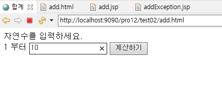
            
        2. 출력
           
            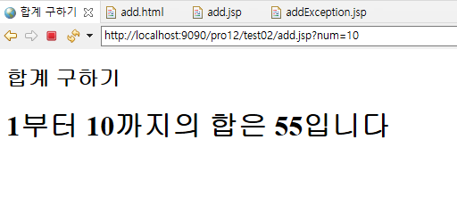
        
    2. 잘못된 데이터 입력한 경우
        1. 입력
           
            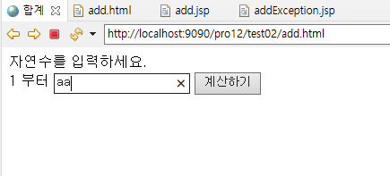
            
        2. 출력
           
            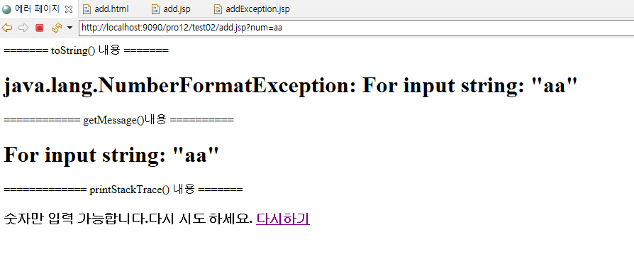
            

### 9.8.3 JSP 페이지의 오류 페이지 종류

- JSP 페이지의 오류 페이지 종류
    - 404 오류 : 요청한 JSP 페이지가 없을 때 발생하는 오류
    - 500 오류 : 컨테이너에서 JSP 페이지 처리 중에 오류가 발생할 때 표시되는 오류

### 9.8.4 에러 코드에 따른 예외 페이지 지정

- web.xml에서 xml로 각각의 에러 코드에 대한 예외 처리 페이지 지정
    1. 오류 페이지들이 위치할  err 폴더와 그 안에 들어갈 error_404.jsp, error_500.jsp 생성
    2.  web.xml 작성
        
        ```xml
        <?xml version="1.0" encoding="UTF-8"?>
        <web-app xmlns:xsi="http://www.w3.org/2001/XMLSchema-instance" xmlns="http://xmlns.jcp.org/xml/ns/javaee" xsi:schemaLocation="http://xmlns.jcp.org/xml/ns/javaee http://xmlns.jcp.org/xml/ns/javaee/web-app_4_0.xsd" id="WebApp_ID" version="4.0">
          
          <error-page>
             <error-code>404</error-code>
             <location>/err/error_404.jsp</location>
          </error-page>
          
          <error-page>
             <error-code>500</error-code>
             <location>/err/error_500.jsp</location>
          </error-page>
          
          
        </web-app>
        ```
        
        - 404와 500 오류 발생 시 예외 처리를 할 페이지 지정
          
            ```xml
            <error-page>
                 <error-code>404</error-code>
                 <location>/err/error_404.jsp</location>
              </error-page>
              
              <error-page>
                 <error-code>500</error-code>
                 <location>/err/error_500.jsp</location>
              </error-page>
            ```
        
    3. error_404.jsp 작성
       
        ```jsp
        <%@ page language="java" contentType="text/html; charset=UTF-8"
            pageEncoding="UTF-8"%>
        
        <!DOCTYPE html>          
        <html>
        <head>
        <meta charset="UTF-8">
        <title>404 예외 처리 페이지</title>
        </head>
        <body>
        <h1>요청한 페이지는 존재하지 않습니다.</h1>
        </body>
        </html>
        ```
        
    4. error_500.jsp 작성
       
        ```jsp
        <%@ page language="java" contentType="text/html; charset=UTF-8"
            pageEncoding="UTF-8"%>
        
        <!DOCTYPE html>          
        <html>
        <head>
        <meta charset="UTF-8">
        <title>500 예외 처리 페이지</title>
        </head>
        <body>
        <br>
        <h1>죄송합니다.서비스 실행 중 오류가 발생했습니다.</h1>
        <h1>잠시 후 다시 시도해 보세요.</h1>
        </body>
        </html>
        ```
        
    5. 예외를 발생시키는 페이지 number.jsp 작성
       
        ```jsp
        <%@ page language="java" contentType="text/html; charset=UTF-8"
            pageEncoding="UTF-8"%>
        <%
            int num = Integer.parseInt(request.getParameter("num"));
        %>
        <!DOCTYPE html>          
        <html>
        <head>
        <meta charset="UTF-8">
        <title>테스트 페이지</title>
        </head>
        <body>
        <h1>쇼핑몰 중심 JSP 입니다!!!!</h1>
        </body>
        </html>
        ```
    
- 실습 결과
    1. 잘못된 주소를 입력한 경우
       
        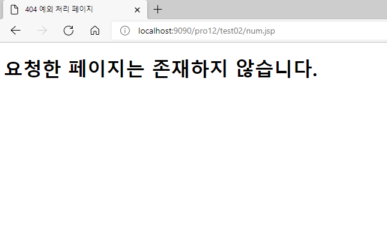
        
    2. 실행 중 예외를 발생시키는 페이지를 요청한 경우
       
        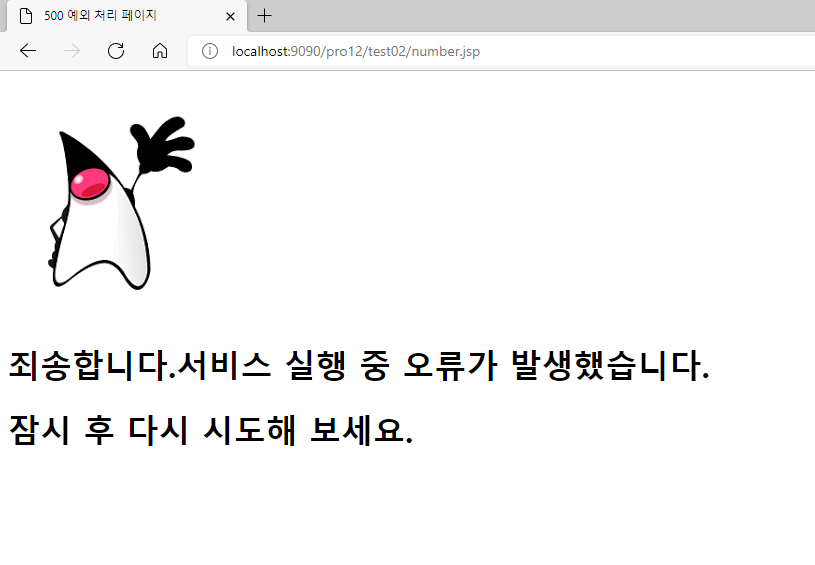
        

## 9.9 JSP welcome 파일 지정하기

### 9.9.1 JSP welcome 파일 지정하는 방법

- JSP welcome 파일 지정
  
    ```xml
    <welcome-file-list>
        <welcome-file>파일 이름(jsp, html)</welcome-file>
        <welcome-file>파일 이름(jsp, html)</welcome-file>
        <welcome-file>파일 이름(jsp, html)</welcome-file>
    		...
    </welcome-file-list>
    ```
    
- JSP welcome 파일 지정 실습
    1. main.jsp 생성
    2. web.xml 작성
       
        ```xml
        <?xml version="1.0" encoding="UTF-8"?>
        <web-app xmlns:xsi="http://www.w3.org/2001/XMLSchema-instance" xmlns="http://xmlns.jcp.org/xml/ns/javaee" xsi:schemaLocation="http://xmlns.jcp.org/xml/ns/javaee http://xmlns.jcp.org/xml/ns/javaee/web-app_4_0.xsd" id="WebApp_ID" version="4.0">
          <welcome-file-list>
            <welcome-file>/test02/main.jsp</welcome-file>
            <welcome-file>/test02/add.jsp</welcome-file>
            <welcome-file>/test02/add.html</welcome-file>
          </welcome-file-list>
          
          <error-page>
             <error-code>404</error-code>
             <location>/err/error_404.jsp</location>
          </error-page>
          
          <error-page>
             <error-code>500</error-code>
             <location>/err/error_500.jsp</location>
          </error-page>
          
          
        </web-app>
        ```
        
    3. 첫 번째 홈페이지인 main.jsp 작성
       
        ```jsp
        <%@ page language="java" contentType="text/html; charset=UTF-8"
            pageEncoding="UTF-8"%>
        
        <!DOCTYPE html>
        <html>
        <head>
        <meta charset="UTF-8">
        <title>홈페이지</title>
        </head>
        <body>
           <br>
        <h1>안녕하세요</h1>
        <h1>쇼핑몰 중심 JSP 홈페이지 입니다!!!</h1>
        </body>
        </html>
        ```
    
- 실습 결과
  
    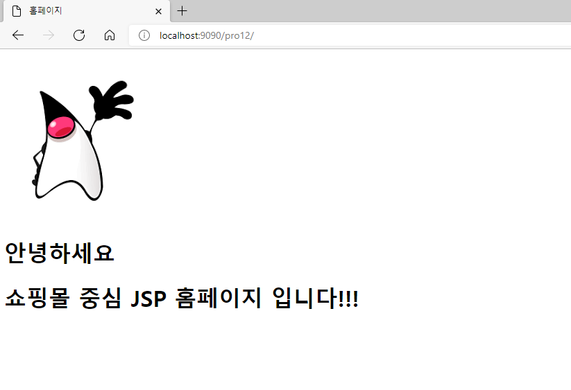
    

## 9.10 스크립트 요소 이용해 회원 정보 조회하기

### 9.10.1 스크립트 요소를 이용한 회원 정보 조회 실습

- 실습
    1. MemberVO, MemberDAO 생성
    2. MemberVO 작성
       
        ```java
        package sec02.ex01;
        
        import java.sql.Date;
        
        public class MemberVO {
        	private String id;
        	private String pwd;
        	private String name;
        	private String email;
        	private Date joinDate;
        	
        	public MemberVO() {
        		System.out.println("MemberVO 생성자 호출");
        	}
        
        	public String getId() {
        		return id;
        	}
        
        	public void setId(String id) {
        		this.id = id;
        	}
        
        	public String getPwd() {
        		return pwd;
        	}
        
        	public void setPwd(String pwd) {
        		this.pwd = pwd;
        	}
        
        	public String getName() {
        		return name;
        	}
        
        	public void setName(String name) {
        		this.name = name;
        	}
        
        	public String getEmail() {
        		return email;
        	}
        
        	public void setEmail(String email) {
        		this.email = email;
        	}
        
        	public Date getJoinDate() {
        		return joinDate;
        	}
        
        	public void setJoinDate(Date joinDate) {
        		this.joinDate = joinDate;
        	}
        
        	
        }
        ```
        
        - 변수 : id, pwd, name, email, joinDate
    3. 데이터베이스의 회원 조회하는 페이지 작성
       
        <search.jsp>
        
        ```jsp
        <%@ page language="java" contentType="text/html; charset=UTF-8"
            pageEncoding="UTF-8"%>
        
        <!DOCTYPE html>
        <html>
        <head>
          <meta charset="UTF-8">
          <title>회원 검색창</title>
        </head>
        <body>
           <form method="post" action="member.jsp">
        	   이름:<input type="text" name="name"><br>
        	   <input type ="submit" value="조회하기">
           </form>
        </body>
        </html>
        ```
        
        - 데이터를 member.jsp로 전송
    4. 데이터베이스의 회원 조회 페이지에서 전송된 name 값을 통해 회원 정보를 조회하고 출력하는 페이지 작성
       
        <member.jsp>
        
        ```jsp
        <%@ page language="java" contentType="text/html; charset=UTF-8"
            import="java.util.*"
            import="sec02.ex01.*"
            pageEncoding="UTF-8"
        %>
        <!DOCTYPE html>
        <html>
        <head>
        <style>
        h1 {
        text-align: center;
        }
        </style>
          <meta charset="UTF-8">
        <title>회원 정보 출력창</title>
        </head>
        <body>
        <h1>회원 정보 출력</h1>
        <%
           request.setCharacterEncoding( "utf-8" );
           String _name = request.getParameter("name");
           MemberVO memberVO = new MemberVO();
           memberVO.setName(_name);
           MemberDAO dao=new MemberDAO();
           List membersList=dao.listMembers(memberVO);
        %>
         <table border='1' width='800' align='center'>
           <tr align='center' bgcolor='#FFFF66'> 
             <td>아이디</td>
             <td>비밀번호</td>
             <td>이름</td>
             <td >이메일</td>
             <td>가입일자</td>
        </tr>
        <%	
           for (int i=0; i < membersList.size(); i++){
              MemberVO vo=(MemberVO) membersList.get(i);
              String id=vo.getId();
              String pwd=vo.getPwd();
              String name=vo.getName();
              String email=vo.getEmail();
              Date joinDate=vo.getJoinDate();
        %>
             <tr align=center>
               <td><%= id %></td>
               <td><%= pwd %></td>
               <td><%= name %></td>
               <td><%= email %></td>
               <td><%=joinDate  %></td>
             </tr>
           
        <%		
           }
        %>	
        </table>
        </body>
        </html>
        ```
        
        - `<h1>` 태그의 텍스트를 중앙에 정렬
          
            ```css
            <style>
            h1 {
            text-align: center;
            }
            </style>
            ```
            
        - 전송된 이름 가져오기 : `String _name = request.getParameter("name");`
        - 전송된 이름 입력 : `memberVO.setName(_name);`
        - memberVO를 `listMembers()` 메서드로 전달하여 조회 조건에 해당되는 회원 정보 조회 : `List membersList=dao.listMembers(memberVO);`
        - 회원 정보 출력 테이블 작성
          
            ```jsp
            <table border='1' width='800' align='center'>
               <tr align='center' bgcolor='#FFFF66'> 
                 <td>아이디</td>
                 <td>비밀번호</td>
                 <td>이름</td>
                 <td >이메일</td>
                 <td>가입일자</td>
            </tr>
            <%	
               for (int i=0; i < membersList.size(); i++){
                  MemberVO vo=(MemberVO) membersList.get(i);
                  String id=vo.getId();
                  String pwd=vo.getPwd();
                  String name=vo.getName();
                  String email=vo.getEmail();
                  Date joinDate=vo.getJoinDate();
            %>
                 <tr align=center>
                   <td><%= id %></td>
                   <td><%= pwd %></td>
                   <td><%= name %></td>
                   <td><%= email %></td>
                   <td><%=joinDate  %></td>
                 </tr>
               
            <%		
               }
            %>	
            </table>
            ```
            
        - MemberDAO에서 조회한 회원 정보를 for 반복문을 이용해 테이블의 행으로 출력
          
            ```java
            for (int i=0; i < membersList.size(); i++){
                  MemberVO vo=(MemberVO) membersList.get(i);
                  String id=vo.getId();
                  String pwd=vo.getPwd();
                  String name=vo.getName();
                  String email=vo.getEmail();
                  Date joinDate=vo.getJoinDate();
            ```
        
    5. MemberDAO 클래스 작성
       
        ```java
        package sec02.ex01;
        
        import java.sql.Connection;
        import java.sql.Date;
        import java.sql.PreparedStatement;
        import java.sql.ResultSet;
        import java.sql.Statement;
        import java.util.ArrayList;
        import java.util.List;
        
        import javax.naming.Context;
        import javax.naming.InitialContext;
        import javax.sql.DataSource;
        
        public class MemberDAO {
        	private Connection con;
        	private PreparedStatement pstmt;
        	private DataSource dataFactory;
        
        	public MemberDAO() {
        		try {
        			Context ctx = new InitialContext();
        			Context envContext = (Context) ctx.lookup("java:/comp/env");
        			dataFactory = (DataSource) envContext.lookup("jdbc/oracle");
        		} catch (Exception e) {
        			e.printStackTrace();
        		}
        	}
        
        	public List listMembers(MemberVO memberVO) {
        		List membersList = new ArrayList();
        		String _name=memberVO.getName();
        		try {
        			con = dataFactory.getConnection();
        			String query = "select * from t_member ";
        			
        			if((_name!=null && _name.length()!=0)){
        				 query+=" where name=?";
        				 pstmt = con.prepareStatement(query);
        				 pstmt.setString(1, _name);
        			}else {
        				pstmt = con.prepareStatement(query);	
        			}
        			
        			
        			System.out.println("prepareStatememt: " + query);
        			ResultSet rs = pstmt.executeQuery();
        			while (rs.next()) {
        				String id = rs.getString("id");
        				String pwd = rs.getString("pwd");
        				String name = rs.getString("name");
        				String email = rs.getString("email");
        				Date joinDate = rs.getDate("joinDate");
        				MemberVO vo = new MemberVO();
        				vo.setId(id);
        				vo.setPwd(pwd);
        				vo.setName(name);
        				vo.setEmail(email);
        				vo.setJoinDate(joinDate);
        				membersList.add(vo);
        			}
        			rs.close();
        			pstmt.close();
        			con.close();
        		} catch (Exception e) {
        			e.printStackTrace();
        		}
        		return membersList;
        	}
        
        }
        ```
        
        - DB 연동
            1. Oracle
               
                ```java
                public MemberDAO() {
                		try {
                			Context ctx = new InitialContext();
                			Context envContext = (Context) ctx.lookup("java:/comp/env");
                			dataFactory = (DataSource) envContext.lookup("jdbc/oracle");
                		} catch (Exception e) {
                			e.printStackTrace();
                		}
                	}
                ```
                
            2. MySQL
                - Servers에서 server.xml에 드라이버 정보 추가
                - connector jar 파일 추가
                
                ```xml
                <Resource
                    	name="jdbc/mysql"
                    	auth="Container"
                    	type="javax.sql.DataSource"
                    	driverClassName="com.mysql.jdbc.Driver"
                    	url="jdbc:mysql://localhost:3306/kdt13"
                    	username="root"
                    	password="1234"
                    	maxtotal="8"
                    	maxIdle="4"
                    />
                ```
                
                ```java
                public MemberDAO() {
                		try {
                			Context ctx = new InitialContext();
                			Context envContext = (Context) ctx.lookup("java:/comp/env");
                			dataFactory = (DataSource) envContext.lookup("jdbc/mysql");
                		} catch (Exception e) {
                			e.printStackTrace();
                		}
                	}
                ```
            
        - 조회할 이름 가져오기 : `String _name=memberVO.getName();`
        - `_name` 값이 존재하면 where 절 추가
          
            ```java
            if((_name!=null && _name.length()!=0)){
            				 query+=" where name=?";
            				 pstmt = con.prepareStatement(query);
            				 pstmt.setString(1, _name);
            			}
            ```
            
        - `_name` 값이 없으면 모든 회원 정보 조회
          
            ```java
            else {
            				pstmt = con.prepareStatement(query);	
            			}
            ```
    
- 실습 결과
    1. 조회할 이름을 입력한 후 요청
       
        입력값 : 기성용
        
        DB : MySQL t_member
        
        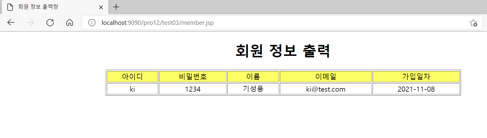
        
    2. 이름을 입력하지 않고 요청
       
        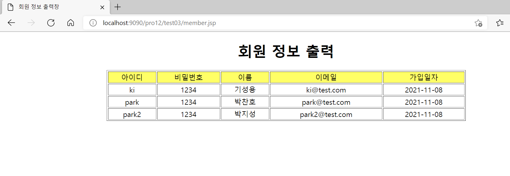
        

---